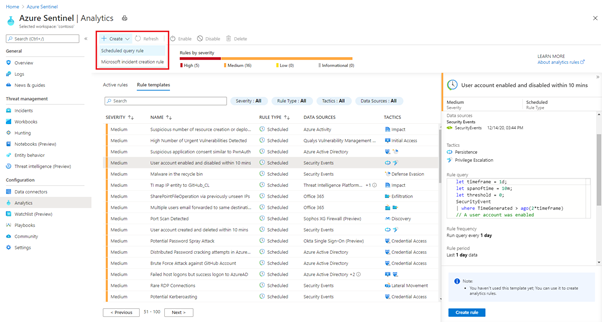
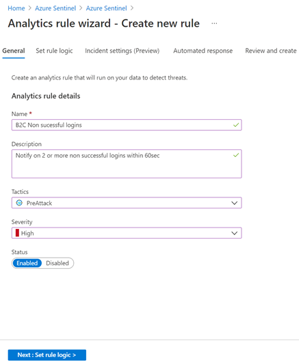
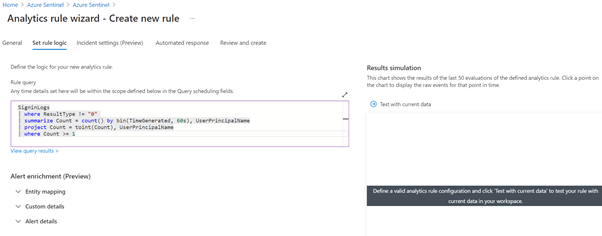
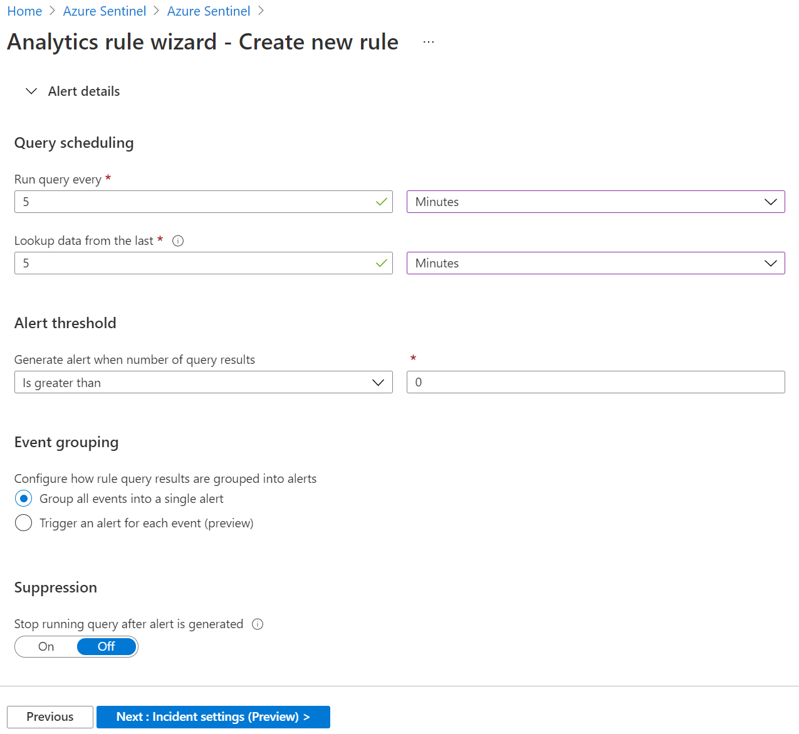
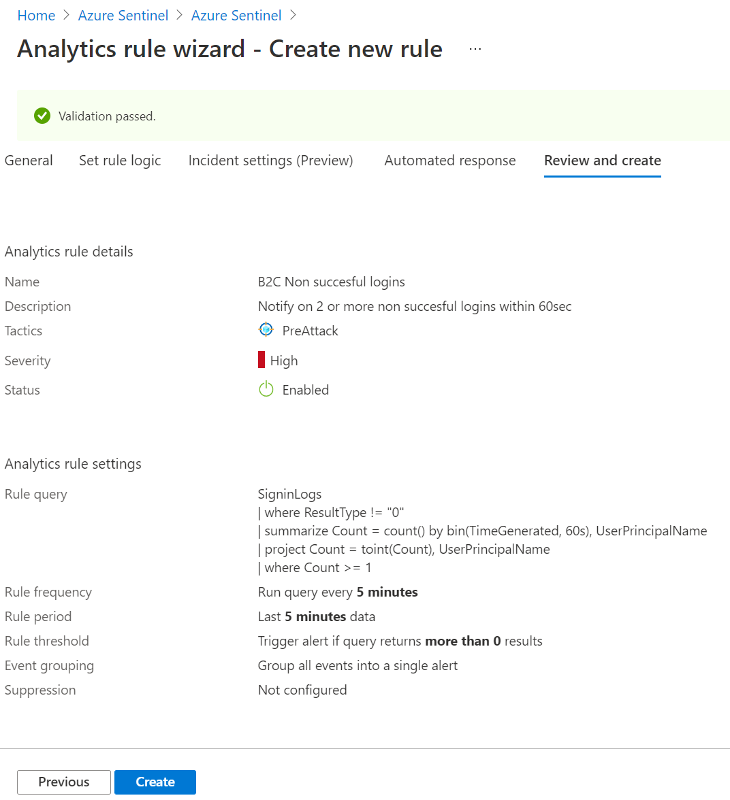
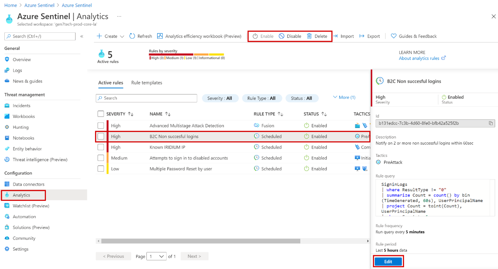
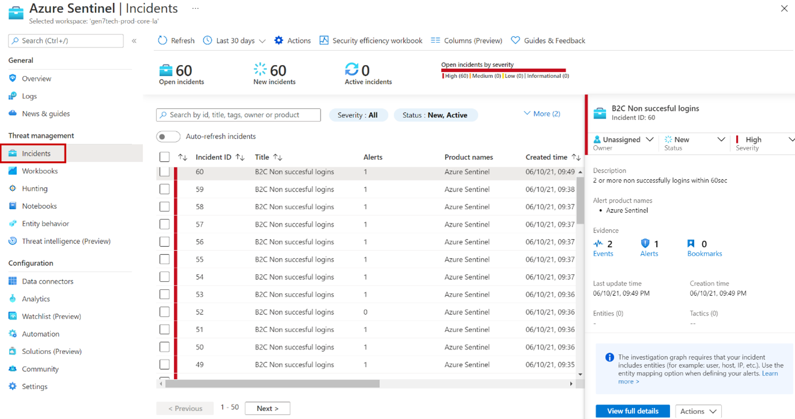
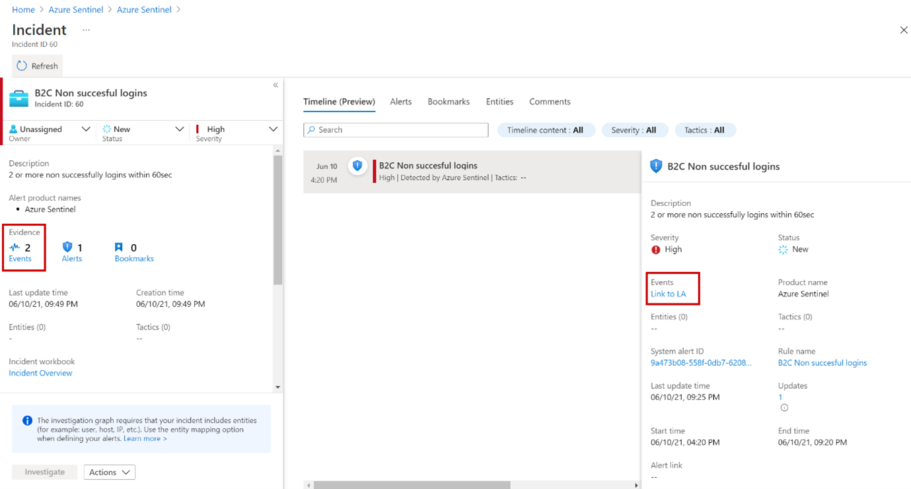
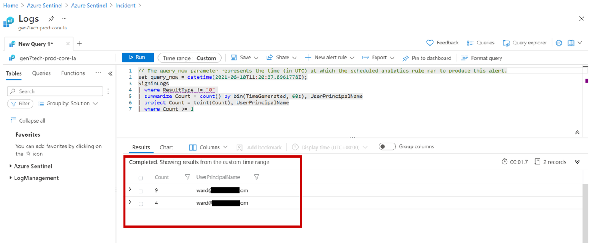
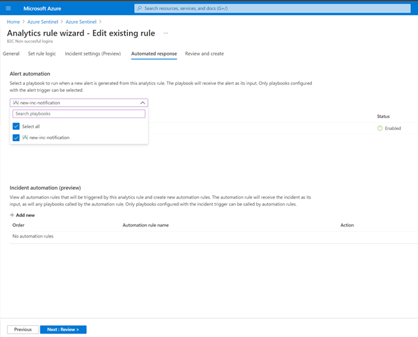

# Tutorial: How to perform Security Analytics for Azure AD B2C with Sentinel

You can further secure your Azure AD B2C environment by routing logs and audit information to Azure Sentinel. Azure Sentinel is a cloud-native **Security Information Event Management (SIEM) and Security Orchestration Automated Response (SOAR)** solution. Azure Sentinel provides alert detection, threat visibility, proactive hunting, and threat response for **Azure AD B2C**.

By utilizing Azure Sentinel in conjunction with Azure AD B2C, you can:
- Detect previously undetected threats, and minimize false positives using Microsoft's analytics and unparalleled threat intelligence.
- Investigate threats with artificial intelligence, and hunt for suspicious activities at scale, tapping into years of cyber security work at Microsoft.
- Respond to incidents rapidly with built-in orchestration and automation of common tasks.
- Meet security and compliance requirements for your organization.

In this tutorial, you’ll learn:
1. How to transfer the B2C logs to Azure Monitor so they land in a Log Analytics workspace.
1. Enable Azure Sentinel the LA workspace.
1. Create a sample rule that will trigger an incident.
1. And lastly, configure some automated response.

## Deployment overview:

## Configure AAD B2C with Azure Monitor

Follow steps 1 to 5 of the [Monitor Azure AD B2C with Azure monitor](./azure-monitor.md) to configure Azure AD B2C to send logs to Azure Monitor. 

## Deploy an Azure Sentinel instance
> [!IMPORTANT]
> To enable Azure Sentinel, you need **contributor permissions** to the subscription in which the Azure Sentinel workspace resides. To use Azure Sentinel, you need either contributor or reader permissions on the resource group that the workspace belongs to.

Once you've configured your Azure AD B2C instance to send logs to Azure Monitor, you need to enable an Azure Sentinel instance.

1.	Sign into the Azure portal. Make sure that the subscription where the LA workspace created in the previous step is selected.

2.	Search for and select **Azure Sentinel**.

3.	Select **Add**.

    

4.	Select the workspace created in the previous step. 

    
5. Select **Add Azure Sentinel**.
> [!NOTE]
> You can run Azure Sentinel on more than one workspace, but the data is isolated to a single workspace. For additional details on enabling Sentinel, please see this [QuickStart](https://docs.microsoft.com/en-us/azure/sentinel/quickstart-onboard). 

## Create a Sentinel Rule

>[!NOTE] 
>Azure Sentinel provides out-of-the-box, built-in templates to help you create threat detection rules designed by Microsoft's team of security experts and analysts. Rules created from these templates automatically search across your data for any suspicious activity. Because today there is no native Azure AD B2C connector we will not use native rules in our example. For this tutorial we will create our own rule.

Now that you've enabled Sentinel you'll want to be notified when something suspicious occurs in your B2C tenant.

You can create custom analytics rules to help you discover threats and anomalous behaviours that are present in your environment. These rules search for specific events or sets of events, alert you when certain event thresholds or conditions are reached to then generate incidents for further investigation.

>[!NOTE] 
>For a detailed review on Analytic Rules you can see this [Tutorial](https://docs.microsoft.com/en-us/azure/sentinel/tutorial-detect-threats-custom). 

In our scenario, we want to receive a notification if someone is trying to enforce access to our environment but they are not successful, this could mean a brute-force attack, we want to get notified for ***2 or more non successful logins within 60sec***

1.	From the Azure Sentinel navigation menu, select **Analytics**.
2.	In the action bar at the top, select **+Create** and select **Scheduled query rule**. This opens the **Analytics rule wizard**.

    

3.	Analytics rule wizard - General tab
    - Provide a unique **Name** and a **Description** 
        - **Name**: *B2C Non successful logins* **Description**: *Notify on 2 or more non successful logins within 60sec*
    - In the **Tactics** field, you can choose from among categories of attacks by which to classify the rule. These are based on the tactics of the [MITRE ATT&CK](https://attack.mitre.org/) framework.
        - For our example we will choose *PreAttack*

>[!Tip] 
>MITRE ATT&CK® is a globally accessible knowledge base of adversary tactics and techniques based on real-world observations. The ATT&CK knowledge base is used as a foundation for the development of specific threat models and methodologies.

- Set the alert **Severity** as appropriate.
    - Giving this is our first rule, we will choose *High*. We can makes changes to our rule later
- When you create the rule, its **Status** is **Enabled** by default, which means it will run immediately after you finish creating it. If you don’t want it to run immediately, select **Disabled**, and the rule will be added to your **Active rules** tab and you can enable it from there when you need it.

    

4.	Define the rule query logic and configure settings.

In the **Set rule logic** tab, we will write a query directly in the **Rule query** field. This query will alert you when there are 2 or more non successful logins within 60sec to your B2C tenant and will organize by *UserPrincipalName*

```kusto
SigninLogs
| where ResultType != "0" 
| summarize Count = count() by bin(TimeGenerated, 60s), UserPrincipalName
| project Count = toint(Count), UserPrincipalName
| where Count >= 1
```



- In the Query scheduling section, set the following parameters:



5.	Click Next in **Incident Settings (Preview)** and in **Automated Response**. You will configure and add the Automated Response later.

6.	Select **Review and create** to review all the settings for your new alert rule. When the "Validation passed" message appears, select **Create** to initialize your alert rule.

    

7.	View the rule and Incidents it generates.
    - You can find your newly created custom rule (of type "Scheduled") in the table under the **Active rules** tab on the main **Analytics** screen. From this list you can enable, disable, or delete rules.

    

- To view the results of our new B2C Non successful logins rule, go to the Incidents page, where you can triage, investigate, and remediate the threats.

    An incident can include multiple alerts. It's an aggregation of all the relevant evidence for a specific investigation. You can set properties such as severity and status at the incident level.

>[!NOTE] 
>For detailed review on Incident investigation please see this [Tutorial](https://docs.microsoft.com/en-us/azure/sentinel/tutorial-investigate-cases)

To begin the investigation, select a specific incident. On the right, you can see detailed information for the incident including its severity, entities involved, the raw events that triggered the incident, and the incident’s unique ID.



To view more details about the alerts and entities in the incident, select **View full details** in the incident page and review the relevant tabs that summarize the incident information



To review further details about the incident you can click on **Evidence->Events** or in **Events -> Link to Log Analytics**

The results will display the *UserPrincipalName* of the identity trying to login the *number* of attempts.



## Automated Response

Azure Sentinel also provides a robust SOAR capability, additional information can be found at the official Sentinel documentation [here](https://docs.microsoft.com/en-us/azure/sentinel/automation-in-azure-sentinel).

Automated action, called playbook in Sentinel can be attached to Analytics rules to suit your requirement.

In our example we are going to add a simple Email notification upon an incident created by our rule.

To accomplish our task we will use an existing Playbook from the Sentinel GitHub repository [Incident-Email-Notification](https://github.com/Azure/Azure-Sentinel/tree/master/Playbooks/Incident-Email-Notification)

Once the Playbook is configured, you will have to just edit the existing rule and select the playbook into the Automation tab:



## Next Steps

- Because no rule is perfect, if needed you can update the rule query to exclude false positives. For more information, see [Handle false positives in Azure Sentinel](https://docs.microsoft.com/en-us/azure/sentinel/false-positives)

- After you connect your data sources, choose from a gallery of expertly created workbooks that surface insights based on your data. [These workbooks](https://github.com/azure-ad-b2c/siem#workbooks) can be easily customized to your needs.
