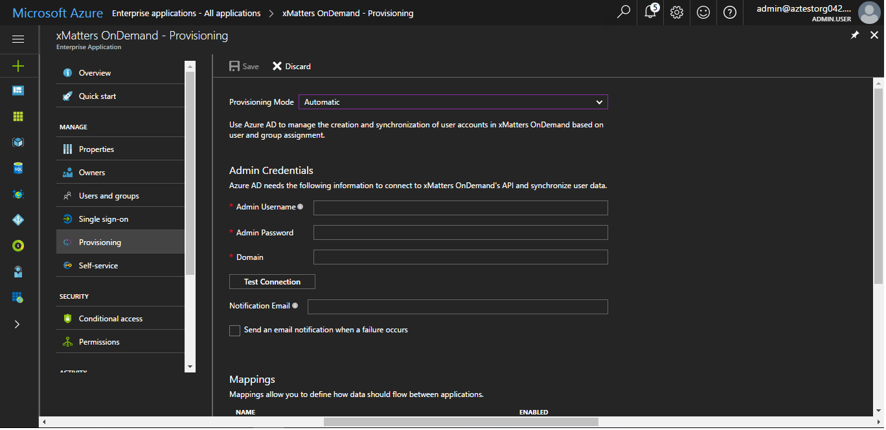

# Tutorial: Configuring Xmatters for Automatic User Provisioning

The objective of this tutorial is to show you the steps you need to perform in Xmatters and Azure AD to automatically provision and de-provision user accounts from Azure AD to Xmatters. 

## Prerequisites

The scenario outlined in this tutorial assumes that you already have the following items:

*   An Azure Active Active directory tenant
*   A user account in Xmatters with Admin permissions 

Note: The Azure AD provisioning integration relies on the [Xmatters REST API](https://help.xmatters.com/xmAPI/#xmatters-rest-api).

## Assigning users to Xmatters

Azure Active Directory uses a concept called "assignments" to determine which users should receive access to selected apps. In the context of automatic user account provisioning, only the users and groups that have been "assigned" to an application in Azure AD will be synchronized. 

Before configuring and enabling the provisioning service, you will need to decide what users and/or groups in Azure AD represent the users who need access to your Xmatters app. Once decided, you can assign these users to your Xmatters app by following the instructions here:

[Assign a user or group to an enterprise app](active-directory-coreapps-assign-user-azure-portal.md)

### Important tips for assigning users to Xmatters

*	It is recommended that a single Azure AD user be assigned to Xmatters to test the provisioning configuration. Additional users and/or groups may be assigned later.

*	When assigning a user to Xmatters, you must select either the **User** role, or another valid application-specific role (if available) in the assignment dialog. Note that the **Default Access** role does not work for provisioning, and these users will be skipped.

## Configuring user provisioning to Xmatters 

This section guides you through connecting your Azure AD to Xmatters's user account provisioning API, and configuring the provisioning service to create, update and disable assigned user accounts in Xmatters based on user and group assignment in Azure AD.

**Tip:** You may also choose to enabled SAML-based Single Sign-On for Xmatters, following the instructions provided in [Azure portal](https://portal.azure.com). Single sign-on can be configured independently of automatic provisioning, though these two features compliment each other.

### To configure automatic user account provisioning to Xmatters in Azure AD:

1)	In the [Azure portal](https://portal.azure.com), browse to the **Azure Active Directory > Enterprise Apps > All applications**  section.

2) If you have already configured Xmatters for single sign-on, search for your instance of Xmatters using the search field. Otherwise, select **Add** and search for **Xmatters** in the application gallery. Select Xmatters from the search results, and add it to your list of applications.

3)	Select your instance of Xmatters, then select the **Provisioning** tab.

4)	Set the **Provisioning Mode** to **Automatic**.

5)	Under the **Admin Credentials** section, input the **Admin Username&Admin Password&Domain** of your Xmatters's account. 

6) In the Azure portal, click **Test Connection** to ensure Azure AD can connect to your Xmatters app. If the connection fails, ensure your Xmatters account has Team Admin permissions and try step 5 again.

7) Enter the email address of a person or group who should receive provisioning error notifications in the **Notification Email** field, and check the checkbox below.

8) Click **Save**. 

9) Under the Mappings section, select **Synchronize Azure Active Directory Users to Xmatters**.

10) In the **Attribute Mappings** section, review the user attributes that will be synchronized from Azure AD to Xmatters. Note that the attributes selected as **Matching** properties will be used to match the user accounts in Xmatters for update operations. Select the Save button to commit any changes.

11) To enable the Azure AD provisioning service for Xmatters, change the **Provisioning Status** to **On** in the **Settings** section

12) Click **Save**. 

This will start the initial synchronization of any users and/or groups assigned to Xmatters in the Users and Groups section. Note that the initial sync will take longer to perform than subsequent syncs, which occur approximately every 20 minutes as long as the service is running. You can use the **Synchronization Details** section to monitor progress and follow links to provisioning activity reports, which describe all actions performed by the provisioning service.

For more information on how to read the Azure AD provisioning logs, see [Reporting on automatic user account provisioning](https://docs.microsoft.com/en-us/azure/active-directory/active-directory-saas-provisioning-reporting).

## Additional Resources

* [Managing user account provisioning for Enterprise Apps](active-directory-enterprise-apps-manage-provisioning.md)
* [What is application access and single sign-on with Azure Active Directory?](active-directory-appssoaccess-whatis.md)

## Next steps

* [Learn how to review logs and get reports on provisioning activity](active-directory-saas-provisioning-reporting.md)
