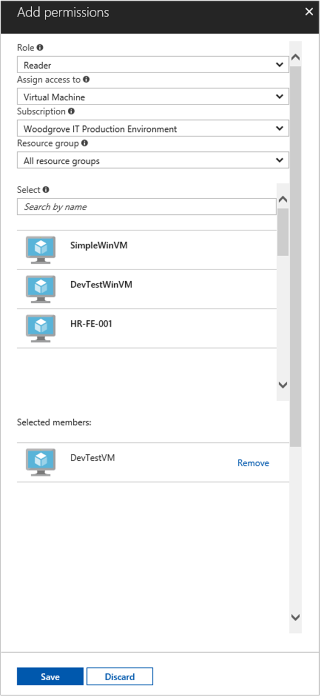

# Use Managed Service Identity with a Linux VM to access Azure Resource Manager

[!INCLUDE[preview-notice](../../includes/active-directory-msi-preview-notice.md)]

This tutorial shows you how to enable Managed Service Identity (MSI) for a Linux Virtual Machine, and then use that identity to access the Azure Resource Manager API. Managed Service Identities are automatically managed by Azure and enable you to authenticate to services that support Azure AD authentication without needing to insert credentials into your code. 
You learn how to:

> [!div class="checklist"]
> * Enable MSI on a Linux Virtual Machine 
> * Grant your VM access to a Resource Group in Azure Resource Manager 
> * Get an access token using the VM identity and use it to call Azure Resource Manager 


If you don't have an Azure subscription, create a [free account](https://azure.microsoft.com/free/?WT.mc_id=A261C142F) before you begin.

## Sign in to Azure

Sign in to the Azure portal at [https://portal.azure.com](https://portal.azure.com).

## Create a Linux Virtual Machine in a new Resource Group

For this tutorial, we create a new Linux VM. You can also enable MSI on an existing VM.

1. Click the **New** button found on the upper left-hand corner of the Azure portal.
2. Select **Compute**, and then select **Ubuntu Server 16.04 LTS**.
3. Enter the virtual machine information. For **Authentication type**, select **SSH public key** or **Password**. The created credentials will allow you to login to the VM.

    

4. Choose a **Subscription** for the virtual machine in the dropdown.
5. To select a new **Resource Group** you would like the virtual machine to be created in, choose **Create New**. When complete, click **OK**.
6. Select the size for the VM. To see more sizes, select **View all** or change the Supported disk type filter. On the settings blade, keep the defaults and click **OK**.

## Enable MSI on your VM

A Virtual Machine MSI enables you to get access tokens from Azure AD without you needing to put credentials into your code. Under the covers, enabling MSI does two things: it installs the MSI VM extension on your VM and it enables MSI for the VM.  

1. Select the **Virtual Machine** that you want to enable MSI on.
2. On the left navigation bar click **Configuration**.
3. You will see **Managed Service Identity**. To register and enable the MSI, select **Yes**, if you wish to disable it, choose No.
4. Ensure you click **Save** to save the configuration.

    

5. If you wish to check which extensions are on this **Linux VM**, click **Extensions**. If MSI is enabled, the **ManagedIdentityExtensionforLinux** will appear on the list.

    

## Grant your VM access to a Resource Group in Azure Resource Manager 

Using MSI your code can get access tokens to authenticate to resources that support Azure AD authentication. The Azure Resource Manager API supports Azure AD authentication. First, we need to grant this VM's identity access to a resource in Azure Resource Manager, in this case the Resource Group in which the VM is contained.  

1. Navigate to the tab for **Resource Groups**.
2. Select the specific **Resource Group** you created earlier.
3. Go to **Access control(IAM)** in the left panel.
4. Click to **Add** a new role assignment for your VM. Choose **Role** as **Reader**.
5. In the next dropdown, **Assign access to** the resource **Virtual Machine**.
6. Next, ensure the proper subscription is listed in the **Subscription** dropdown. And for **Resource Group**, select **All resource groups**.
7. Finally, in **Select** choose your Linux Virtual Machine in the dropdown and click **Save**.

    

## Get an access token using the VM Identity and use it to call Resource Manager 

To complete these steps, you will need an SSH client. If you are using Windows, you can use the SSH client in the [Windows Subsystem for Linux](https://msdn.microsoft.com/commandline/wsl/about). 

1. In the portal, navigate to your Linux VM and in the **Overview**, click **Connect**.  
2. **Connect** to the VM with the SSH client of your choice. 
3. In the terminal window, using CURL, make a request to the local MSI endpoint to get an access token for Azure Resource Manager.  
 
    The CURL request for the access token is below.  
    
    ```bash
    curl http://localhost:50342/oauth2/token --data "resource=https://management.azure.com/" -H Metadata:true   
    ```
    
    > [!NOTE]
    > The value of the “resource” parameter must be an exact match for what is expected by Azure AD.  In the case of the Resource Manager resource ID, you must include the trailing slash on the URI. 
    
    The response includes the access token you need to access Azure Resource Manager. 
    
    Response:  

    ```bash
    {"access_token":"eyJ0eXAiOiJKV1QiLCJhbGciOiJSUzI1NiIsIng1dCI6IkhIQnlLVS0wRHFBcU1aaDZaRlBkMlZXYU90ZyIsImtpZCI6IkhIQnlLVS0wRHFBcU1aaDZaRlBkMlZXYU90ZyJ9.eyJhdWQiOiJodHRwczovL21hbmFnZW1lbnQuYXp1cmUuY29tIiwiaXNzIjoiaHR0cHM6Ly9zdHMud2luZG93cy5uZXQvNzJmOTg4YmYtODZmMS00MWFmLTkxYWItMmQ3Y2QwMTFkYjQ3LyIsImlhdCI6MTUwNDEyNjYyNywibmJmIjoxNTA0MTI2NjI3LCJleHAiOjE1MDQxMzA1MjcsImFpbyI6IlkyRmdZTGg2dENWSzRkSDlGWGtuZzgyQ21ZNVdBZ0E9IiwiYXBwaWQiOiI2ZjJmNmU2OS04MGExLTQ3NmEtOGRjZi1mOTgzZDZkMjUxYjgiLCJhcHBpZGFjciI6IjIiLCJpZHAiOiJodHRwczovL3N0cy53aW5kb3dzLm5ldC83MmY5ODhiZi04NmYxLTQxYWYtOTFhYi0yZDdjZDAxMWRiNDcvIiwib2lkIjoiMTEyODJiZDgtMDNlMi00NGVhLTlmYjctZTQ1YjVmM2JmNzJlIiwic3ViIjoiMTEyODJiZDgtMDNlMi00NGVhLTlmYjctZTQ1YjVmM2JmNzJlIiwidGlkIjoiNzJmOTg4YmYtODZmMS00MWFmLTkxYWItMmQ3Y2QwMTFkYjQ3IiwidXRpIjoib0U5T3JVZFJMMHVKSEw4UFdvOEJBQSIsInZlciI6IjEuMCJ9.J6KS7b9kFgDkegJ-Vfff19LMnu3Cfps4dL2uNGucb5M76rgDM5f73VO-19wZSRhQPxWmZLETzN3SljnIMQMkYWncp79MVdBud_xqXYyLdQpGkNinpKVJhTo1j1dY27U_Cjl4yvvpBTrtH3OX9gG0GtQs7PBFTTLznqcH3JR9f-bTSEN4wUhalaIPHPciVDtJI9I24_vvMfVqxkXOo6gkL0mEPfpXZRLwrBNd607AzX0KVmLFrwA1vYJnCV-sSV8bwTh2t6CVEj240t0iyeVWVc2usJ0NY2rxPzKd_UckQ_zzrECG3kS4vuYePKz6GqNJFVzm2w2c61lX0-O1CwvQ9w","refresh_token":"","expires_in":"3599","expires_on":"1504130527","not_before":"1504126627","resource":"https://management.azure.com","token_type":"Bearer"} 
    ```
    
    You can use this access token to access Azure Resource Manager, for example to read the details of the Resource Group to which you previously granted this VM access. Replace the values of <SUBSCRIPTION ID>, <RESOURCE GROUP>, and <ACCESS TOKEN> with the ones you created earlier. 
    
    > [!NOTE]
    > The URL is case sensitive, so ensure if you are using the exact same case as you used earlier when you named the Resource Group, and the uppercase “G” in “resourceGroup”.  
    
    ```bash 
    curl https://management.azure.com/subscriptions/<SUBSCRIPTION ID>/resourceGroups/<RESOURCE GROUP>?api-version=2016-09-01 -H "Authorization: Bearer <ACCESS TOKEN>" 
    ```
    
    The response back with the specific Resource Group information: 
     
    ```bash
    {"id":"/subscriptions/98f51385-2edc-4b79-bed9-7718de4cb861/resourceGroups/DevTest","name":"DevTest","location":"westus","properties":{"provisioningState":"Succeeded"}} 
    ```
     
## Related content

- For an overview of MSI, see [Managed Service Identity overview](../active-directory/msi-overview.md).

Use the following comments section to provide feedback and help us refine and shape our content.

