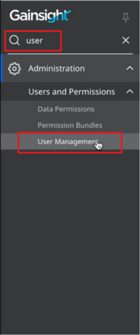
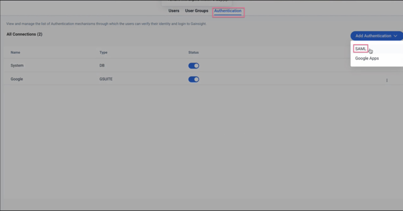
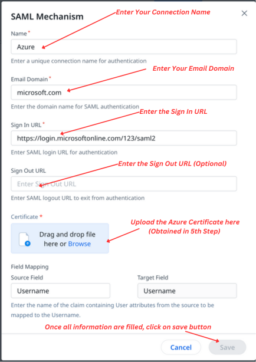
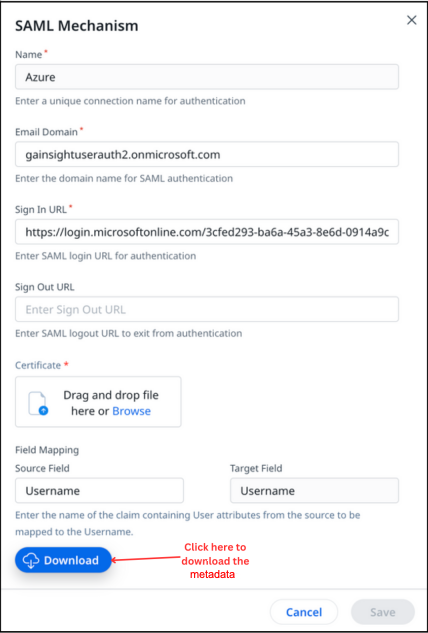

# Azure Active Directory SSO integration with Gainsight

In this article, you'll learn how to integrate Gainsight with Azure Active Directory (Azure AD). Use Azure AD to manage user access and enable single sign-on with Gainsight. Requires an existing Gainsight subscription. When you integrate Gainsight with Azure AD, you can:

* Control in Azure AD who has access to Gainsight.
* Enable your users to be automatically signed-in to Gainsight SAML with their Azure AD accounts.
* Manage your accounts in one central location - the Azure portal.

You'll configure and test Azure AD single sign-on for Gainsight in a test environment. Gainsight supports both **SP** and **IDP** initiated single sign-on.

## Prerequisites

To integrate Azure Active Directory with Gainsight, you need:

* An Azure AD user account. If you don't already have one, you can [Create an account for free](https://azure.microsoft.com/free/?WT.mc_id=A261C142F).
* One of the following roles: Global Administrator, Cloud Application Administrator, Application Administrator, or owner of the service principal.
* An Azure AD subscription. If you don't have a subscription, you can get a [free account](https://azure.microsoft.com/free/).
* Gainsight single sign-on (SSO) enabled subscription.

## Add application and assign a test user

Before you begin the process of configuring single sign-on, you need to add the Gainsight application from the Azure AD gallery. You need a test user account to assign to the application and test the single sign-on configuration.

### Add Gainsight SAML from the Azure AD gallery

Add Gainsight SAML from the Azure AD application gallery to configure single sign-on with Gainsight SAML. For more information on how to add application from the gallery, see the [Quickstart: Add application from the gallery](https://learn.microsoft.com/en-us/azure/active-directory/manage-apps/overview-application-gallery).

### Create and assign Azure AD test user

Follow the guidelines in the [create and assign a user account](https://learn.microsoft.com/en-us/azure/active-directory/manage-apps/add-application-portal-assign-users) article to create a test user account in the Azure portal called B.Simon.

Alternatively, you can also use the [Enterprise App Configuration Wizard](https://portal.office.com/AdminPortal/home?Q=Docs#/azureadappintegration). In this wizard, you can add an application to your tenant, add users/groups to the app, and assign roles. The wizard also provides a link to the single sign-on configuration pane in the Azure portal. [Learn more about Microsoft 365 wizards.](https://learn.microsoft.com/en-us/microsoft-365/admin/misc/azure-ad-setup-guides).

## Configure Azure AD SSO

Complete the following steps to enable Azure AD single sign-on in the Azure portal.

1. In the Azure portal, on the **Gainsight SAML** application integration page, find the **Manage** section and select **single sign-on**.
2. On the **Select a single sign-on method** page, select **SAML**.
3. Provide any dummy url like (https://gainsight.com) in the Identifier (Entity ID) and Reply URL (Assertion Consumer Service URL).
4. On the **Set-up single sign-on with SAML** page, in the **SAML Signing Certificate** section, find **Certificate (Base64)** and select **Download** to download the certificate and save it on your computer.

   

5. On the **Set up Gainsight SAML** section, copy the **Login URL**.

   

6. Now on the Gainsight Side, Navigate to **User Management** and click on **Authentication** tab, Create a New **SAML** Authentication.

     ## Setup SAML 2.0 Authentication in Gainsight: 
   SAML 2.0 Authentication allows the users to login to Gainsight via Azure AD. Once Gainsight is configured to authenticate via SAML 2.0, users who want to access Gainsight will no longer be prompted to enter a username or password. Instead, an exchange between Gainsight and Azure AD occurs that grants Gainsight access to the users.

    **To configure SAML 2.0 Authentication:**

    1. Login to your **Gainsight** Instance.  
    2. Click on the **search bar** on the left side.  
       
    3. Type in **User Management** in the search bar then click on the **User Management** Page.  
       
    4. Click on the **Authentication** tab
       
    5. Click Add **AUTHENTICATION** and select **SAML**. The SAML Mechanism window appears.  
       

    6. For more info on SAML creation click on the link - [GAINSIGHT SAML](https://support.gainsight.com/Gainsight_NXT/01Onboarding_and_Implementation/Onboarding_for_Gainsight_NXT/Login_and_Permissions/03Gainsight_Authentication)

7. Provide a **Name**, **Email domain**, **Sign In URL** (Login URL obtained in previous Step), Upload the **certificate**(Obtained in previous step), Save the changes.  
   
8. Reopen the new **SAML** Authentication by click on edit on the newly created connection, and download the **metadata**. Open the **metadata** file in your favourite Editor, and copy **entityID** and **Assertion Consumer Service Location URL**.
   
9. Now back to Azure Portal, On the **Set up single sign-on with SAML** page, select the pencil icon for **Basic SAML Configuration** to edit the settings.

   

10. On the **Basic SAML Configuration** section, perform the following steps:

    a. In the **Identifier** textbox, type in the **entityID** (obtained in previous step), it would be in one of the following patterns:

    | **Identifier**  |
    | ------------- |
    | `urn:auth0:gainsight:<ID>`  |
    | `urn:auth0:gainsight-eu:<ID>`  |

    b. In the **Reply URL** textbox, type in **Assertion Consumer Service Location URL** ((obtained in previous step), it would be in one of the following patterns:

    | **Reply URL**  |
    | ------------- |
    | `https://secured.gainsightcloud.com/login/callback?connection=<ID>`  |
    | `https://secured.eu.gainsightcloud.com/login/callback?connection=<ID>`  |

11. Perform the following step, if you wish to configure the application in **SP** initiated mode:

    In the **Sign on URL** textbox, type a URL using one of the following patterns:

    | **Sign on URL**  |
    | ------------- |
    | `https://secured.gainsightcloud.com/samlp/<ID>`  |
    | `https://secured.eu.gainsightcloud.com/samlp/<ID>`  |

    > [!NOTE]
    > These values are not real. Update these values with the actual Identifier, Reply URL and Sign on URL. Contact [Gainsight support team](mailto:support@gainsight.com) to get these values. You can also refer to the patterns shown in the **Basic SAML Configuration** section in the Azure portal.

### Create Gainsight SAML test user

In this section, you create a user called Britta Simon at Gainsight SAML SSO. Work with [Gainsight SAML support team](mailto:support@gainsight.com) to add the users in the Gainsight SAML SSO platform. Users must be created and activated before you use single sign-on.

## Test SSO

In this section, you test your Azure AD single sign-on configuration with following options.

#### SP initiated:

* Click on **Test this application** in Azure portal. This will redirect to Gainsight Sign-on URL where you can initiate the login flow.

* Go to Gainsight SAML Sign-on URL directly and initiate the login flow from there.

#### IDP initiated:

* Click on **Test this application** in Azure portal and you should be automatically signed in to the Gainsight SAML for which you set up the SSO.

You can also use Microsoft My Apps to test the application in any mode. When you click the Gainsight SAML tile in the My Apps, if configured in SP mode you would be redirected to the application sign-on page for initiating the login flow and if configured in IDP mode, you should be automatically signed in to the Gainsight SAML for which you set up the SSO. For more information about the My Apps, see [Introduction to the My Apps](../user-help/my-apps-portal-end-user-access.md).

## Additional resources

* [What is single sign-on with Azure Active Directory?](../manage-apps/what-is-single-sign-on.md)
* [Plan a single sign-on deployment](../manage-apps/plan-sso-deployment.md).

## Next steps

Once you configure Gainsight SAML you can enforce session control, which protects exfiltration and infiltration of your organization’s sensitive data in real time. Session control extends from Conditional Access. [Learn how to enforce session control with Microsoft Cloud App Security](/cloud-app-security/proxy-deployment-aad).
