# Azure Marketplace Mailjet User Guide


## Overview

This guide demonstrates how to  perform common programming tasks with the Mailjet email service on Azure. The samples are written in C# and support .NET Standard 1.1 (.NET Core 1.0 and .NET Framework 4.5). The scenarios covered include creating and sending email, sending emails to multiple recipients, using already created templates and using template language for email personalization. For more information on Mailjet and sending emails, see the [Next Steps](#next-steps) section.

## What is the Mailjet Email Service?

Mailjet is a cloud-based email service, which allows you to easily create and send transactional emails, as well as marketing campaigns. The Mailjet services comply with European data privacy regulations and are commonly used to:
- Create, maintain and update customer contact lists;
- Create and send out campaigns for monthly newsletters, promotions and discounts on goods;
- Automatically send purchase confirmations to customers, or remind them of items they left in their shopping carts;
- Create and set up automatic emails for forgotten sign-in details or Welcome messages;
- Review the success of campaigns in real time, based on metrics like customer engagement (opens, clicks), bounces, unsubscriptions etc

In addition, Mailjet also offers an integrated [MJML](http://www.mjml.io/) framework to create responsive HTML email templates.

Azure end users can benefit from Mailjet’s [REST-ful API](https://dev.mailjet.com/), [SMTP relay](https://www.mailjet.com/features/smtp-relay.html/?utm_source=Partners&utm_medium=IntegrationsAzureDoc&utm_campaign=AzureDoc?p=azuredoc) and optimized deliverability to:
- send and receive timely messages and alerts;
- parse inbound traffic;
- track email events in realtime;
- receive alerts and notifications in real time for unusual sending volume, timing, statistics and errors;
- synchronise their data back into their applications hosted on Azure.

For more information please visit [https://www.mailjet.com/azure/](https://www.mailjet.com/azure?utm_source=Partners&utm_medium=IntegrationsAzureDoc&utm_campaign=AzureDoc&p=azuredoc).

## Enabling Mailjet on Azure

Azure users can take advantage of the variety of Mailjet subscription options, from 25,000 emails monthly for the Mailjet Free plan, to 2,500,000 monthly for the Diamond plan. All subscription options (including the Free plan) will give you access to the Mailjet API, SMTP Relay and Responsive Marketing Tool; Tracking, Advanced Reporting and Personalisation options; Unlimited Contacts and Global Deliverability.

### To Install Mailjet Email Service in Azure

1. Log into your [Azure account](http://portal.azure.com/), click on **New**.


2. Once there, enter **Mailjet** in the search bar and select the **Mailjet Email Service** result:


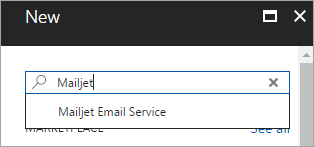


3. Click on **Create** to start the sign-up.


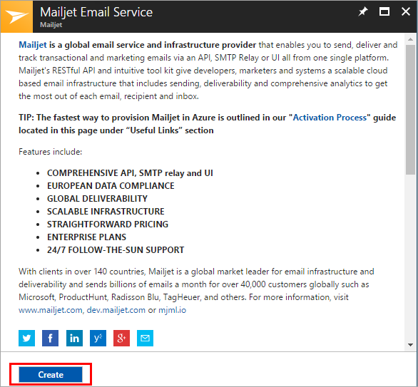

4. You will now need to submit a **Name** to identify the Mailjet Email Service in your Azure settings. The name needs to be between 2 and 64 characters long and alphanumeric. It must start with a letter.


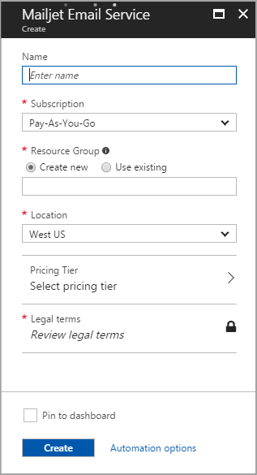

5. Select your **Subscription**.
6. Choose an existing **Resource Group** for the Mailjet Email Service, or create a new one. Keep in mind that the Resource Group name should be up to 90 characters long, can only include alphanumeric characters, periods, underscores, hyphens and parenthesis. It cannot end in a period.
7. Select your **Location**.
8. Choose a **Pricing Tier**. When you click on each plan, you will see the features it contains. There will also be an option for you to enter a promotional code, in case you have one. After reviewing the features and entering the code, click on **OK** and then on **Select** to submit your choice.


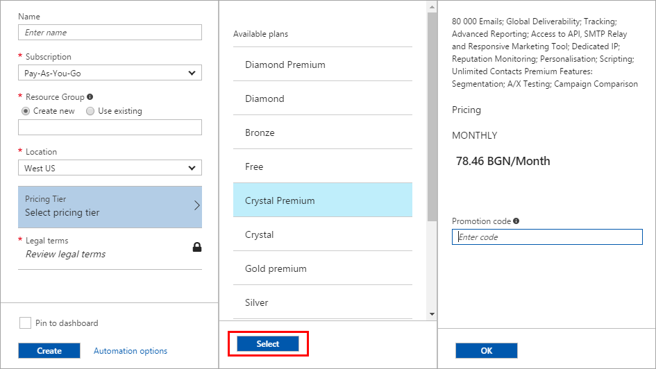

9. Click on **Review Legal Terms**. Read and review the Terms and click on **Purchase** to accept them.


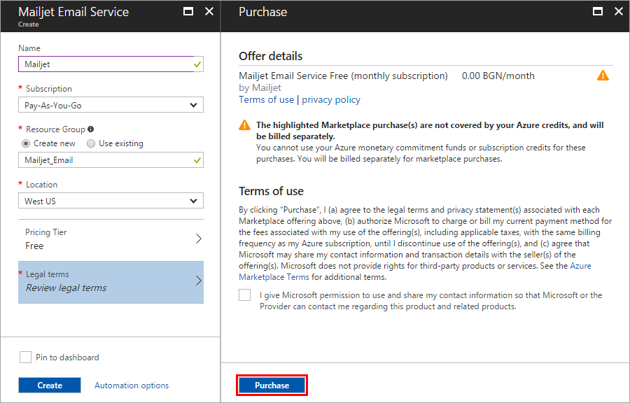


10. Tick the **Pin to dashboard** checkbox to be able to find the Mailjet resource more easily after the deployment.

11. Click on **Create** to start the deployment.


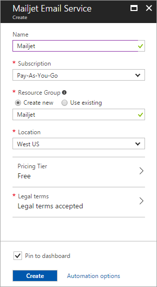

12. Once the deployment has finished, you will see a **Deployment Succeeded** pop-up notification. You will be able to find the Mailjet resource on the **Dashboard**, if the Pin to Dashboard option has been selected during the setup. Otherwise, you will find it in the **All Resources** section of the main menu.


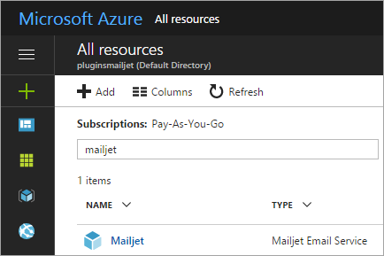

Any status updates or errors encountered during the deployment will be listed in the **Notifications** area on the Azure home screen.


### To find your Mailjet API Keys

1. Access the Mailjet configuration screen from Azure, then click on **Manage**.


2. You will arrive at your **Mailjet Account Settings** page.


3. Under **REST API**, click on **Master API key & Sub API key management**.


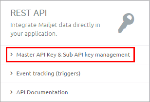

4. You will see your **Public** and **Secret API Key** here. You will also see any Sub-account API Keys that may have been added.


### To Configure Mailjet for Use

Once Mailjet is deployed successfully, you will need to complete several steps on the Mailjet side to be able to send your first email.

1. Click on **Manage** to access your Mailjet Account Settings.


2. Validate a Sender Address for your newly provisioned Mailjet resource. To do this, click on **Add a Sender Domain or Address** from your Account page.

**You will not be able to send any emails before your Sender email address or domain is registered and validated.**


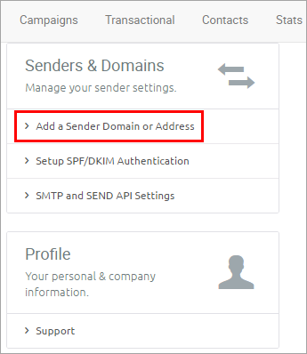

3. Then **add a new sender address**. If you want to use many email addresses linked to the same top level domain, you can **add the domain** instead. For more information, please see the Mailjet [FAQ](https://app.mailjet.com/support/am-i-limited-to-one-email-sending-address,96.htm?utm_source=Partners&utm_medium=IntegrationsAzureDoc&utm_campaign=AzureDoc&p=azuredoc).


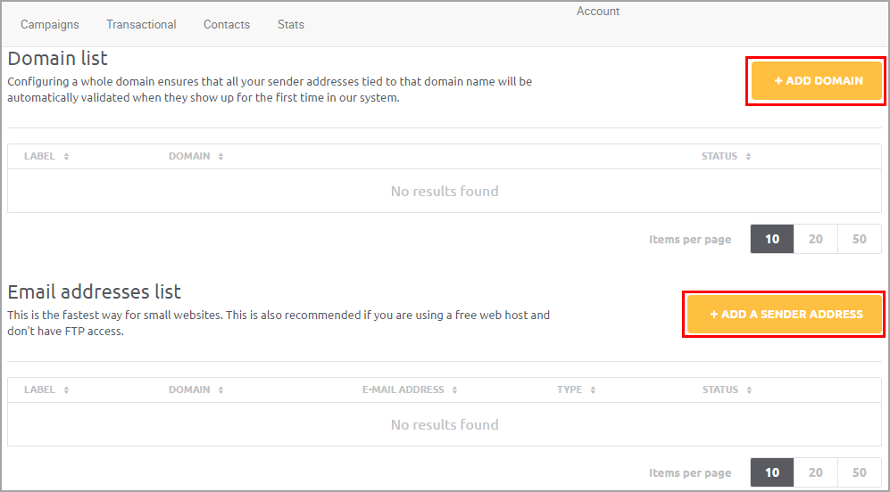

4. It is highly recommended to also [configure your SPF and DKIM records](https://www.mailjet.com/docs/getting_started#getstarted-general-spfdkim) to highly improve the deliverability of your emails.
5. You can also decide whether or not to use Mailjet’s [open and click tracking](https://www.mailjet.com/docs/getting_started#getstarted-general-tracking) (by default the ‘open’ and ‘click’ tracking is activated). To change your tracking, simply click on **Settings** in the **Account Section > Account Preferences**.


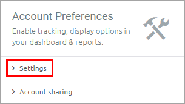


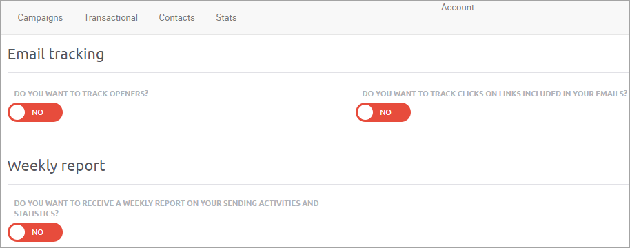

You can also [customize the tracking links](https://www.mailjet.com/docs/getting_started#getstarted-general-links) to improve your deliverability and make it more attractive to your customers.

## How To: Reference the Mailjet .NET Class Library

The **Mailjet NuGet Package** is an easy way to retrieve the Mailjet API and configure your application with all dependencies. NuGet is a Visual Studio extension that facilitates installing and updating tools and libraries. It is included with Microsoft Visual Studio 2015 and above.

>[!NOTE]
>To install NuGet when running an earlier version than Microsoft Visual Studio 2015, please visit http://www.nuget.org  and click on **Install NuGet**.

To install the Mailjet NuGet package, follow these instructions:

1. In Visual Studio, click on **New Project**, then choose a **Template**.


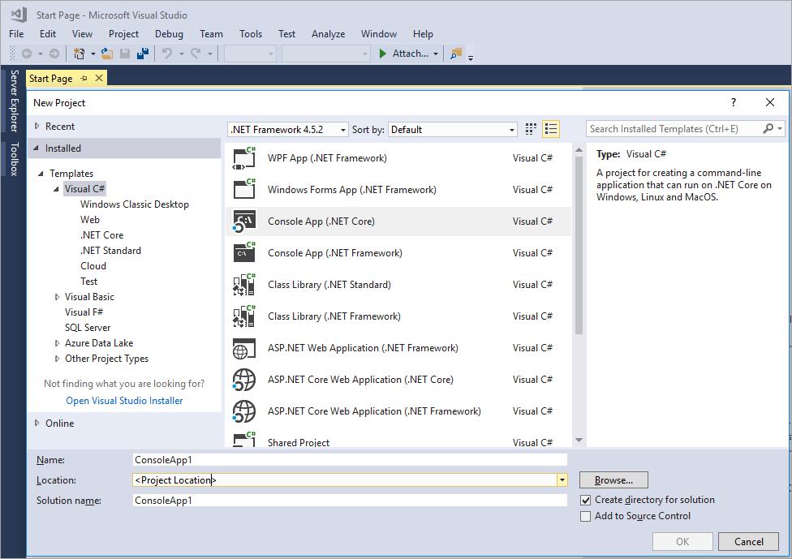

2. In Visual Studio, go to **Tools > NuGet Package Manager > Package Manager Console** to open the Console.


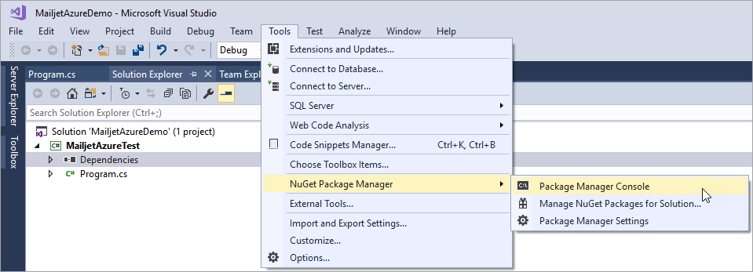

3. Select the Project from the **Default Project** menu, then enter **Install-Package Mailjet.Api** in the Console to install it.


4. Once installed, you will be able to view the installed dependency under **Dependencies > NuGet > Mailjet.Api**.


Mailjet.Api is the name of Mailjet’s .NET class library. It contains the following namespaces:
- **Mailjet.Client**
- **Mailjet.Client.Resources**

Add the following code namespace declarations at the start of a C# file, in which you want to programmatically access the Mailjet Email Service.

```csharp
using Mailjet.Client;
using Mailjet.Client.Resources;
```

## Code Examples

In the following sections you will find examples of using the Mailjet .NET library to create and send an email. You will also see other features, like adding an attachment or sending to several recipients. For more information please visit the [Mailjet .NET repo](https://github.com/mailjet/mailjet-apiv3-dotnet) on GitHub and the Mailjet [Developer Zone](https://dev.mailjet.com).

### How To: Send a Basic Email

In order to send an email using the **Mailjet Send API v3.0**, you need at least the following mandatory properties:

- `FromEmail`: a verified Sender address;
- `Recipients`: collection of  email addresses to send the message to;
- `TextPart` and/or `HtmlPart`: content of the message sent in text or HTML format. At least one of these content types needs to be specified. When `HtmlPart` is the only content provided, Mailjet will not generate a text part from the HTML version.

You can use the following code:

```csharp
using Mailjet.Client;
using Mailjet.Client.Resources;
using System;
using Newtonsoft.Json.Linq;
namespace MailjetAzureTest
{
   class Program
   {
      static void Main(string[] args)
      {
         RunAsync().Wait();
      }
      static async Task RunAsync()
      {
         MailjetClient client = new MailjetClient(Environment.GetEnvironmentVariable("MJ_APIKEY_PUBLIC"), Environment.GetEnvironmentVariable("MJ_APIKEY_PRIVATE"));
/// substitute MJ_APIKEY_PUBLIC and MJ_APIKEY_PRIVATE with your Public and Secret API Keys
         MailjetRequest request = new MailjetRequest
         {
            Resource = Send.Resource,
         }
            .Property(Send.FromEmail, "pilot@mailjet.com")
/// replace pilot@mailjet.com with the sender email address
            .Property(Send.FromName, "Mailjet Pilot")
            .Property(Send.Subject, "Your email flight plan!")
            .Property(Send.TextPart, "Dear passenger, welcome to Mailjet! May the delivery force be with you!")
            .Property(Send.HtmlPart, "<h3>Dear passenger, welcome to Mailjet!</h3><br />May the delivery force be with you!")
            .Property(Send.Recipients, new JArray {
                new JObject {
                 {"Email", "passenger@mailjet.com"}
/// replace passenger@mailjet.com with the recipient email address
                 }
                });
         MailjetResponse response = await client.PostAsync(request);
         if (response.IsSuccessStatusCode)
         {
            Console.WriteLine(string.Format("Total: {0}, Count: {1}\n", response.GetTotal(), response.GetCount()));
            Console.WriteLine(response.GetData());
         }
         else
         {
            Console.WriteLine(string.Format("StatusCode: {0}\n", response.StatusCode));
            Console.WriteLine(string.Format("ErrorInfo: {0}\n", response.GetErrorInfo()));
            Console.WriteLine(string.Format("ErrorMessage: {0}\n", response.GetErrorMessage()));
         }
      }
   }
}
```
### How To: Send to Multiple Recipients

To send the same email to multiple contacts, add Email addresses in the `Recipients` list.  Optionally, in place of Recipients, you can use `To`, `Cc` and `Bcc` properties. `To`, `Cc` and `Bcc` can’t be used in conjunction with Recipients. The properties can contain several recipients separated by commas, using the one of following formats:

- `pilot@mailjet.com`
- `<pilot@mailjet.com>`
- `"Mailjet Pilot" <pilot@mailjet.com>`.

>[!NOTE]
>Recipients and To have different behaviors. The recipients listed in To will receive a common message, showing every other recipient. The recipients listed in Recipients will each receive a separate message, without showing all other recipients.

In the following example we have created a sending list using `Recipients`:

```csharp
.Property(Send.Recipients, new JArray {
                new JObject {
                 {"Email", "passenger1@mailjet.com"},
                 {"Name", "passenger 1"}
                 },
                new JObject {
                 {"Email", "passenger2@mailjet.com"},
                 {"Name", "passenger 2"}
                 }
                })
```

You can see the following example for creating a sending list using `To`, `Cc` and `Bcc`:

```csharp
.Property(Send.To, "Name <passenger@mailjet.com>, Name2 <passenger2@mailjet.com>")
.Property(Send.Cc, "Name3 <passenger3@mailjet.com>")
.Property(Send.Bcc, "Name4 <passenger4@mailjet.com>")
```
### How To: Send Using a Template

Mailjet offers to store your transactional and marketing  templates on its platform. You can use these templates in your transactional API call. This removes the need to repeat the content of a transactional message for each Send API call.

You can either create the templates via the Mailjet online drag-and-drop [Passport tool](https://www.mailjet.com/feature/passport/), or via the [/template](https://dev.mailjet.com/guides/#storing-a-template) API resource.

In the following example, `MjTemplateID` will be the Id provided by Passport at the end of your designing process, or the Id returned by the /template resource.

```csharp
            .Property(Send.MjTemplateID, "1")
```
### How to: Personalize a Template with Mailjet Templating Language

Mailjet offers a templating language for transactional messaging.  It lets you leverage conditions, loops, functions and the recipients’ various contact properties. This way you can easily create dynamic emails that adapt to recipients’ profiles. You can even go further by adding logic into your email to add / remove sections of the delivered message.

>[!NOTE]
>You must set the `MjTemplateLanguage` property in the payload provided to send API at true to have the templating language interpreted by Mailjet.

```csharp
           .Property(Send.MjTemplateLanguage, "True")
```

**Variables** can be used to insert contact-specific information into the template. They can be printed using the  `{{ ... }}` syntax or combined operators, in functions or control structures.

The following example shows **simple insertion of variables**, using the syntax `{{var:namevar:defaultvalue}}`. In this case we have inserted two variables - one for the day, and another to include a personalized message at the end of the email.

```csharp
         MailjetRequest request = new MailjetRequest
         {
            Resource = Send.Resource,
         }
            .Property(Send.FromEmail, "pilot@mailjet.com")
            .Property(Send.FromName, "Mailjet Pilot")
            .Property(Send.Subject, "Your email flight plan!")
            .Property(Send.TextPart, "Dear passenger, welcome to Mailjet! On this {{var:day:\"monday\"}}, may the delivery force be with you! {{var:personal_message:\"\"}}")
            .Property(Send.HtmlPart, "Dear passenger, welcome to Mailjet! On this {{var:day:\"monday\"}}, may the delivery force be with you! {{var:personal_message:\"\"}}")
            .Property(Send.Vars, new JObject {
                {"day", "Monday"}
                })
            .Property(Send.Recipients, new JArray {
                new JObject {
                 {"Email", "passenger1@mailjet.com"},
                 {"Name", "passenger 1"},
                 {"Vars", new JObject {
                     { "day", "Tuesday"},
                     { "personal_message", "Happy birthday!" },
                   }
                 }
                },
                new JObject {
                 {"Email", "passenger2@mailjet.com"},
                 {"Name", "passenger 2"}
                 }
                })
            .Property(Send.MjTemplateLanguage, "True");
```

As you can see, there is no `personal_message` value defined for our second recipient. This means that the default value - in this case an empty string - will be placed there instead.

You can use **Conditional Statements** (`if`, `else`, `elseif` and `endif`) to specify whether to include certain personalized details in the template or not.

```html
<html><body>

<ul>
    <li>{{data:age}}</li>
</ul>

</body></html>
```

You can also set conditional personalized messages:

```

    You can code, drink and vote!

    You can't drink, but you still can code and vote!

    A few more years to wait !!!

```

**For loop Statements** allow inserting an iteration on a JSON object or array in your template. The syntax is as follows:

```

  html or/and nested statement

```

On each iteration, the value of the current element from var:json_source is assigned to `variable_name`. `variable_name` can be used for display ( i.e. `{{ variable_name }}` ) or inside a nested statement. You can see the following example for a JSON payload:

```csharp
{
...
"Vars":{"x":[“foo”, “bar”, "Pilot"]}
...
}
```

You can use the loop statement to display the list of variables in the array, for example:

```html
<html><body>
<ul>

    <li>{{value}}</li>

</ul>
</body></html>
```

This approach can be applied to a multidimensional array.

For additional information on the Mailjet Template Language, please visit https://dev.mailjet.com/template-language/reference/.

## Additional Information and Code Samples

The Mailjet API features are numerous and we cannot go into all of them here. That is why in the following table we have provided links to different sections of the [Mailjet Developer Zone](https://dev.mailjet.com) for reference. We hope you find the information useful.

Section | Info Contained
|:-------|:-------|
[Transactional Mails](https://dev.mailjet.com/guides/#send-transactional-email) | Send transactional emails, attach files, personalization, add email headers, send transactional messages in bulk API call, group emails into campaign, Send API properties and errors, etc
[Template API](https://dev.mailjet.com/guides/#template-api) | Store an email template, use a stored template in Send API
[Send Marketing Campaigns](https://dev.mailjet.com/guides/#send-marketing-campaigns) | Create a contact list, add contacts in bulk, create and send a campaign, contact list segmentation, campaign statistics
[Event API](https://dev.mailjet.com/guides/#event-api-real-time-notifications) | Track events in real time (opens, clicks, email bounces etc)
[Statistics](https://dev.mailjet.com/guides/#statistics) | Statistics for specific sent messages or events, for specific period of time
[Inbound Processing](https://dev.mailjet.com/guides/#parse-api-inbound-emails) | Parse Inbound messages and deliver content to a webhook
[Manage Contacts](https://dev.mailjet.com/guides/#managing-contacts-in-bulk) | Bulk management of contact lists for marketing
[Real-Time Monitoring](https://dev.mailjet.com/guides/#real-time-monitoring) | Monitor transactional emails, create push alerts and notifications for unusual sending volume, timing, statistics and errors

## Next Steps

You can visit the Mailjet Getting Started Guide at: [https://www.mailjet.com/docs/getting_started](https://www.mailjet.com/docs/getting_started?utm_source=Partners&utm_medium=IntegrationsAzureDoc&utm_campaign=AzureDoc&p=azuredoc).

For all of the recommended configurations, please check out the Mailjet Developer Zone at [dev.mailjet.com](https://dev.mailjet.com/).

The SMTP Relay is useful if you have an existing solution for transactional email by SMTP, or if you cannot use the Send API. To find out how to configure an SMTP Relay to relay messages through the Mailjet SMTP, please [click here](https://dev.mailjet.com/guides/#postfix-installation).

As a new client you may need to send a high volume of emails right away. In such cases it is important to protect the sending reputation of your Azure Mailjet account. To find out how we can help you with this, please visit [this page](https://www.mailjet.com/guides/azure-mailjet-developer-resource-user-guide/#activating-your-mailjet-account).
