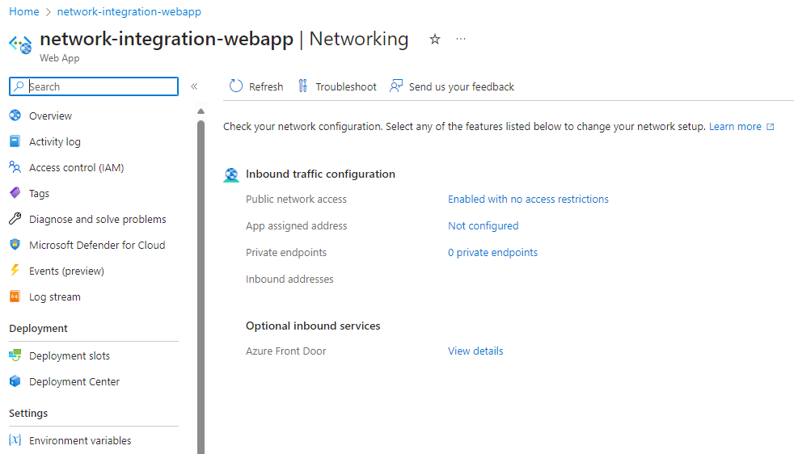
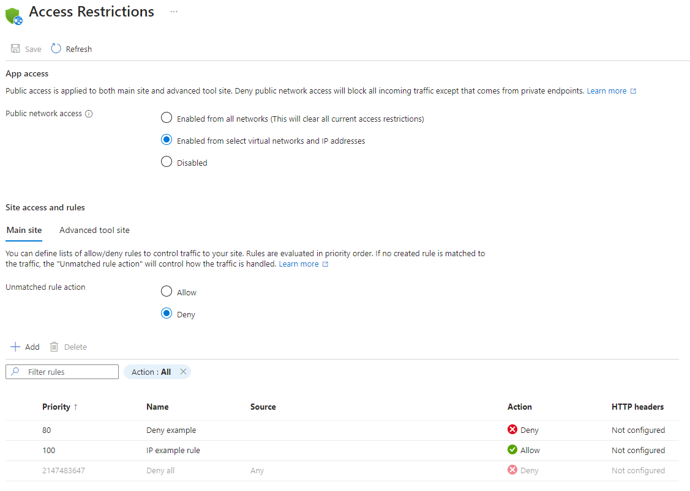
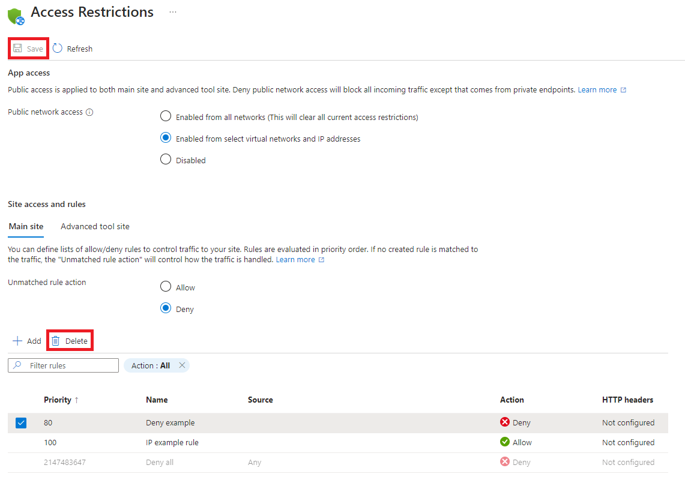
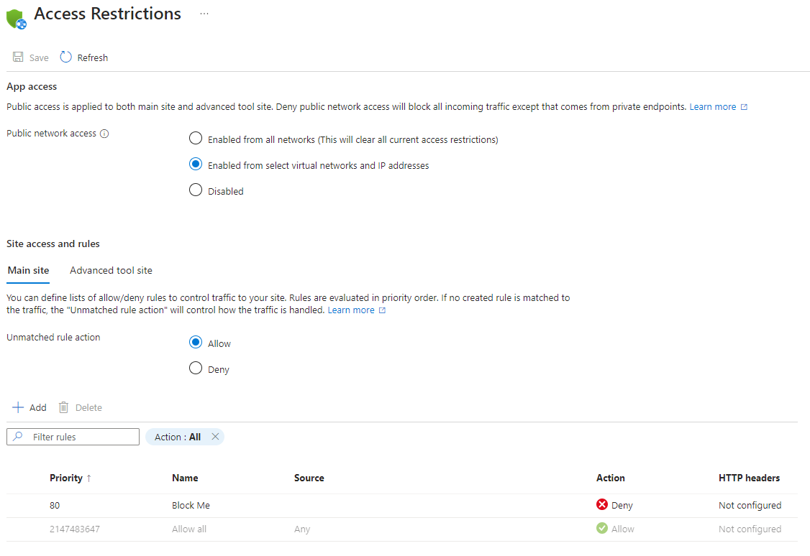

# Azure App Service Access Restrictions #

Access Restrictions enable you to define a priority ordered allow/deny list that controls network access to your app. The list can include IP addresses or Azure Virtual Network subnets. When there are one or more entries, there is then an implicit "deny all" that exists at the end of the list.

The Access Restrictions capability works with all App Service hosted work loads including; web apps, API apps, Linux apps, Linux container apps, and Functions.

When a request is made to your app, the FROM address is evaluated against the IP address rules in your access restrictions list. If the FROM address is in a subnet that is configured with service endpoints to Microsoft.Web, then the source subnet is compared against the virtual network rules in your access restrictions list. If the address is not allowed access based on the rules in the list, the service replies with an [HTTP 403](https://en.wikipedia.org/wiki/HTTP_403) status code.

The access restrictions capability is implemented in the App Service front-end roles, which are upstream of the worker hosts where your code runs. Therefore, access restrictions are effectively network ACLs.

The ability to restrict access to your web app from an Azure Virtual Network (VNet) is called [service endpoints][serviceendpoints]. Service endpoints enable you to restrict access to a multi-tenant service from selected subnets. It must be enabled on both the networking side as well as the service that it is being enabled with. It does not work to restrict traffic to apps that are hosted in an App Service Environment.  If you are in an App Service Environment, you can control access to your app with IP address rules.


## Adding and editing Access Restriction rules in the portal ##

To add an access restriction rule to your app, use the menu to open **Network**>**Access Restrictions** and click on **Configure Access Restrictions**

  

From the Access Restrictions UI, you can review the list of access restriction rules defined for your app.



The list will show all of the current restrictions that are on your app. If you have a VNet restriction on your app, the table will show if service endpoints are enabled for Microsoft.Web. When there are no defined restrictions on your app, your app will be accessible from anywhere.  

## Adding IP address rules

You can click on **[+] Add** to add a new access restriction rule. Once you add a rule, it will become effective immediately. Rules are enforced in priority order starting from the lowest number and going up. There is an implicit deny all that is in effect once you add even a single rule.

When creating a rule, you must select allow/deny and also the type of rule. You are also required to provide the priority value and what you are restricting access to.  You can optionally add a name, and description to the rule.  


To set an IP address based rule, select a type of IPv4 or IPv6. IP Address notation must be specified in CIDR notation for both IPv4 and IPv6 addresses. To specify an exact address, you can use something like 1.2.3.4/32 where the first four octets represent your IP address and /32 is the mask. The IPv4 CIDR notation for all addresses is 0.0.0.0/0. To learn more about CIDR notation, you can read [Classless Inter-Domain Routing](https://en.wikipedia.org/wiki/Classless_Inter-Domain_Routing). 

## Service endpoints

Service endpoints enables you to restrict access to selected Azure virtual network subnets. To restrict access to a specific subnet, create a restriction rule with a type of Virtual Network. You can pick the subscription, VNet, and subnet you wish to allow or deny access with. If service endpoints are not already enabled with Microsoft.Web for the subnet that you selected, it will automatically be enabled for you unless you check the box asking not to do that. The situation where you would want to enable it on the app but not the subnet is largely related to if you have the permissions to enable service endpoints on the subnet or not. If you need to get somebody else to enable service endpoints on the subnet, you can check the box and have your app configured for service endpoints in anticipation of it being enabled later on the subnet. 


Service endpoints cannot be used to restrict access to apps that run in an App Service Environment. When your app is in an App Service Environment, you can control access to your app with IP access rules. 

With service endpoints, you can configure your app with Application Gateways or other WAF devices. You can also configure multi-tier applications with secure backends. For more details on some of the possibilities, read [Networking features and App Service](networking-features.md).

## Managing access restriction rules

You can click on any row to edit an existing access restriction rule. Edits are effective immediately including changes in priority ordering.


When you edit a rule, you cannot change the type between an IP address rule and a Virtual Network rule. 


To delete a rule, click the **...** on your rule and then click **remove**.



## Blocking a single IP Address ##

When adding your first IP Restriction rule, the service will add an explicit **deny all** rule with a priority of 2147483647. In practice, the explicit **deny all** rule will be last rule executed and will block access to any IP address that is not explicitly allowed using an **Allow** rule.

For the scenario where users want to explicitly block a single IP address or IP address block, but allow everything else access, it is necessary to add an explicit **Allow All** rule.



## SCM site 

In addition to being able to control access to your app, you can also restrict access to the scm site used by your app. The scm site is the web deploy endpoint and also the Kudu console. You can separately assign access restrictions to the scm site from the app or use the same set for both the app and the scm site. When you check the box to have the same restrictions as your app, everything is blanked out. If you uncheck the box, whatever settings you had earlier on the scm site are applied. 


## Programmatic manipulation of access restriction rules ##

There currently is no CLI or PowerShell script for the new Access Restrictions capability but the values can be set manually with a PUT operation on the app configuration in Resource Manager. As an example, you can use resources.azure.com and edit the ipSecurityRestrictions block to add the required JSON.

The location for this information in Resource Manager is:

management.azure.com/subscriptions/**subscription ID**/resourceGroups/**resource groups**/providers/Microsoft.Web/sites/**web app name**/config/web?api-version=2018-02-01

The JSON syntax for the earlier example is:

    "ipSecurityRestrictions": [
      {
        "ipAddress": "131.107.159.0/24",
        "action": "Allow",
        "tag": "Default",
        "priority": 100,
        "name": "allowed access"
      }
    ],

Powershell example 
```powershell
$PropertiesObject = @"
{
   "ipSecurityRestrictions": [
      {
        "ipAddress": "131.107.159.0/24",
        "action": "Allow",
        "tag": "Default",
        "priority": 100,
        "name": "allowed access"
      }
    ]
}
"@ | ConvertFrom-Json 

Set-AzureRmResource -PropertyObject $PropertiesObject -ResourceGroupName $myResourceGroup -ResourceType Microsoft.Web/sites/config -ResourceName "$Website/web" -ApiVersion 2018-02-01 -Force
```

## Function App IP Restrictions

IP restrictions are available for both Function Apps with the same functionality as App Service plans. Enabling IP restrictions will disable the portal code editor for any disallowed IPs.

[Learn more here](../azure-functions/functions-networking-options.md#inbound-ip-restrictions)


<!--Links-->
[serviceendpoints]: https://docs.microsoft.com/azure/virtual-network/virtual-network-service-endpoints-overview
