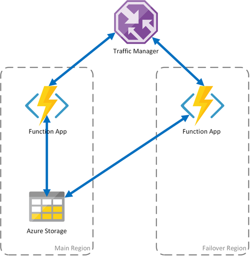
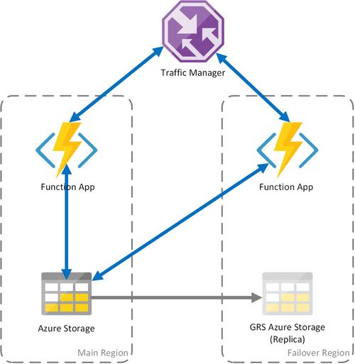

# Disaster Recovery and Geo-Distribution

## Overview

In Azure Durable Functions, all state is persisted in Azure Storage. A [task hub](durable-functions-task-hubs.md) is a logical container for Azure Storage resources that are used for orchestrations. Orchestrator and activity functions can only interact with each other when they belong to the same task hub.
The scenarios described in this article propose deployment options to increase availability and minimize downtime during disaster recovery activities.
It is important to notice that these scenarios are based on an Active-Passive configurations, since they are guided by the usage of Azure Storage.

> [!NOTE]
> All function apps that are redundantly deployed, must share the same function access keys in the case of being activated via HTTP. The Functions Runtime exposes a [management API](https://github.com/Azure/azure-functions-host/wiki/Key-management-API) that enables consumers to programmatically add, delete, and update function keys.

## Scenario 1 - Load Balanced Compute with Shared Storage

### Traffic Manager, Load Balanced Function Apps, single Storage account

In the event of problems of the compute service in Azure, the Function App could be affected. To minimize the possibility of such downtime, this scenario uses two instances of the Function App deployed to different regions. The underlying storage account and task hub are created in the main region, and it is shared by both instances.
Traffic Manager is configured to detect problems in the main site and automatically redirect traffic to the healthy Function App in the failover region.
Because Function App the failover region shares the same Azure Storage account and Task Hub, the state of the functions is not lost, and word can resume normally. Once the health is restored in the main region, Traffic Manager will start routing requests to that instance of the Function App automatically.

There are several benefits when using this deployment scenario:
- In the case of a failure in the compute layer, work can resume in the failover region without state loss.
- Traffic Manager takes care of the automatic failover to the healthy instance automatically.
- Traffic Manager automatically re-establishes traffic to the main Function App after the outage has been corrected.

However, consider the following when using this scenario.
- If the Function App is deployed using a dedicated AppService plan, there is an increased cost by replicating the compute instance in the failover datacenter.
- This scenario covers outages at the compute layer, but the storage account continues to be the single point of failure for the Function App. If there is a Storage outage, the application suffers a downtime.
- If the FunctionApp is failed over, there will be increased latency since it will access its storage account across regions.
- Accessing the storage service from a different region where it is located incurs in higher cost due to network egress traffic.
- This scenario depends on Traffic Manager. Considering [how Traffic Manager works](../traffic-manager/traffic-manager-overview#how-traffic-manager-works), it may be some time until a client application that consumes a Durable Function needs to re-query the FunctionApp address from Traffic Manager. 

## Scenario 2 - Load Balanced Compute with Regional Storage
### Traffic Manager, Load Balanced Function Apps, One Storage account per region
The previous proposed scenario covers only the case of failure in the compute services. If the storage service fails, it will result in an outage of the FunctionApp.
To ensure continuous operation of the durable functions, this scenario uses a local storage account on each region to which the FunctionApps are deployed.

This approach adds improvements on the previous scenario:
- In the case of failure, failover to the failover regions is still managed by Traffic Manager. However, because the FunctionApp relies on its own storage account, the durable functions continue to work.
- During a failover, there is no additional latency in the failover region, since the FunctionApp and the storage account are co-located.
- Failure of the storage layer will cause failures in the durable functions, which, in turn, will trigger a redirection to the failover region. Again, since the FunctionApp and storage are isolated per region, the durable functions will continue to work.
 
Important considerations for this scenario:
- If the Function App is deployed using a dedicated AppService plan, there is an increased cost by replicating the compute instance in the failover datacenter.
- Current state is not failed over. This implies that executing and checkpointed functions will fail. It is up to the client application to retry/restart the work.

## Scenario 3 - Load Balanced Compute with GRS Shared Storage

### Traffic Manager, Load Balanced Function Apps, single (GRS) Storage account

This scenario is a modification over the first scenario, implementing a shared storage account. The main difference that the storage account is created with geo-replication enabled.
Functionally, this scenario provides the same advantages as Scenario 1, but it enables additional data recovery advantages:
- Geo-redundant storage (GRS) and Read-access GRS (RA-GRS) maximize availability for your storage account. Additionally, RA-GRS provides read-only access to the data in the secondary location, in addition to geo-replication across two regions.
- If there is a region outage of the storage service, one of the possibilities is that the datacenter operations determine that storage must be failed over to the secondary region. In this case, storage account access will be redirected transparently to the geo-replicated copy of the storage account, without user intervention.
- In this case, state of the durable functions will be preserved up to the last replication of the storage account.

As with the other scenarios, there are important considerations:
- Failover to the replica is done by datacenter operators and it may take some time. Until that time, the FunctionApp will suffer an outage.
- There is an increased cost for using geo-replicated storage accounts.
- GRS occurs asynchronously. It is possible that some or the latest transactions are lost because of the latency of the replication process.

