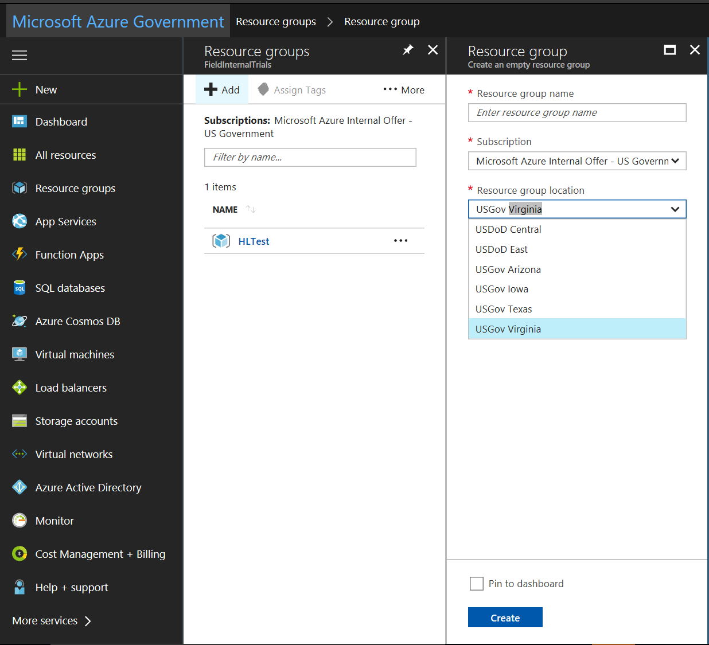
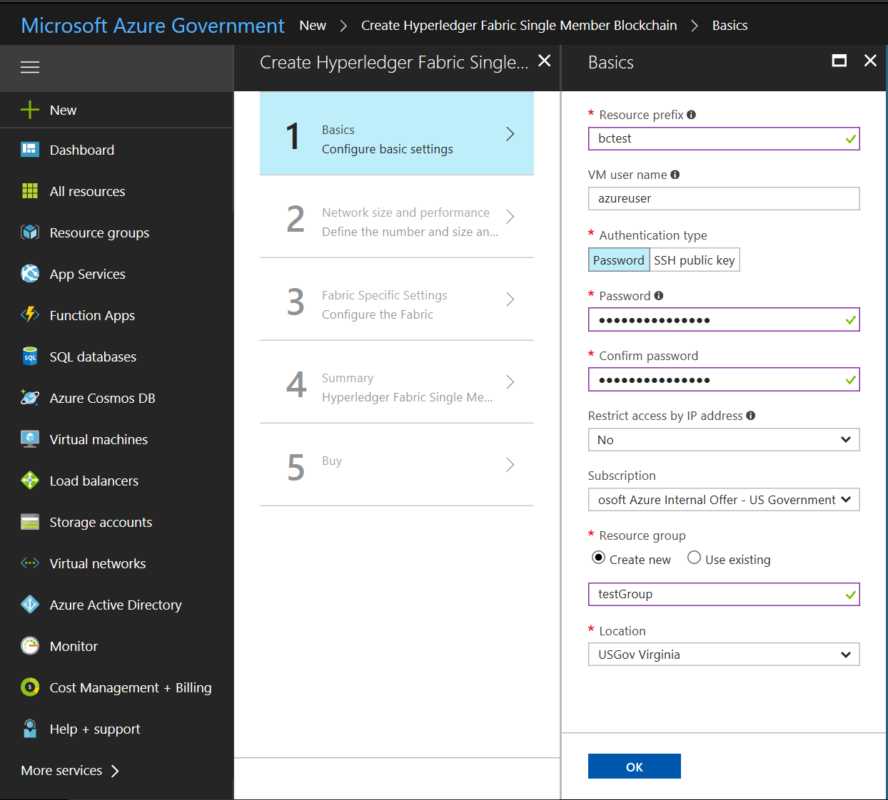
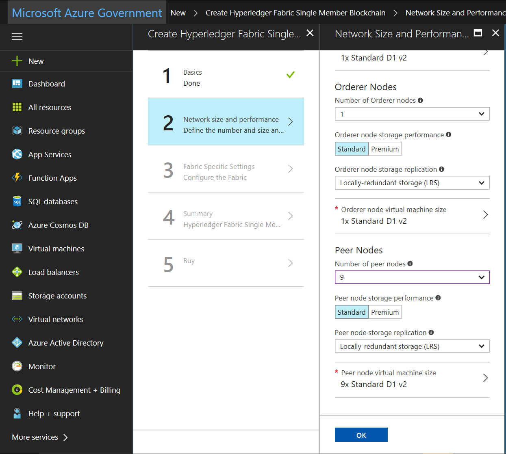
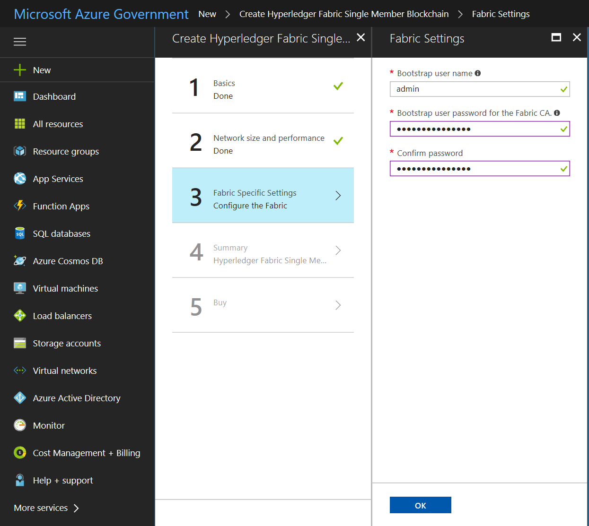
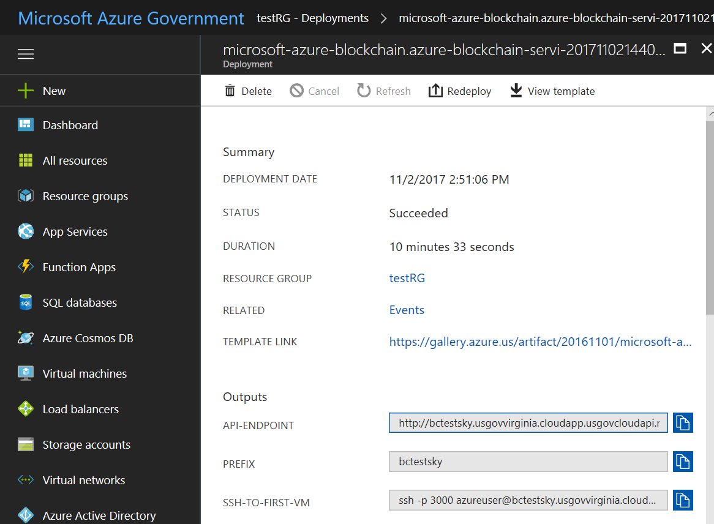
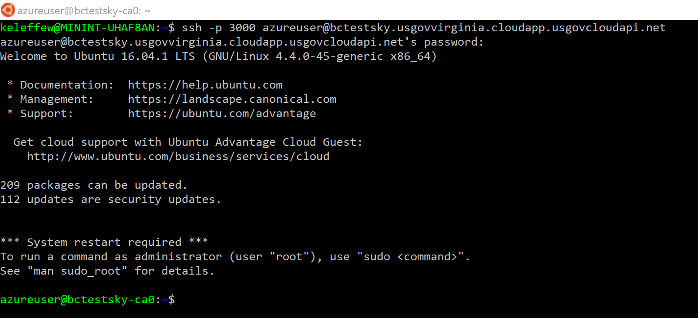

# Azure HL Fabric Blockchain Quickstarts for Azure Government
*Hyperledger Fabric is a blockchain framework implementation and one of the Hyperledger projects hosted by The Linux Foundation.*

The Marketplace in Azure Government contains a template for developers to easily configure the details of the blockchain network topology.  Azure Government uses the same underlying technologies as commercial Azure, enabling you to use the development tools you’re already familiar with.
 
This quickstart guide will help you get started implementing a blockchain network on Azure Government.
 
## Prerequisites
1. Before configuring the sample, you must have the following
⋅⋅* An active Azure Government subscription.  If you don't have an Azure Government subscription, create a free account before you begin.

## Creating a Resource Group
*	Using the CLI 2.0 or Azure Portal, configure a resource group to parameterize the resources related to our Hyperledger blockchain network
⋅⋅*	If using the CLI, create a new resource group by using the command "$ az group create -h"
⋅⋅*	If using the Azure Government portal, we may configure a new resource group by selecting: "Resource groups" on the left-hand panel and pressing “+Add”
*	Next, enter the values associated with Resource group name, Subscription, and Resource group location

 
 
## Provision a Hyperledger Fabric Single Member Blockchain
1.	Log in to the Azure Government Portal.  
2.	Click the "New" button in the top left corner.  
3.	Select "Blockchain" from the list of Azure Marketplace offerings. 
⋅⋅* Pick the option for "Hyperledger Fabric Single Member Blockchain".
 
 
 
Once selected, it is time to configure the basic settings and network topology.  The Template Deployment will walk you through configuring the network.  The deployment flow is divided into three steps: Basics, Network configuration, and Fabric configuration.
 
1.	Under 'Basics', specify values for Resource prefix, VM username, and Authentication type (using either a password or SSH pubkey for greater security)
⋅⋅*	If you'd like to restrict access to the network to a preapproved whitelist, click Yes, and configure the allowed IP addresses or subnets.  Otherwise choose ‘No’.
⋅⋅* For Resource group, use the one configured at the start of the guide, or select 'Create new' and specify the value for the parameter name.
⋅⋅*	For Location, select the Location in which you wish to host your virtual machines and network.
 
 
 
 
2. Under the 'Network size and performance' blade:
⋅⋅* Select the types of VM's and storage performance which you desire for your network, as well as the number of peer nodes to commit transactions and maintain ledger state.  Hit 'OK' when finished.
⋅⋅*	For a simple test-run, the default configuration options should be fine.
⋅⋅*	A sample snippet is shown below:
 
 

 
3. Finally, under Fabric Settings, we will specify the fabric related configuration settings
⋅⋅* The value for Bootstrap user name  configures the initial authorized user that will be registered with the member services in the deployed network. 
⋅⋅* The Bootstrap user password is used to secure the Fabric CA account imported into the Membership node.
⋅⋅* A sample deployment is shown below:
 
  
 
 
4. In the next blade, you will see a summary of the inputs specified.  Hit 'OK' to move on to the final blade
 
5. Select 'Create' to deploy your newly configured Hyperledger Fabric blockchain network.  The resources may take a few minutes to finish deployment.
 

## Accessing the Nodes
 
1.) Once the deployment has been completed, you should be able to access an overview of the resources within the Resource Group.  In the Resource Group blade, click on the 'Deployments' tab (as shown below)
 
 
 

 
  

2.) Click on the deployment prepended with the string 'microsoft-azure-blockchain' in the list and look at the details.
 
 

3. Under Outputs, look for the values "API-ENDPOINT", "PREFIX", and "SSH-TO-FIRST-VM" as shown below.
⋅⋅* The "SSH-TO-FIRST-VM" gives you a pre-assembled ssh command with all the required parameters to connect to the first VM in your network 
⋅⋅* In this case, the VM will be the Fabric-CA node. 
⋅⋅*	The command may be copied to the clipboard and pasted into an Ubuntu terminal
 
3. You can now SSH into the VM for each node with your admin username and password/SSH key.  
⋅⋅*	Note that, Node VMs do not have their own public IP addresses, so you will need to go through the load balancer and specify the port number.  
⋅⋅*	The SSH command to access the first transaction node is found in the third output, ‘SSH-TO-FIRST-VM”
⋅⋅* This command may be copied to the clipboard and pasted into a terminal using the file icon next to the text.
⋅⋅* The example for the sample deployment is: “$ ssh -p 3000 azureuser@bctestsky.usgovvirginia.cloudapp.usgovcloudapi.net”
⋅⋅* ⋅⋅*To get to additional transaction nodes, increment the port number by one (e.g. the first transaction node is on port 3000, the second is on 3001, the third is on 3002, etc.). 

 
 
 
### Next Steps
 
Now you can begin to develop and test your chaincode and applications against your Hyperledger Fabric consortium network.  

For further developer documentation related to Hyperledger Fabric, chaincode, and network deployment, check out the Fabric Github repositry: [Link.](https://github.com/hyperledger/fabric)
