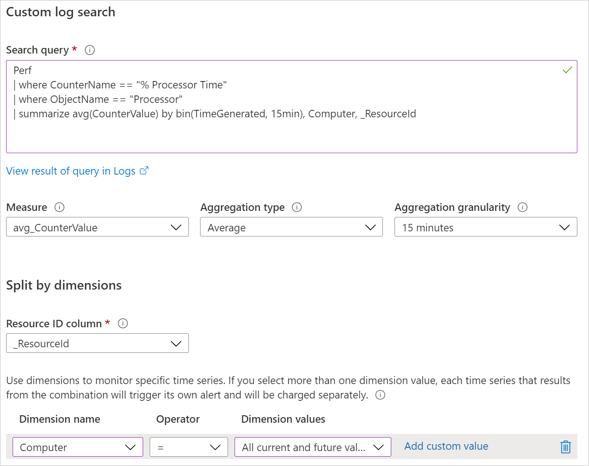
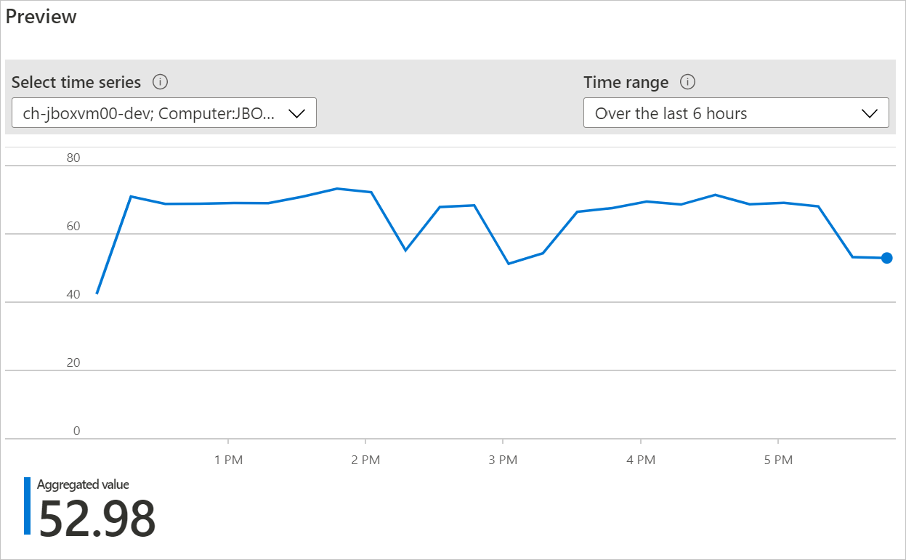
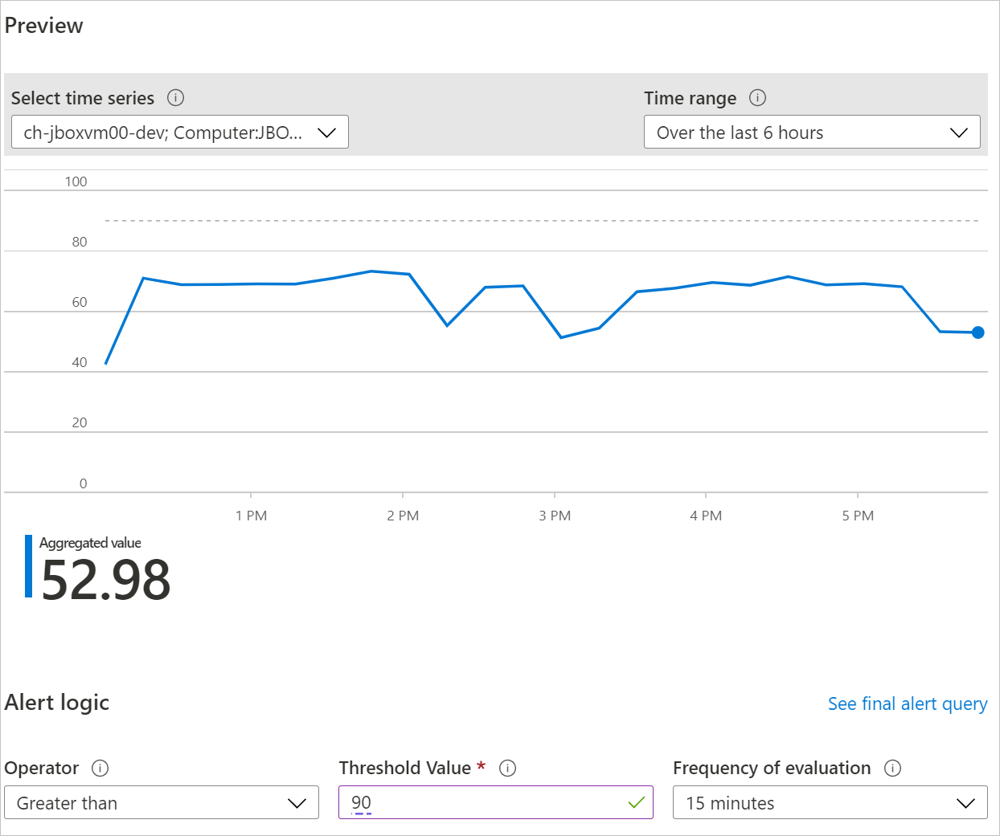
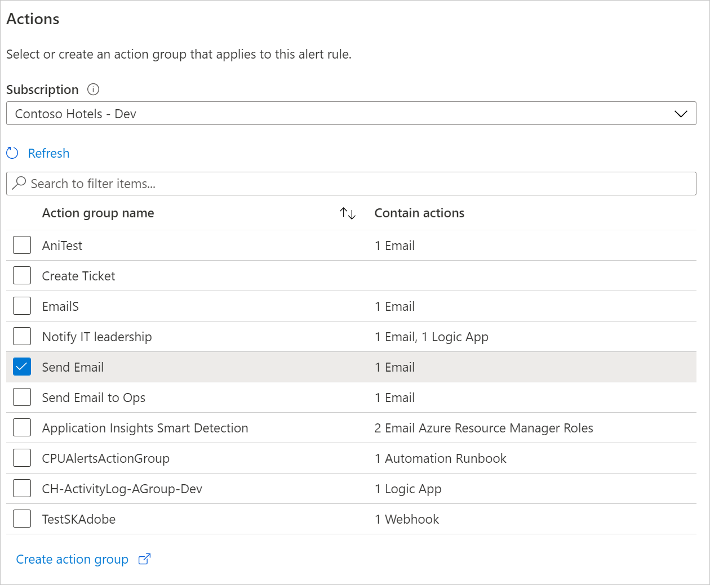
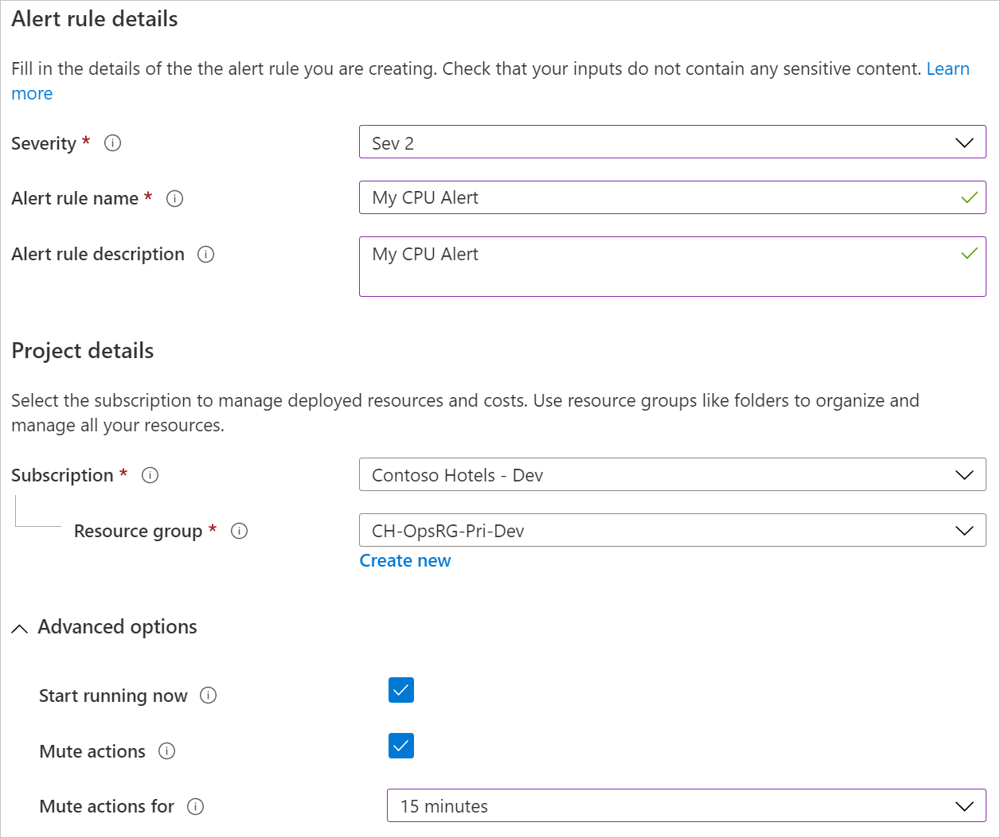
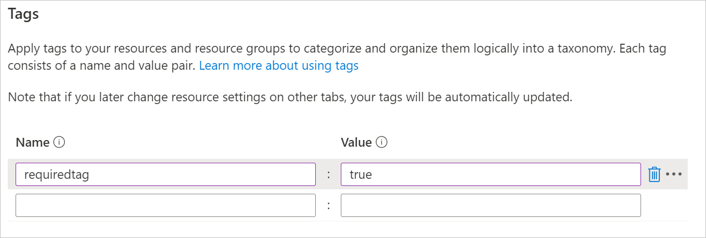
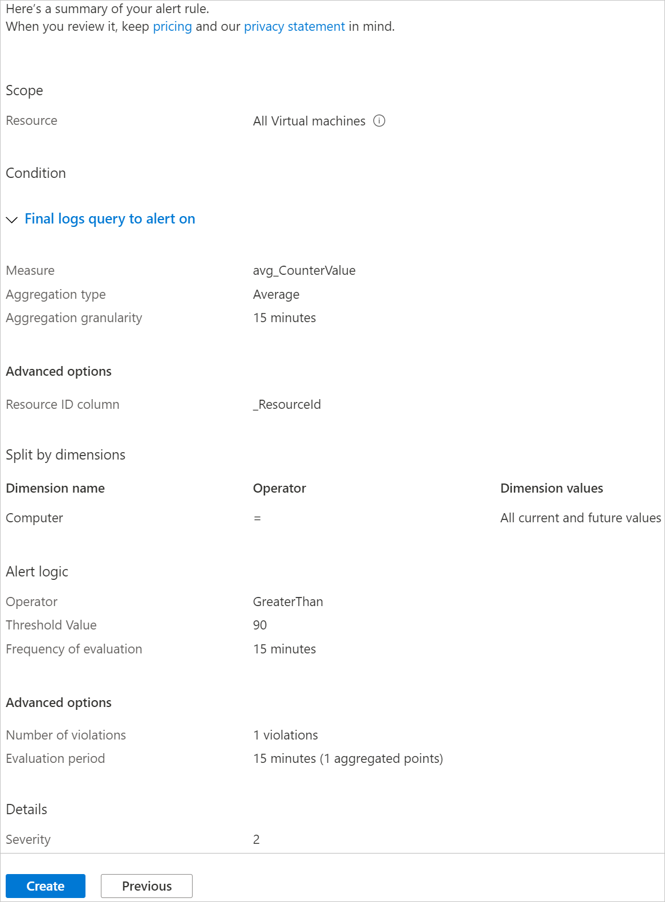

# Create, view, and manage log alerts using Azure Monitor

## Overview

Log alerts allow users to use a [Log Analytics](../log-query/log-analytics-tutorial.md) query to evaluate resources logs every set frequency, and fire an alert based on the results. Rules can trigger one or more actions using [Action Groups](./action-groups.md). [Learn more about functionality and terminology of log alerts](alerts-unified-log.md).

This article shows you how to create and manage log alerts using Azure Monitor. Alert rules are defined by three components:
- Target: A specific Azure resource to monitor.
- Criteria: Logic to evaluate. If met, the alert fires.  
- Action: Notifications or automation - email, SMS, webhook, and so on.

You can also create log alert rules using Azure Resource Manager templates, which are described in [a separate article](alerts-log-create-templates.md).

> [!NOTE]
> Log data from a [Log Analytics workspace](../log-query/log-analytics-tutorial.md) can be sent to the Azure Monitor metrics store. Metrics alerts have [different behavior](alerts-metric-overview.md), which may be more desirable depending on the data you are working with. For information on what and how you can route logs to metrics, see [Metric Alert for Logs](alerts-metric-logs.md).

## Create a log alert rule with the Azure portal

Here the steps to get started writing queries for alerts:

1. Go to the resource you would like to alert on. It is recommended to setup alert rules on multiple resources by selecting a subscripition or resource group scope. 
1. Under **Monitor**, select **Logs**.
1. Query the log data that can indicate the issue. You can use the [alert query examples topic](../log-query/example-queries.md) to understand what you can discover or [get started on writing your own query](../log-query/log-analytics-tutorial.md). Also, [learn how to create optimized alert queries](alerts-log-query.md).
1. Press on '+ New Alert Rule' button to start the alert creation flow.

    

> [!NOTE]
> It is recommended that you create alerts at scale, when using resource access mode for logs, which runs on multiple resources using a resource group or subscription scope. Alerting at scale reduces rule management overhead. To be able to target the resources, please include the resource ID column in the results. [Learn more about splitting alerts by dimensions](alerts-unified-log.md#split-by-alert-dimensions).

### Log alert for Log Analytics and Application Insights

1. If the query syntax is correct, then historical data for the query appears as a graph with the option to tweak the chart period from the last six hours to last week.
 
    If your query results contain summarized data or [project](/azure/kusto/query/projectoperator) specific columns without time column, the chart shows a single value.

    

1. Choose the time range over which to assess the specified condition, using [**Period**](alerts-unified-log.md#query-time-range) option.

1. Log Alerts can be based on two types of [**Measures**](alerts-unified-log.md#measure):
    1. **Number of results** - Count of records returned by the query.
    1. **Metric measurement** - *Aggregate value* calculated using summarize grouped by expressions chosen and [bin()](/azure/kusto/query/binfunction) selection. For example:

    ```Kusto
    // Reported errors
    union Event, Syslog // Event table stores Windows event records, Syslog stores Linux records
    | where EventLevelName == "Error" // EventLevelName is used in the Event (Windows) records
    or SeverityLevel== "err" // SeverityLevel is used in Syslog (Linux) records
    | summarize AggregatedValue = count() by Computer, bin(TimeGenerated, 15m)
    ```

1. For metric measurements alert logic, you can optionally specify how to [split the alerts by dimensions](alerts-unified-log.md#split-by-alert-dimensions) using the **Aggregate on** option. Row grouping expression must be unique and sorted.

    > [!NOTE]
    > As [bin()](/azure/kusto/query/binfunction) can result in uneven time intervals, the alert service will automatically convert [bin()](/azure/kusto/query/binfunction) function to [bin_at()](/azure/kusto/query/binatfunction) function with appropriate time at runtime, to ensure results with a fixed point.

    > [!NOTE]
    > Split by alert dimensions is only available for the current scheduledQueryRules API. If you use the legacy [Log Analytics Alert API](api-alerts.md), you will need to switch. [Learn more about switching](./alerts-log-api-switch.md). Resource centric alerting at scale is only supported in the API version `2020-05-01-preview` and above.

    

1. Next, based on the preview data set the [**Operator**, **Threshold Value**](alerts-unified-log.md#threshold-and-operator), and [**Frequency**](alerts-unified-log.md#frequency).

1. You can also optionally set the [number of violations to trigger an alert](alerts-unified-log.md#number-of-violations-to-trigger-alert) by using **Total or Consecutive Breaches**.

1. Select **Done**. 

1. Define the **Alert rule name**, **Description**, and select the alert **Severity**. These details are used in all alert actions. Additionally, you can choose to not activate the alert rule on creation by selecting **Enable rule upon creation**.

1. Choose if you want to suppress rule actions for a time after an alert is fired, use the [**Suppress Alerts**](alerts-unified-log.md#state-and-resolving-alerts) option. The rule will still run and create alerts but actions won't be triggered to prevent noise. Mute actions value must be greater than the frequency of alert to be effective.

    

1. Specify if the alert rule should trigger one or more [**Action Groups**](action-groups.md#webhook) when alert condition is met.

    > [!NOTE]
    > Refer to the [Azure subscription service limits](../../azure-resource-manager/management/azure-subscription-service-limits.md) for limits on the actions that can be performed.  

1. You can optionally customize actions in log alert rules:

    - **Custom Email Subject**: Overrides the *e-mail subject* of email actions. You can't modify the body of the mail and this field **isn't for email addresses**.
    - **Include custom Json payload**: Overrides the webhook JSON used by Action Groups assuming the action group contains a webhook action. Learn more about [webhook action for Log Alerts](./alerts-log-webhook.md).

    

1. If all fields are correctly set, the **Create alert rule** button can be clicked and an alert is created.

    Within a few minutes, the alert is active and triggers as previously described.

    

#### Creating log alert for Log Analytics and Application Insights from the alerts management

> [!NOTE]
> Creation from alerts management is currently not supported for resource centric logs

1. In the [portal](https://portal.azure.com/), select **Monitor** then choose **Alerts**.

    

1. Select **New Alert Rule**. 

    

1. The **Create Alert** pane appears. It has four parts: 
    - The resource to which the alert applies.
    - The condition to check.
    - The actions to take if the condition is true.
    - The details to name and describe the alert. 

    

1. Press on **Select Resource** button. Filter by choosing the *Subscription*, *Resource Type*, and select a resource. Ensure the resource has logs available.

   

1. Next, use the add **Condition** button to view list of signal options available for the resource. Select **Custom log search** option.

   

   > [!NOTE]
   > The alerts portal lists saved queries from Log Analytics and Application Insights and they can be used as template alert queries.

1. Once selected, write, paste, or edit the alerting query in the **Search Query** field.

1. Continue to the next steps described in the [last section](#log-alert-for-log-analytics-and-application-insights).

### Log alert for all other resource types

> [!NOTE]
> There are currently no additional charges for the API version `2020-05-01-preview` and resource centric log alerts.  Pricing for features that are in preview will be announced in the future and a notice provided prior to start of billing. Should you choose to continue using new API version and resource centric log alerts after the notice period, you will be billed at the applicable rate.

1. Start from the **Condition** tab:

    1. Check that the [**Measure**](alerts-unified-log.md#measure), [**Aggregation type**](alerts-unified-log.md#aggregation-type), and [**Aggregation granularity**](alerts-unified-log.md#aggregation-granularity) are correct. 
        1. By default, the rule counts the number of results in the last 5 minutes.
        1. If we detect summarized query results, the rule will be updated automatically within a few seconds to capture that.

    1. Choose [alert splitting by dimensions](alerts-unified-log.md#split-by-alert-dimensions), if needed: 
       - **Resource ID column** is selected automatically, if detected, and changes the context of the fired alert to the record's resource. 
       - **Resource ID column** can be de-selected to fire alerts on subscription or resource groups. De-selecting is useful when query results are based on cross-resources. For example, a query that check if 80% of the resource group's virtual machines are experiencing high CPU usage.
       - Up to six additional splittings can be also selected for any number or text columns types using the dimensions table.
       - Alerts are fired separately according to splitting based on unique combinations and alert payload includes this information.
    
        

    1. The **Preview** chart shows query evaluations results over time. You can change the chart period or select different time series that resulted from unique alert splitting by dimensions.

        

    1. Next, based on the preview data, set the **Alert logic**; [**Operator**, **Threshold Value**](alerts-unified-log.md#threshold-and-operator), and [**Frequency**](alerts-unified-log.md#frequency).

        

    1. You can optionally set [**Number of violations to trigger the alert**](alerts-unified-log.md#number-of-violations-to-trigger-alert) in the **Advanced options** section.
    
        

1. In the **Actions** tab, select or create the required [action groups](action-groups.md).

    

1. In the **Details** tab, define the **Alert rule details**, and **Project details**. You can optionally set whether to not **Start running now**, or [**Mute Actions**](alerts-unified-log.md#state-and-resolving-alerts) for a period after the alert rule fires.

    > [!NOTE]
    > Log alert rules are currently stateless and fires an action every time an alert is created unless muting is defined.

    

1. In the **Tags** tab, set any required tags on the alert rule resource.

    

1. In the **Review + create** tab, a validation will run and inform of any issues. Review and approve the rule definition.
1. If all fields are correct, select the **Create** button and complete the alert rule creation. All alerts can be viewed from the alerts management.
 
    

## View & manage log alerts in Azure portal

1. In the [portal](https://portal.azure.com/), select the relevant resource or the **Monitor** service. Then select **Alerts** in the Monitor section.

1. The alerts management displays all alerts that fired. [Learn more about the alert management](alerts-managing-alert-instances.md).

    > [!NOTE]
    > Log alert rules are currently [stateless and do not resolve](alerts-unified-log.md#state-and-resolving-alerts).

1. Select **Manage alert rules** button on the top bar to edit rules:

    

## Managing log alerts using PowerShell

[!INCLUDE [updated-for-az](../../../includes/updated-for-az.md)]

> [!NOTE]
> PowerShell is not currently supported in the API version `2020-05-01-preview`

PowerShell cmdlets listed below are available to manage rules with the [Scheduled Query Rules API](/rest/api/monitor/scheduledqueryrules/).

- [New-AzScheduledQueryRule](/powershell/module/az.monitor/new-azscheduledqueryrule) : PowerShell cmdlet to create a new log alert rule.
- [Set-AzScheduledQueryRule](/powershell/module/az.monitor/set-azscheduledqueryrule) : PowerShell cmdlet to update an existing log alert rule.
- [New-AzScheduledQueryRuleSource](/powershell/module/az.monitor/new-azscheduledqueryrulesource) : PowerShell cmdlet to create or update object specifying source parameters for a log alert. Used as input by [New-AzScheduledQueryRule](/powershell/module/az.monitor/new-azscheduledqueryrule) and [Set-AzScheduledQueryRule](/powershell/module/az.monitor/set-azscheduledqueryrule) cmdlet.
- [New-AzScheduledQueryRuleSchedule](/powershell/module/az.monitor/new-azscheduledqueryruleschedule): PowerShell cmdlet to create or update object specifying schedule parameters for a log alert. Used as input by [New-AzScheduledQueryRule](/powershell/module/az.monitor/new-azscheduledqueryrule) and [Set-AzScheduledQueryRule](/powershell/module/az.monitor/set-azscheduledqueryrule) cmdlet.
- [New-AzScheduledQueryRuleAlertingAction](/powershell/module/az.monitor/new-azscheduledqueryrulealertingaction) : PowerShell cmdlet to create or update object specifying action parameters for a log alert. Used as input by [New-AzScheduledQueryRule](/powershell/module/az.monitor/new-azscheduledqueryrule) and [Set-AzScheduledQueryRule](/powershell/module/az.monitor/set-azscheduledqueryrule) cmdlet.
- [New-AzScheduledQueryRuleAznsActionGroup](/powershell/module/az.monitor/new-azscheduledqueryruleaznsactiongroup) : PowerShell cmdlet to create or update object specifying action groups parameters for a log alert. Used as input by [New-AzScheduledQueryRuleAlertingAction](/powershell/module/az.monitor/new-azscheduledqueryrulealertingaction) cmdlet.
- [New-AzScheduledQueryRuleTriggerCondition](/powershell/module/az.monitor/new-azscheduledqueryruletriggercondition) : PowerShell cmdlet to create or update object specifying trigger condition parameters for log alert. Used as input by [New-AzScheduledQueryRuleAlertingAction](/powershell/module/az.monitor/new-azscheduledqueryrulealertingaction) cmdlet.
- [New-AzScheduledQueryRuleLogMetricTrigger](/powershell/module/az.monitor/new-azscheduledqueryrulelogmetrictrigger) : PowerShell cmdlet to create or update object specifying metric trigger condition parameters for [metric measurement type log alert](./alerts-unified-log.md#calculation-of-measure-based-on-a-numeric-column-such-as-cpu-counter-value). Used as input by [New-AzScheduledQueryRuleTriggerCondition](/powershell/module/az.monitor/new-azscheduledqueryruletriggercondition) cmdlet.
- [Get-AzScheduledQueryRule](/powershell/module/az.monitor/get-azscheduledqueryrule) : PowerShell cmdlet to list existing log alert rules or a specific log alert rule
- [Update-AzScheduledQueryRule](/powershell/module/az.monitor/update-azscheduledqueryrule) : PowerShell cmdlet to enable or disable log alert rule
- [Remove-AzScheduledQueryRule](/powershell/module/az.monitor/remove-azscheduledqueryrule): PowerShell cmdlet to delete an existing log alert rule

> [!NOTE]
> ScheduledQueryRules PowerShell cmdlets can only manage rules created in the current [Scheduled Query Rules API](/rest/api/monitor/scheduledqueryrules/). Log alert rules created using legacy [Log Analytics Alert API](api-alerts.md) can only be managed using PowerShell only after [switching to Scheduled Query Rules API](alerts-log-api-switch.md).

Here are example steps for creating a log alert rule using the PowerShell:

```powershell
$source = New-AzScheduledQueryRuleSource -Query 'Heartbeat | summarize AggregatedValue = count() by bin(TimeGenerated, 5m), _ResourceId' -DataSourceId "/subscriptions/a123d7efg-123c-1234-5678-a12bc3defgh4/resourceGroups/contosoRG/providers/microsoft.OperationalInsights/workspaces/servicews"

$schedule = New-AzScheduledQueryRuleSchedule -FrequencyInMinutes 15 -TimeWindowInMinutes 30

$metricTrigger = New-AzScheduledQueryRuleLogMetricTrigger -ThresholdOperator "GreaterThan" -Threshold 2 -MetricTriggerType "Consecutive" -MetricColumn "_ResourceId"

$triggerCondition = New-AzScheduledQueryRuleTriggerCondition -ThresholdOperator "LessThan" -Threshold 5 -MetricTrigger $metricTrigger

$aznsActionGroup = New-AzScheduledQueryRuleAznsActionGroup -ActionGroup "/subscriptions/a123d7efg-123c-1234-5678-a12bc3defgh4/resourceGroups/contosoRG/providers/microsoft.insights/actiongroups/sampleAG" -EmailSubject "Custom email subject" -CustomWebhookPayload "{ `"alert`":`"#alertrulename`", `"IncludeSearchResults`":true }"

$alertingAction = New-AzScheduledQueryRuleAlertingAction -AznsAction $aznsActionGroup -Severity "3" -Trigger $triggerCondition

New-AzScheduledQueryRule -ResourceGroupName "contosoRG" -Location "Region Name for your Application Insights App or Log Analytics Workspace" -Action $alertingAction -Enabled $true -Description "Alert description" -Schedule $schedule -Source $source -Name "Alert Name"
```

You can also create the log alert using a [template and parameters](./alerts-log-create-templates.md) files using PowerShell:

```powershell
Connect-AzAccount

Select-AzSubscription -SubscriptionName <yourSubscriptionName>

New-AzResourceGroupDeployment -Name AlertDeployment -ResourceGroupName ResourceGroupofTargetResource `
  -TemplateFile mylogalerttemplate.json -TemplateParameterFile mylogalerttemplate.parameters.json
```

## Managing log alerts using CLI

> [!NOTE]
> Azure CLI support is only available for the scheduledQueryRules API version `2020-05-01-preview` and above. Pervious API version can use the Azure Resource Manager CLI with templates as described below. If you use the legacy [Log Analytics Alert API](api-alerts.md), you will need to switch to use CLI. [Learn more about switching](./alerts-log-api-switch.md).

The previous sections described how to create, view, and manage log alert rules using Azure portal. This section will describe how to do the same using cross-platform [Azure CLI](/cli/azure/get-started-with-azure-cli). Quickest way to start using Azure CLI is through [Azure Cloud Shell](../../cloud-shell/overview.md). For this article, we'll use Cloud Shell.

1. Go to Azure portal, select **Cloud Shell**.

1. At the prompt, you can use commands with ``--help`` option to learn more about the command and how to use it. For example, the following command shows you the list of commands available for creating, viewing, and managing log alerts:

    ```azurecli
    az monitor scheduled-query --help
    ```

1. You can create a log alert rule that monitors count of system event errors:

    ```azurecli
    az monitor scheduled-query create -g {ResourceGroup} -n {nameofthealert} --scopes {vm_id} --condition "count \'union Event, Syslog | where TimeGenerated > ago(1h) | where EventLevelName == \"Error\" or SeverityLevel== \"err\"\' > 2" --description {descriptionofthealert}
    ```

1. You can view all the log alerts in a resource group using the following command:

    ```azurecli
    az monitor scheduled-query list -g {ResourceGroup}
    ```

1. You can see the details of a particular log alert rule using the name or the resource ID of the rule:

    ```azurecli
    az monitor scheduled-query show -g {ResourceGroup} -n {AlertRuleName}
    ```

    ```azurecli
    az monitor scheduled-query show --ids {RuleResourceId}
    ```

1. You can disable a log alert rule using the following command:

    ```azurecli
    az monitor scheduled-query update -g {ResourceGroup} -n {AlertRuleName} --enabled false
    ```

1. You can delete a log alert rule using the following command:

    ```azurecli
    az monitor scheduled-query delete -g {ResourceGroup} -n {AlertRuleName}
    ```

You can also use Azure Resource Manager CLI with [templates](./alerts-log-create-templates.md) files:

```azurecli
az login

az deployment group create \
    --name AlertDeployment \
    --resource-group ResourceGroupofTargetResource \
    --template-file mylogalerttemplate.json \
    --parameters @mylogalerttemplate.parameters.json
```

On success for creation, 201 is returned. On success for update, 200 is returned.

## Next steps

* Learn about [log alerts](./alerts-unified-log.md).
* Create log alerts using [Azure Resource Manager Templates](./alerts-log-create-templates.md).
* Understand [webhook actions for log alerts](./alerts-log-webhook.md).
* Learn more about [log queries](../log-query/log-query-overview.md).
