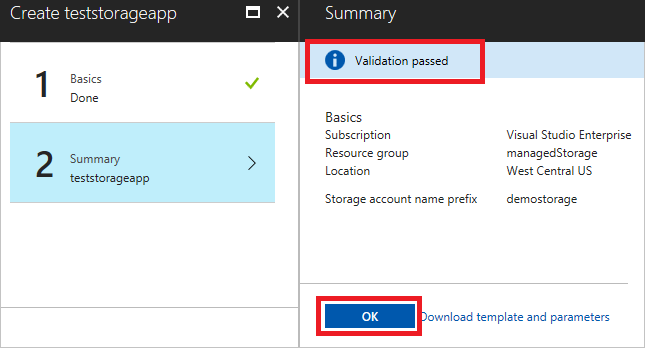

# Consume an internal managed application

You can consume Azure [managed applications](managed-application-overview.md) that are intended for members of your organization. For example, you can select managed applications from your IT department that ensure compliance with organizational standards. These managed applications are available through the Service Catalog, not the Azure Marketplace.

Before proceeding with this article, you must have a managed application available in the service catalog for your subscription. If someone in your organization has not already created a managed application, see [Publish a managed application for internal consumption](managed-application-publishing.md).

Currently, you can use either Azure CLI or the Azure portal to consume a managed application.

## Create the managed application by using the portal

To deploy a managed application through the portal, follow these steps:

1. Go to the Azure portal. Search for **Service Catalog Managed Application**.

   

1. Select the managed application you want to create from the list of available solutions. Select **Create**.

   

1. Provide values for the parameters that are required to provision the resources. Select **West Central US** for location. Select **OK**.

   

1. The template validates the values you provided. If validation succeeds, select **OK** to start the deployment.

   

After the deployment finishes, the appropriate resources defined in the template are provisioned in the managed resource group you provided.

## Create the managed application by using Azure CLI

There are two ways to create a managed application by using Azure CLI:

* Use the command for creating managed applications.
* Use the regular template deployment command.

### Use the template deployment command

Deploy the applianceMainTemplate.json file that the vendor created.

Then create two resource groups. The first resource group is where the managed application resource is created: Microsoft.Solutions/appliances. The second resource group contains all the resources defined in mainTemplate.json. This resource group is managed by the ISV.

```azurecli
az group create --name mainResourceGroup --location westcentralus
az group create --name managedResourceGroup --location westcentralus
```

> [!NOTE]
> Use `westcentralus` as the location of the resource group.
>

To deploy applianceMainTemplate.json in mainResourceGroup, use the following command:

```azurecli
az group deployment create --name managedAppDeployment --resourceGroup mainResourceGroup --templateUri
```

After the preceding template runs, it prompts you for the values of the parameters that are defined in the template. In addition to the parameters that are needed to provision resources in a template, you need two key parameter values:

- **managedResourceGroupId**: The ID of the resource group containing the resources defined in applianceMainTemplate.json. The ID is of the form `/subscriptions/{subscriptionId}/resourceGroups/{resoureGroupName}`. In the preceding example, it's the ID of `managedResourceGroup`.
- **applianceDefinitionId**: The ID of the managed application definition resource. This value is provided by the ISV.

> [!NOTE]
> The publisher must grant access to the resource group that contains the managed application definition. The definition resource is created in the publisher subscription. Therefore, a user, user group, or application in the customer tenant needs read access to this resource.

After the deployment finishes successfully, you see the managed application is created in mainResourceGroup. The storageAccount resource is created in managedResourceGroup.

### Use the create command

You can use the `az managedapp create` command to create a managed application from the managed application definition.

```azurecli
az managedapp create --name ravtestappliance401 --location "westcentralus"
	--kind "Servicecatalog" --resource-group "ravApplianceCustRG401"
   	--managedapp-definition-id "/subscriptions/{guid}/resourceGroups/ravApplianceDefRG401/providers/Microsoft.Solutions/applianceDefinitions/ravtestAppDef401"
   	--managed-rg-id "/subscriptions/{guid}/resourceGroups/ravApplianceCustManagedRG401"
   	--parameters "{\"storageAccountName\": {\"value\": \"ravappliancedemostore1\"}}"
   	--debug
```

* **appliance-definition-Id**: The resource ID of the managed application definition created in the preceding step. To obtain this ID, run the following command:

  ```azurecli
  az managedapp definition show -n ravtestAppDef1 -g ravApplianceRG2
  ```

  This command returns the managed application definition. You need the value of the ID property.

* **managed-rg-id**: The name of the resource group containing the resources defined in applianceMainTemplate.json. This resource group is the managed resource group. It's managed by the publisher. If it doesn't exist, it's created for you.
* **resource-group**: The resource group where the managed application resource is created. The Microsoft.Solutions/appliance resource lives in this resource group.
* **parameters**: The parameters that are needed for the resources defined in applianceMainTemplate.json.

## Known issues

This preview release includes the following issues:

* A 500 internal server error appears during the creation of the managed application. If you run into this issue, it's likely to be intermittent. Retry the operation.
* A new resource group is needed for the managed resource group. If you use an existing resource group, the deployment fails.
* The resource group that contains the Microsoft.Solutions/appliances resource must be created in the **westcentralus** location.

## Next steps

* For an introduction to managed applications, see [Managed application overview](managed-application-overview.md).
* For information about publishing a Service Catalog managed application, see [Create and publish a Service Catalog managed application](managed-application-publishing.md).
* For information about publishing managed applications to the Azure Marketplace, see [Azure managed applications in the Marketplace](managed-application-author-marketplace.md).
* For information about consuming a managed application from the Marketplace, see [Consume Azure managed applications in the Marketplace](managed-application-consume-marketplace.md).
