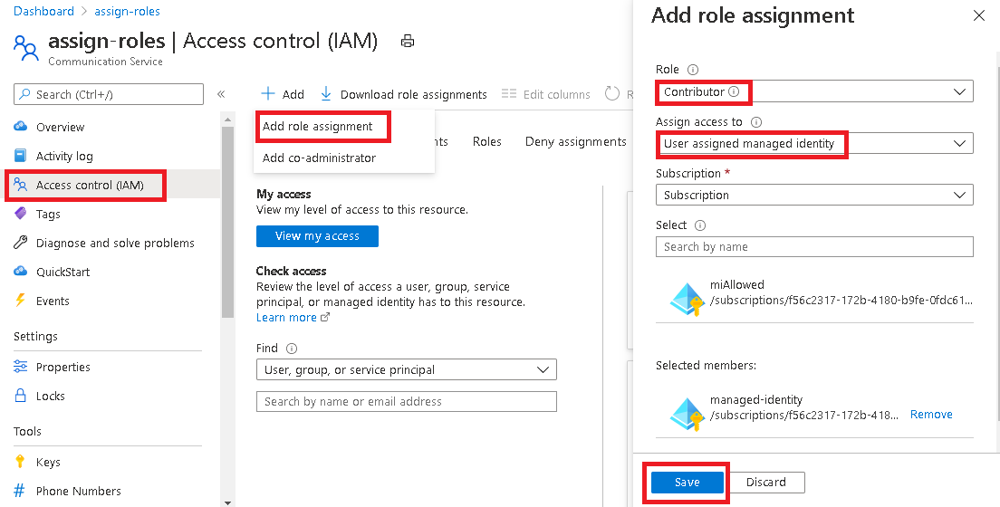

# Overview

This article shows how to authorize access to Administration and SMS SDKs from an Azure environment that supports managed identities. It also describes how to test your code in the development environment.

Administration and SMS SDKs support Azure Active Directory (Azure AD) authentication with [managed identities for Azure resources](../../active-directory/managed-identities-azure-resources/overview.md).

# Benefits of using managed identities

By using managed identities for Azure resources together with Azure AD authentication, you can:

1. Avoid storing credentials with your applications that run in the cloud
1. Use [Azure role-based access control](https://docs.microsoft.com/azure/role-based-access-control) for fine grained access management 

## Enable managed identities on a VM or App service

Before you can use managed identities for Azure Resources to authorize, access to ACS APIs from your Azure Function, you must first enable managed identities for Azure Resources on the VM. To learn how to enable managed identities for Azure Resources, see one of these articles:

- [Azure portal](../../active-directory/managed-identities-azure-resources/qs-configure-portal-windows-vm.md)
- [Azure PowerShell](../../active-directory/managed-identities-azure-resources/qs-configure-powershell-windows-vm.md)
- [Azure CLI](../../active-directory/managed-identities-azure-resources/qs-configure-cli-windows-vm.md)
- [Azure Resource Manager template](../../active-directory/managed-identities-azure-resources/qs-configure-template-windows-vm.md)
- [Azure Resource Manager client libraries](../../active-directory/managed-identities-azure-resources/qs-configure-sdk-windows-vm.md)
- [App services](../../app-service/overview-managed-identity.md)

### Assign Azure roles for access to APIs

When an Azure AD security principal attempts to access an API, that security principal must have permissions to the resource. The security principal (managed or dev environment Azure AD identity) must be assigned an Azure role that grants access. For information about assigning permissions via [Azure role-based access control](https://docs.microsoft.com/azure/role-based-access-control).

#### Azure portal

1. Go to the Azure portal
1. Go to the Azure Communication Service resource
1. Navigate to Access Control (IAM) menu -> + Add -> Add role assignment
1. Select the role "Contributor" (the only one supported at the moment)
1. Select "User assigned managed identity" (or a "System assigned managed identity") then select the wanted identity then save


#### PowerShell

Assigning roles is also possible using PowerShell, see [Add or remove Azure role assignments using Azure PowerShell](../../articles/role-based-access-control/role-assignments-powershell.md)

## Authenticate with the Azure Identity library

The Azure Identity client library provides Azure AD token authentication support for the [Azure SDK](https://github.com/Azure/azure-sdk). The latest versions of the ACS SDKs integrate with the Azure Identity library to provide secure means to acquire an OAuth 2.0 token for authorization of Communication requests.

For more information about the Azure Identity client library for .NET, see [Azure Identity client library for .NET](https://github.com/Azure/azure-sdk-for-net/tree/master/sdk/identity/Azure.Identity). For reference documentation for the Azure Identity client library, see [Azure.Identity Namespace](/dotnet/api/azure.identity).

### Authenticate the user in the development environment

The authentication in the development environment may be handled automatically. For example, Microsoft Visual Studio supports single sign-on (SSO), so that the active Azure AD user account is automatically used for authentication. For more information about SSO, see [Single sign-on to applications](../../active-directory/manage-apps/what-is-single-sign-on.md).

## Set up

### Install client library packages

```console
dotnet add package Azure.Communication.Administration
dotnet add package Azure.Communication.Configuration
dotnet add package Azure.Communication.Sms
dotnet add package Azure.Identity
```

### Use the library packages

Add the following `using` directives to your code to use the Azure Identity and Azure Storage client libraries.

```csharp
using Azure.Identity;
using Azure.Communication.Administration;
using Azure.Communication.Configuration;
using Azure.Communication.Sms;
```

The examples below are using the [DefaultAzureCredential](https://docs.microsoft.com/dotnet/api/azure.identity.defaultazurecredential) that is suitable for multiple environments.

### Administration SDK example (create identity and issue token)

```csharp
     
     public async Task<> CreateIdentityAndIssueTokenAsync(string resourceEdnpoint) 
     {
          TokenCredential credential = new DefaultAzureCredential();
     
          var client = new CommunicationIdentityClient(credential, resourceEndpoint);
          var identityResponse = await client.CreateUserAsync();
     
          var tokenResponse = await client.IssueTokenAsync(identity, scopes: new [] { CommunicationTokenScope.VoIP });
     }
```

More details about [Creating user access tokens](../quickstarts/access-tokens.md).

### SMS SDK example (send SMS)


```csharp

     public async Task SendSmsAsync(string resourceEndpoint)
     {
          TokenCredential credential = new DefaultAzureCredential();
     
          SmsClient smsClient = new SmsClient(credential, resourceEndpoint);
          smsClient.Send(
               from: new PhoneNumber("<leased-phone-number>"),
               to: new PhoneNumber("<to-phone-number>"),
               message: "Hello World via SMS",
               new SendSmsOptions { EnableDeliveryReport = true } // optional
          );
     }
```

More details about [Send an SMS message](../quickstarts/telephony-sms/send.md).

## Next steps

> [!div class="nextstepaction"]
> [Learn about authentication](../concepts/authentication.md)

You may also want to:

- [Creating user access tokens](../quickstarts/access-tokens.md)
- [Send an SMS message](../quickstarts/telephony-sms/send.md)
- [Learn more about SMS](../../concepts/telephony-sms/concepts.md)