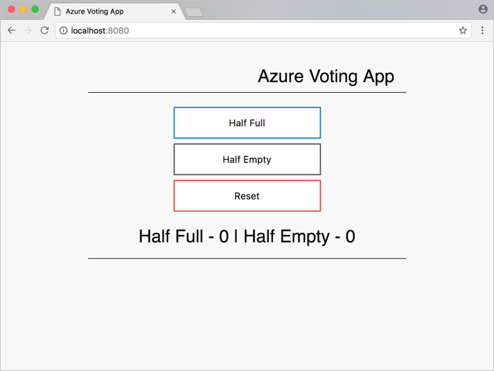
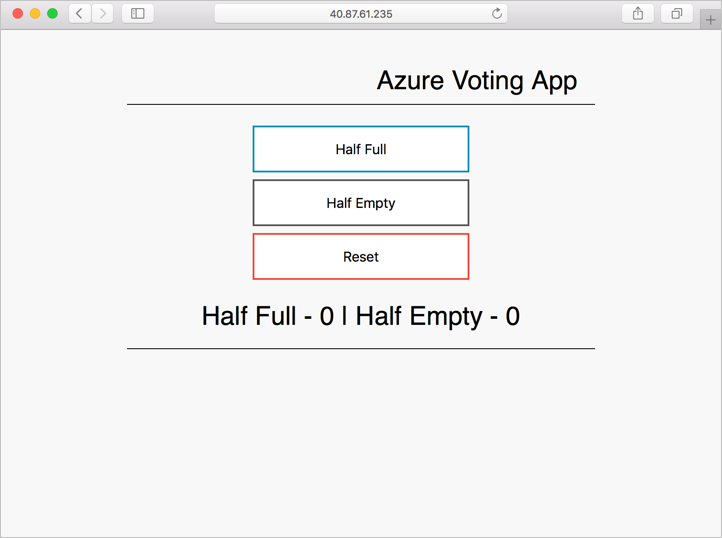

# Update an application in Kubernetes

After you deploy an application in Kubernetes, you can update it by specifying a new container image or image version. When you update an application, the update rollout is staged so that only a portion of the deployment is concurrently updated. 

This staged update enables the application to keep running during the update, and provides a rollback mechanism if a deployment failure occurs. 

In this tutorial, the sample Azure Vote app is updated. Tasks that you complete include:

> [!div class="checklist"]
> * Updating the front-end application code.
> * Creating an updated container image.
> * Pushing the container image to Azure Container Registry.
> * Deploying an updated application.

## Before you begin

In previous tutorials, we packaged an application into container images, uploaded the images to Azure Container Registry, and created a Kubernetes cluster. We then ran the application on the Kubernetes cluster. 

If you haven't taken these steps, and want to try them now, return to [Tutorial 1 – Create container images](./container-service-tutorial-kubernetes-prepare-app.md). 

At a minimum, this tutorial requires a Kubernetes cluster with a running application.

## Update application

To complete the steps in this tutorial, you must have cloned a copy of the Azure Vote application. If necessary, create this cloned copy with the following command:

```bash
git clone https://github.com/Azure-Samples/azure-voting-app.git
```

Open the `config_file.cfg` file with any code or text editor. You can find this file under the following directory of the cloned repo.

```bash
 /azure-voting-app/azure-vote/azure-vote/config_file.cfg
```

Change the values for `VOTE1VALUE` and `VOTE2VALUE`, and then save the file.

```bash
# UI Configurations
TITLE = 'Azure Voting App'
VOTE1VALUE = 'Half Full'
VOTE2VALUE = 'Half Empty'
SHOWHOST = 'false'
```

Use `docker build` to re-create the front-end image.

```bash
docker build --no-cache ./azure-voting-app/azure-vote -t azure-vote-front:v2
```

## Test application

Create a Docker network. This network is used for communication between the containers.  

```bash
docker network create azure-vote
```

Run an instance of the back-end container image by using the `docker run` command.

```bash
docker run -p 3306:3306 --name azure-vote-back -d --network azure-vote -e MYSQL_ROOT_PASSWORD=Password12 -e MYSQL_USER=dbuser -e MYSQL_PASSWORD=Password12 -e MYSQL_DATABASE=azurevote azure-vote-back 
```

Run an instance of the front-end container image.

```bash
docker run -d -p 8080:80 --name azure-vote-front --network=azure-vote -e MYSQL_USER=dbuser -e MYSQL_PASSWORD=Password12 -e MYSQL_DATABASE=azurevote -e MYSQL_HOST=azure-vote-back azure-vote-front:v2
```

Go to `http://localhost:8080` to see the updated application. The application takes a few seconds to initialize. If you get an error, try again.



## Tag and push images

Tag the *azure-vote-front* image with the loginServer of the container registry.

If you're using Azure Container Registry, get the login server name with the [az acr list](/cli/azure/acr#list) command.

```azurecli-interactive
az acr list --resource-group myResourceGroup --query "[].{acrLoginServer:loginServer}" --output table
```

Use [docker tag](https://docs.docker.com/engine/reference/commandline/tag/) to tag the image, making sure to update the command with your Azure Container Registry login server or public registry hostname.

```bash
docker tag azure-vote-front:v2 <acrLoginServer>/azure-vote-front:v2
```

Push the image to your registry. Replace `<acrLoginServer>` with your Azure Container Registry login server name or public registry hostname.

```bash
docker push <acrLoginServer>/azure-vote-front:v2
```

## Deploy update to Kubernetes

### Verify multiple POD replicas

To ensure maximum uptime, multiple instances of the application pod must be running. Verify this configuration with the [kubectl get pod](https://kubernetes.io/docs/user-guide/kubectl/v1.6/#get) command.

```bash
kubectl get pod
```

Output:

```bash
NAME                               READY     STATUS    RESTARTS   AGE
azure-vote-back-217588096-5w632    1/1       Running   0          10m
azure-vote-front-233282510-b5pkz   1/1       Running   0          10m
azure-vote-front-233282510-dhrtr   1/1       Running   0          10m
azure-vote-front-233282510-pqbfk   1/1       Running   0          10m
```

If you don't have multiple pods running the azure-vote-front image, scale the *azure-vote-front* deployment.


```bash
kubectl scale --replicas=3 deployment/azure-vote-front
```

### Update application

To update the application, run the following command. Update `<acrLoginServer>` with the login server or host name of your container registry.

```bash
kubectl set image deployment azure-vote-front azure-vote-front=<acrLoginServer>/azure-vote-front:v2
```

To monitor the deployment, use the [kubectl get pod](https://kubernetes.io/docs/user-guide/kubectl/v1.6/#get) command. As the updated application is deployed, your pods are terminated and re-created with the new container image.

```bash
kubectl get pod
```

Output:

```bash
NAME                               READY     STATUS    RESTARTS   AGE
azure-vote-back-2978095810-gq9g0   1/1       Running   0          5m
azure-vote-front-1297194256-tpjlg   1/1       Running   0         1m
azure-vote-front-1297194256-tptnx   1/1       Running   0         5m
azure-vote-front-1297194256-zktw9   1/1       Terminating   0         1m
```

## Test updated application

Get the external IP address of the *azure-vote-front* service.

```bash
kubectl get service
```

Go to the IP address to see the updated application.



## Next steps

In this tutorial, we updated an application and rolled out this update to a Kubernetes cluster. We completed the following tasks:  

> [!div class="checklist"]
> * Updated the front-end application code.
> * Created an updated container image.
> * Pushed the container image to Azure Container Registry.
> * Deployed the updated application.

Advance to the next tutorial to learn about how to monitor Kubernetes with Operations Management Suite.

> [!div class="nextstepaction"]
> [Monitor Kubernetes with OMS](./container-service-tutorial-kubernetes-monitor.md)
