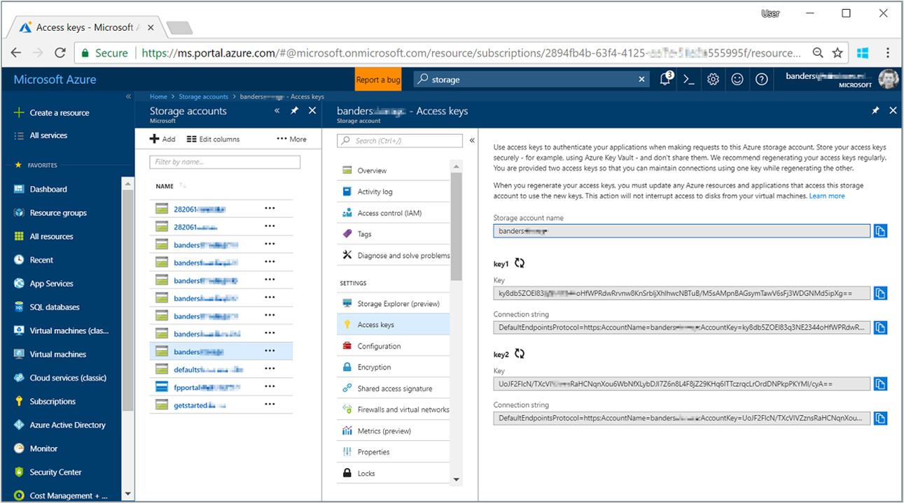
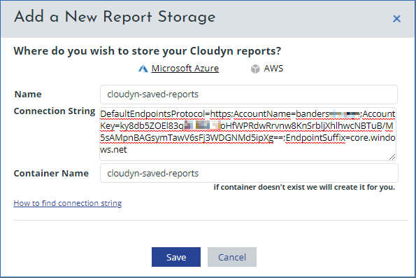
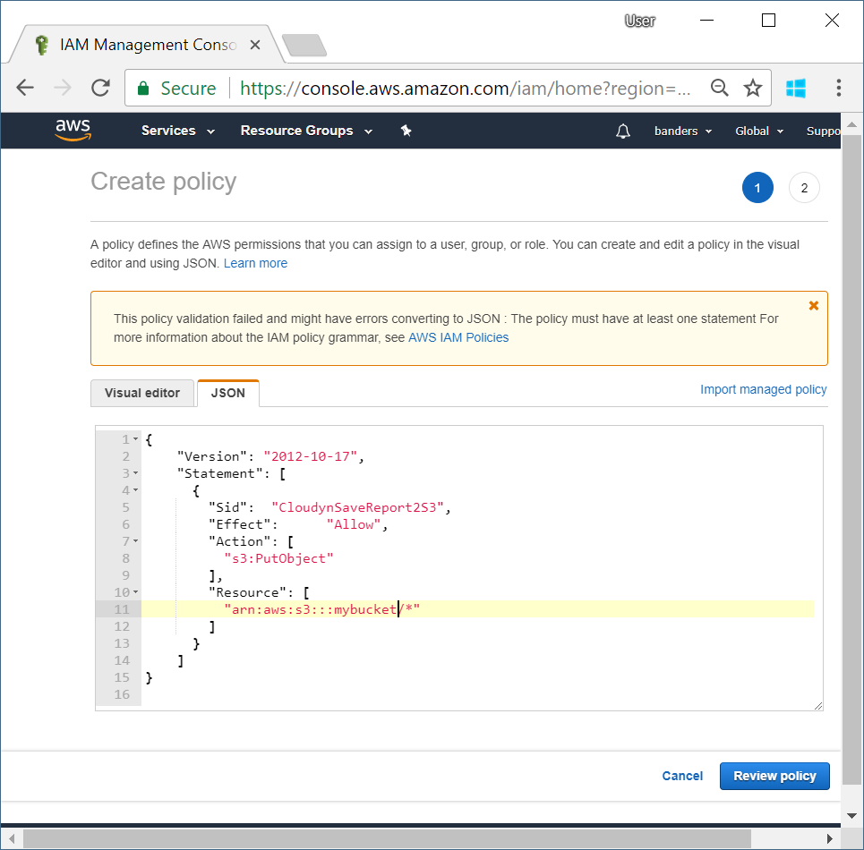
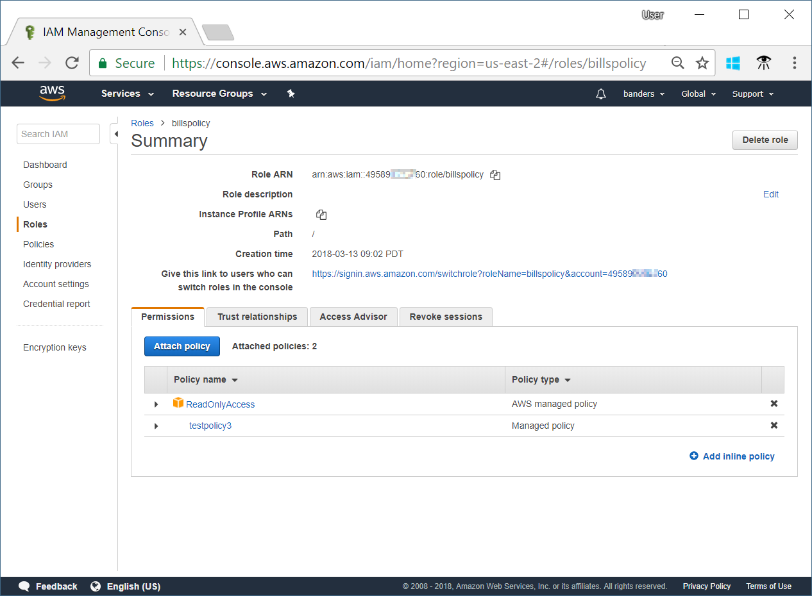
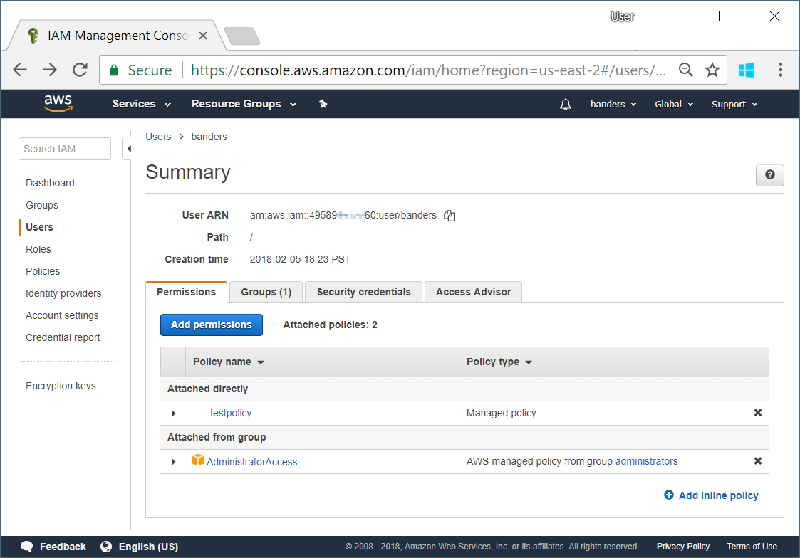
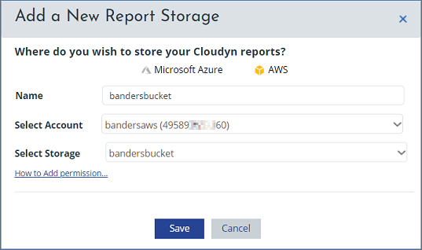

# Configure storage accounts for Cloudyn

<!--- intent: As a Cloudyn user, I want to configure Cloudyn to use my cloud service provider storage account to store my reports. -->

You can save Cloudyn reports in the Cloudyn portal, Azure storage, or AWS storage buckets. Saving your reports to the Cloudyn portal is free of charge. However, saving your reports to your cloud service provider's storage is optional and incurs additional cost. This article helps you configure Azure storage accounts and Amazon Web Services (AWS) storage buckets to store your reports.

## Prerequisites

You must have either an Azure storage account or an Amazon storage bucket.

If you don't have an Azure storage account, you need to create one. For more information about creating an Azure storage account, see [Create a storage account](../storage/common/storage-quickstart-create-account.md).

If you don't have an AWS simple storage service (S3) bucket, you need to create one. For more information about creating an S3 bucket, see [Create a Bucket](https://docs.aws.amazon.com/AmazonS3/latest/gsg/CreatingABucket.html).

## Configure your Azure storage account

Configuring you Azure storage for use by Cloudyn is straightforward. Gather details about the storage account and copy them in the Cloudyn portal.

1. Sign in to the Azure portal at https://portal.azure.com.
2. Click **All Services**, select **Storage accounts**, scroll to the storage account that you want to use, and then select the account.
3. On your storage account page under **Settings**, click **Access Keys**.
4. Copy your **Storage account name** and **Connection string** under key1.  
     
5. Open the Cloudyn portal from the Azure portal or navigate to https://azure.cloudyn.com and sign in.
6. Click the cog symbol and then select **Reports Storage Management**.
7. Click **Add new +** and ensure that Microsoft Azure is selected. Paste your Azure storage account name in the **Name** area. Paste your **connection string** in the corresponding area. Enter a container name and then click **Save**.  
   

   Your new Azure report storage entry appears in the storage account list.  
    


You can now save reports to Azure storage. In any report, click **Actions** and then select **Schedule report**. Name the report and then either add your own URL or use the automatically created URL. Select  **Save to storage**  and then select the storage account. Enter a prefix that gets appended to the report file name. Select either CSV or JSON file format and then save the report.

## Configure an AWS storage bucket

The Cloudyn uses existing AWS credentials: User or Role, to save the reports to your bucket. To test the access, Cloudyn tries to save a small text file to the bucket with the file name _check-bucket-permission.txt_.

You provide the Cloudyn role or user with the PutObject permission to your bucket. Then, use an existing bucket or create a new one to save reports. Finally, decide how to manage the storage class, set lifecycle rules, or remove any unnecessary files.

###  Assign permissions to your AWS user or role

When you create a new policy, you provide the exact permissions needed to save a report to a S3
bucket.

1. Sign in to the AWS console and select **Services**.
2. Select **IAM** from the list of services.
3. Select **Policies** on the left side of the console and then click **Create Policy**.
4. Click the **JSON** tab.
5. The following policy allows you to save a report to a S3 bucket. Copy and paste the following policy example to the **JSON** tab. Replace &lt;bucketname&gt; with your bucket name.

   ```json
   {
	"Version": "2012-10-17",
	"Statement": [
	  {
		"Sid":  "CloudynSaveReport2S3",
		"Effect":      "Allow",
		"Action": [
		  "s3:PutObject"
		],
		"Resource": [
		  "arn:aws:s3:::<bucketname>/*"
		]
	  }
    ]
   }
   ```

6. Click **Review policy**.  
      
7. On the Review policy page, type a name for your policy. For example, _CloudynSaveReport2S3_.
8. Click **Create policy**.

### Attach the policy to a Cloudyn role or user in your account

To attach the new policy, you open the AWS console and edit the Cloudyn role or user.

1. Sign in to the AWS console and select **Services**, then select **IAM** from the list of services.
2. Select either **Roles** or **Users** from the left side of the console.

**For roles:**

  1. Click your Cloudyn role name.
  2. On the **Permissions** tab, click **Attach Policy**.
  3. Search for the policy that you created and select it, then click **Attach Policy**.
    

**For users:**

1. Select the Cloudyn User.
2. On the **Permissions** tab, click **Add permissions**.
3. In the **Grant Permission** section, select **Attach existing policies directly**.
4. Search for the policy that you created and select it, then click **Next: Review**.
5. On the Add permissions to role name page, click **Add permissions**.  
    


### Optional: Set permission with bucket policy

You can also set permission to create reports on your S3 bucket using a bucket policy. In the classic S3 view:

1. Create or select an existing bucket.
2. Select the **Permissions** tab and then click **Bucket policy**.
3. Copy and paste the following policy sample. Replace &lt;bucket\_name&gt; and &lt;Cloudyn\_principle&gt; with the ARN of your bucket. Replace the ARN of either the role or user used by Cloudyn.

   ```
   {
   "Id": "Policy1485775646248",
   "Version": "2012-10-17",
   "Statement": [
    {
      "Sid": "SaveReport2S3",
      "Action": [
        "s3:PutObject"
      ],
      "Effect": "Allow",
      "Resource": "<bucket_name>/*",
      "Principal": {
        "AWS": [
          "<Cloudyn_principle>"
        ]
      }
    }
   ]
   }
   ```

4. In the Bucket policy editor, click **Save**.

### Add AWS report storage to Cloudyn

1. Open the Cloudyn portal from the Azure portal or navigate to https://azure.cloudyn.com and sign in.
2. Click the cog symbol and then select **Reports Storage Management**.
3. Click **Add new +** and ensure that AWS is selected.
4. Select an account and storage bucket. The name of the AWS storage bucket is automatically filled-in.  
      
5. Click **Save** and then click **Ok**.

    Your new AWS report storage entry appears in the storage account list.  
    


You can now save reports to Azure storage. In any report, click **Actions**  and then select **Schedule report**. Name the report and then either add your own URL or use the automatically created URL. Select  **Save to storage**  and then select the storage account. Enter a prefix that gets appended to the report file name. Select either CSV or JSON file format and then save the report.

## Next steps

- Review [Understanding Cloudyn reports](understanding-cost-reports.md) to learn about the basic structure and functions of Cloudyn reports.
