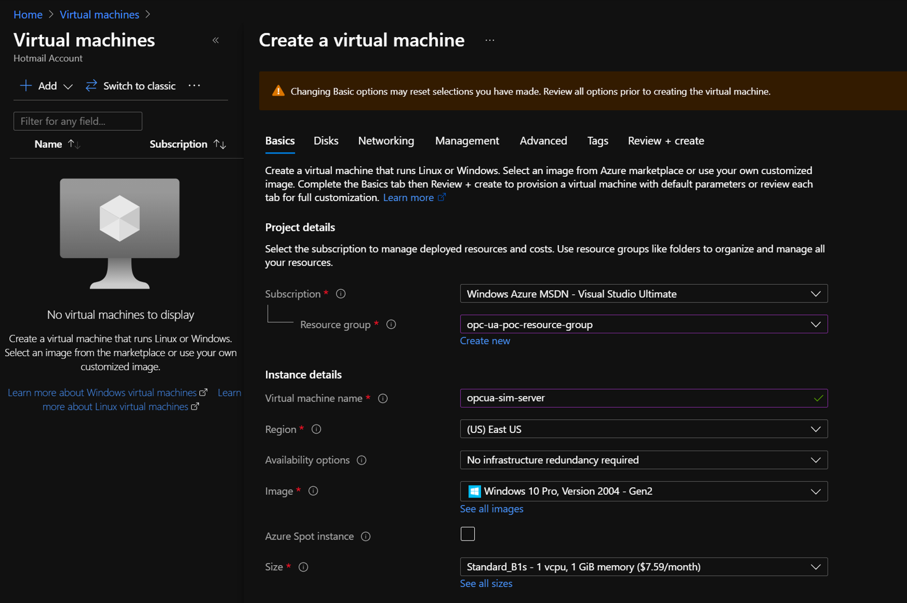
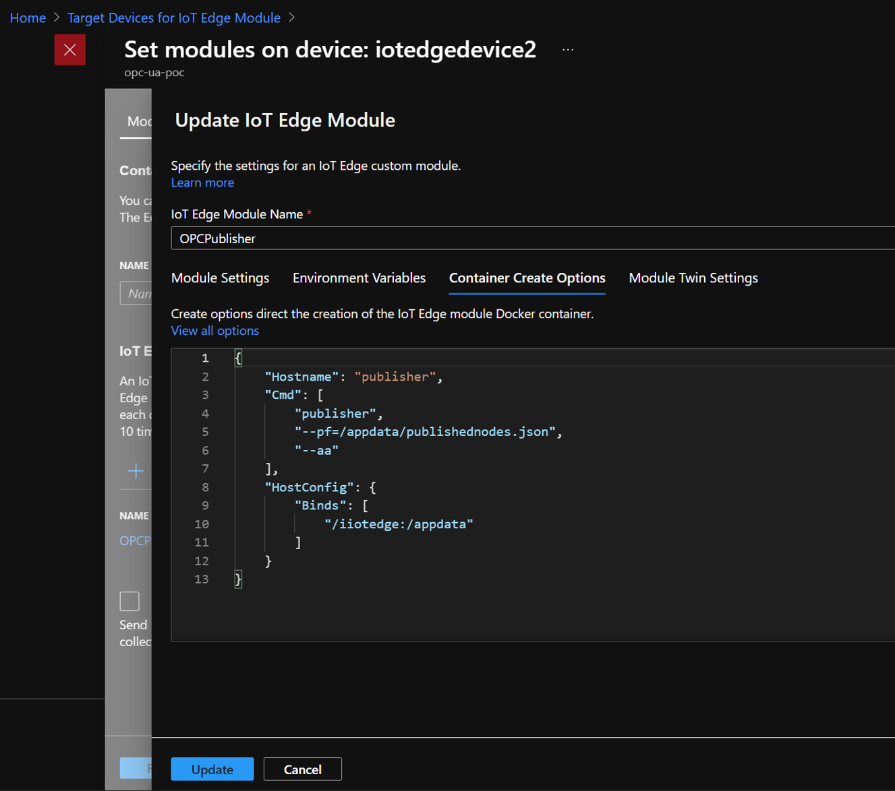

---
# Mandatory fields.
title: How to get OPC UA data into Azure Digital Twins
titleSuffix: Azure Digital Twins
description: Steps to get your Azure OPC UA Data into Azure Digital Twins
author: dahellem
ms.author: dahellem # Microsoft employees only
ms.date: 5/20/2021
ms.topic: how-to
ms.service: digital-twins
# Optional fields. Don't forget to remove # if you need a field.
# ms.custom: can-be-multiple-comma-separated
# ms.reviewer: MSFT-alias-of-reviewer
# manager: MSFT-alias-of-manager-or-PM-counterpart
---

# Get OPC UA data into Azure Digital Twins

## Architecture

Getting your OPC UA Server data to flow into Azure Digital Twins is hard. There are multiple components you need to install on different devices, custom code you need to write, and settings you need to configure. But it can be done. To help, we put together a proof of concept that connects all these pieces together to get your OPC UA nodes into Azure Digital Twins. We hope this will provide you the right guidance and tools to build upon for your solutions.

| Component                       | Description                                                                                                                                                |
| ------------------------------- | ---------------------------------------------------------------------------------------------------------------------------------------------------------- |
| ProSys OPC UA Simulation Server | Free OPC UA Server to simulate the OPC UA data                                                                                                             |
| IoT Edge                        | IoT Hub service that gets installed on a local Linux gateway device. This is required for the OPC Publisher module to run and send data to IoT Hub.        |
| OPC Publisher                   | IoT Edge module built by the Azure Industrial IoT team. This is the module that connects to your OPC UA Server and sends the node data into Azure IoT Hub. |
| Azure IoT Hub                   | OPC Publisher sends the OPC UA telemetry into Azure IoT Hub. From there we can process that data through an Azure Function and into Azure Digital Twins.   |
| Azure Digital Twins             | Azure Digital Twins the platform that enables you to create a digital representation of real-world things, places, business processes, and people.         |
| Azure Function                  | Custom Azure Function is used to process the telemetry coming into Azure IoT Hub into the right twins and properties in Azure Digital Twins.               |

This will feel complicated the first time you try it. There are a lot of steps and configurations that need to be done. But after you done it a couple times, it becomes much easier.

> [!TIP]
> All of the files you need for this proof of concept are located in this [GitHub Repo](https://github.com/Azure-Samples/opcua-to-azure-digital-twins). We recommend you clone or download this repo before you get started.

Finally, this article does not address converting OPC UA nodes into DTDL. It only addresses getting the telemetry from your OPC UA Server into Azure Digital Twins using an existing model. If you are interested in generating DTDL models from OPC UA data, check out the [UANodeSetWebViewer](https://github.com/barnstee/UANodesetWebViewer) and [OPCUA2DTDL](https://github.com/khilscher/OPCUA2DTDL) repos.

## Setup Edge Components

The first steps are getting the devices and software setup on the edge. This includes your OPC UA simulation server, gateway device, and IoT Hub components. The steps to install these components are well documented, but we wanted to step through these together so you can see the whole story. However, if you want more details, you can read the following articles:

* Step-by-step guide to installing OPC Publisher on Azure IoT Edge | Kevin Hilscher
* Install IoT Edge on Linux | Microsoft Docs
* OPC Publisher | GitHub Repo
* Configure OPC Publisher | Microsoft Docs

## OPC UA Server

This is a proof of concept, and we did not have access to physical devices running a real OPC UA Server. So instead, we installed the free [Prosys OPC UA Simulation Server](https://www.prosysopc.com/products/opc-ua-simulation-server/) on a Windows VM to generate OPC UA data. If you already have an OPC UA device, or another OPC UA simulation server, you can skip to the next step. 

### Windows 10 virtual machine

You don’t need a lot of power to run the ProSys Software. This Windows 10 VM (see specs below) should do.



Your VM must be reachable over the internet. To keep things simple, I opened all ports and assigned the VM a Public IP address. This is a security risk, but it is a proof of concept, and we are okay with the risk. You may want to consider better security measures for your environment.


### Install OPC UA simulation software

From your new Windows virtual machine, install the [Prosys OPC UA Simulation Server](https://www.prosysopc.com/products/opc-ua-simulation-server/). Launch once the download and install are completed. It takes a few moments to start the OPC UA server and the Service Status will let you know when it is running. 


Copy the Connection Address (UA TCP) and replace the machine name with your Public IP of your VM. You will need it for the publishednodes.json file later. 

```
opc.tcp://{ip address}:53530/OPCUA/SimulationServer
```

For this proof of concept, we are going to use the simulation nodes provided by default in the Simulation folder. Each item will have a unique NodeId (ns=3;i=1003) value. You will need these NodeId values for the publishednodes.json and opcua-mapping.json files later in this article.


### Verify success

* ProSys Simulation Server setup and running
* Copied the UA TCP Connection Address (`opc.tcp://{ip address}:53530/OPCUA/SimulationServer`)
* Captured the list of NodeId’s (`ns=3;i=1003`) for the simulated nodes you want published

## Setup IoT Edge device

Create an Azure IoT Hub instance by following these steps. Creating a free instance is adequate for a proof of concept.


Go to the IoT Edge item in the left navigation and select the “Add an IoT Edge device”.


Once your device is created, copy the primary or secondary connection string value. You will need this later when you setup your physical edge device.


## Setup gateway device
In order to get your OPC UA Server data into IoT Hub, we need to have another device that runs IoT Edge with the OPC Publisher module. OPC Publisher will then listen to OPC UA node updates and will publish the telemetry into IoT Hub in a json format.

### Create Ubuntu Server virtual machine

We recommend using Ubuntu Server instead of Windows because it is easier to configure the OPC Publisher.


> [!TIP]
> The default size “Standard_b1s – vcpu, 1GiB memory ($7.59/month)” is too slow for RDP. Try updating it to the 2 GiB memory for a better RDP experience. 

> [!NOTE]
> If you choose to RDP into your Ubuntu VM, you can follow [the instructions here](https://docs.microsoft.com/en-us/azure/virtual-machines/linux/use-remote-desktop).

### Install IoT Edge container

Follow the instructions to Install IoT Edge on Linux. 

Once the installation completes run:

```
admin@gateway:~$ sudo iotedge check
```

This will run number of tests to make sure your installation is good.

### Instal OPC Publisher module

The OPC Publisher module now needs to be installed on your gateway device. The easiest way to install the OPC Publisher module is from the [Azure Marketplace](https://azuremarketplace.microsoft.com/en-us/marketplace/apps/microsoft_iot.iotedge-opc-publisher) and follow the steps documented in the [GitHub Repo](https://github.com/Azure/iot-edge-opc-publisher).


In the “Container Create Options” make sure you add the following json:



```JSON
{
    "Hostname": "opcpublisher",
    "Cmd": [
        "--pf=./publishednodes.json",
        "--aa"
    ],
    "HostConfig": {
        "Binds": [
            "/iiotedge:/appdata"
        ]
    }
}
```

This should work without any changes, but you may need to adjust the settings if your gateway device differs from our guidance so far.

Follow the prompts to create the module. After about 15 seconds, you can run `iotedge list` on your gateway device. You should now see the OPCPublisher module up and running.


Finally, go to the `/iiotedge` directory and create a publishednodes.json file. The Id’s need to match the nodeId’s from the OPC Server. Your file should like something like this:

```JSON
[
    {
        "EndpointUrl": "opc.tcp://20.185.195.172:53530/OPCUA/SimulationServer",
        "UseSecurity": false,
        "OpcNodes": [
            {
                "Id": "ns=3;i=1001"               
            },
            {
                "Id": "ns=3;i=1002"                
            },
            {
                "Id": "ns=3;i=1003"               
            },
            {
                "Id": "ns=3;i=1004"                
            },
            {
                "Id": "ns=3;i=1005"                
            },
            {
                "Id": "ns=3;i=1006"                
            }
        ]
    }
]
```

Save your changes to the publishednodes.json file and run the following command:

```
sudo iotedge logs OPCPublisher -f
```

This will give you the output of the OPC Publisher logs. If everything is configured and running correctly, you will see something like this.


To monitor the messages flowing into Azure IoT hub, you can use the following command:

```
az iot hub monitor-events -n {iot-hub-instance} -t 0
```


> [!TIP]
> Try using [Azure IoT Explorer](https://docs.microsoft.com/en-us/azure/iot-pnp/howto-use-iot-explorer) to monitor IoT Hub messages.

Sweet, you now have data flowing from an OPC UA Server into IoT Hub. Next up, getting the telemetry data into Azure Digital Twins.

### Verify success

* IoT Hub instance created.
* IoT Edge device provisioned.
* Ubuntu Server VM created.
* IoT Edge installed and on Ubuntu VM.
* OPC Publisher module installed.
* Publishednodes.json file created and configured.
* OPC Publisher module running, and telemetry data is flowing to IoT Hub.

### Verify success

[!INCLUDE [digital-twins-setup-verify-role-assignment.md](../../includes/digital-twins-setup-verify-role-assignment.md)]

You now have an Azure Digital Twins instance ready to go, and have assigned permissions to manage it.

In the “Container Create Options” make sure you add the following json:


## Next steps

Test out individual REST API calls on your instance using the Azure Digital Twins CLI commands:

- [az dt reference](/cli/azure/ext/azure-iot/dt?preserve-view=true&view=azure-cli-latest)
- [_How-to: Use the Azure Digital Twins CLI_](how-to-use-cli.md)

Or, see how to connect a client application to your instance with authentication code:

- [_How-to: Write app authentication code_](how-to-authenticate-client.md)
