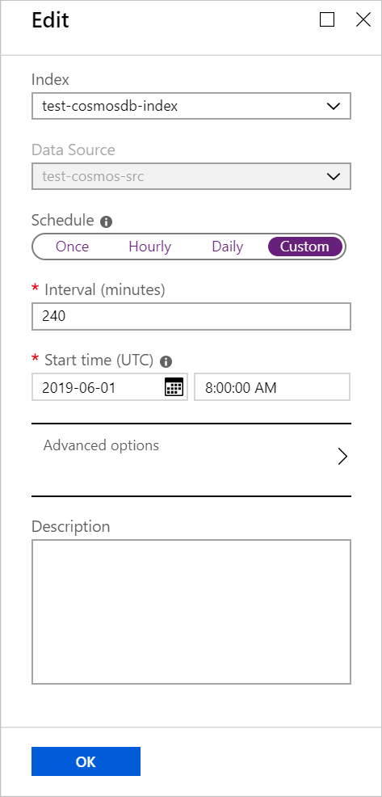

# How to schedule indexers for Azure Search
An indexer normally runs once, immediately after it is created. It can be run again on demand from the Portal or the REST API. You can also can configure an indexer to run periodically on a schedule.

Some situations where indexer scheduling is useful:

* Your source data will change over time, and you want the Azure Search indexers to automatically process the changed data.
* Your index will be populated from multiple data sources, and you want to make sure the indexers all run at different times to reduce conflicts.
* Your source data is very large and you want to spread the indexer processing work over time. For more information about indexing volumes of data, see [How to index large data sets in Azure Search](https://docs.microsoft.com/en-us/azure/search/search-howto-large-index).

The scheduler is a built-in feature of Azure Search. You can't use an external scheduler to control search indexers.

## Schedule an indexer
You can specify a schedule when first creating the indexer, or by updating the indexer's properties later. Indexer schedules can be set using the Portal, the REST API, or the .NET SDK.

## Define an indexer schedule in the Portal

The Import Data wizard in the portal lets you define the schedule for an indexer at creation time. By default, the Schedule is set to Hourly, which means the indexer will run once right after it is created, and then run periodically every hour after that. You can change the Schedule setting to Once if you don't want the indexer to run again automatically. 

When you set the Schedule to Custom, fields appear to let you specify the time Interval and the Start date and time (UTC). The shortest time interval allowed is 5 minutes, and the longest is 1440 minutes (24 hours).

   

After an indexer has been created, you can change the schedule settings using the indexer's Edit panel. The Schedule fields are the same as those in the Import Data wizard.

   

## Define an indexer schedule using the REST API

You can define the schedule for an indexer using the REST API. To do this, include the **schedule** property when creating or updating the indexer. The example below shows a PUT request to update the indexer:

    PUT https://myservice.search.windows.net/indexers/myindexer?api-version=2019-05-06
    Content-Type: application/json
    api-key: admin-key

    {
        "dataSourceName" : "myazuresqldatasource",
        "targetIndexName" : "target index name",
        "schedule" : { "interval" : "PT10M", "startTime" : "2015-01-01T00:00:00Z" }
    }

The **interval** parameter is required. The interval refers to the time between the start of two consecutive indexer executions. The smallest allowed interval is 5 minutes; the longest is one day. It must be formatted as an XSD "dayTimeDuration" value (a restricted subset of an [ISO 8601 duration](https://www.w3.org/TR/xmlschema11-2/#dayTimeDuration) value). The pattern for this is: `P(nD)(T(nH)(nM))`. Examples: `PT15M` for every 15 minutes, `PT2H` for every 2 hours.

The optional **startTime** indicates when the scheduled executions should commence. If it is omitted, the current UTC time is used. This time can be in the past – in which case the first execution is scheduled as if the indexer has been running continuously since the startTime.  

Only one execution of an indexer can run at a time. If an indexer is already running when its execution is scheduled, the execution is postponed until the next scheduled time.

Let’s consider an example to make this more concrete. Suppose we the following hourly schedule configured:

    "schedule" : { "interval" : "PT1H", "startTime" : "2015-03-01T00:00:00Z" }

Here’s what happens:

1. The first indexer execution starts at or around March 1, 2015 12:00 a.m. UTC.
2. Assume this execution takes 20 minutes (or any time less than 1 hour).
3. The second execution starts at or around March 1, 2015 1:00 a.m.
4. Now suppose that this execution takes more than an hour – for example, 70 minutes – so that it completes around 2:10 a.m.
5. It’s now 2:00 a.m., time for the third execution to start. However, because the second execution from 1 a.m. is still running, the third execution is skipped. The third execution starts at 3 a.m.

You can add, change, or delete a schedule for an existing indexer by using a **PUT indexer** request.

## Schedule an indexer using the .NET SDK

TBD

## Help us make Azure Search better
If you have feature requests or ideas for improvements, please reach out to us on our [UserVoice site](https://feedback.azure.com/forums/263029-azure-search/).
