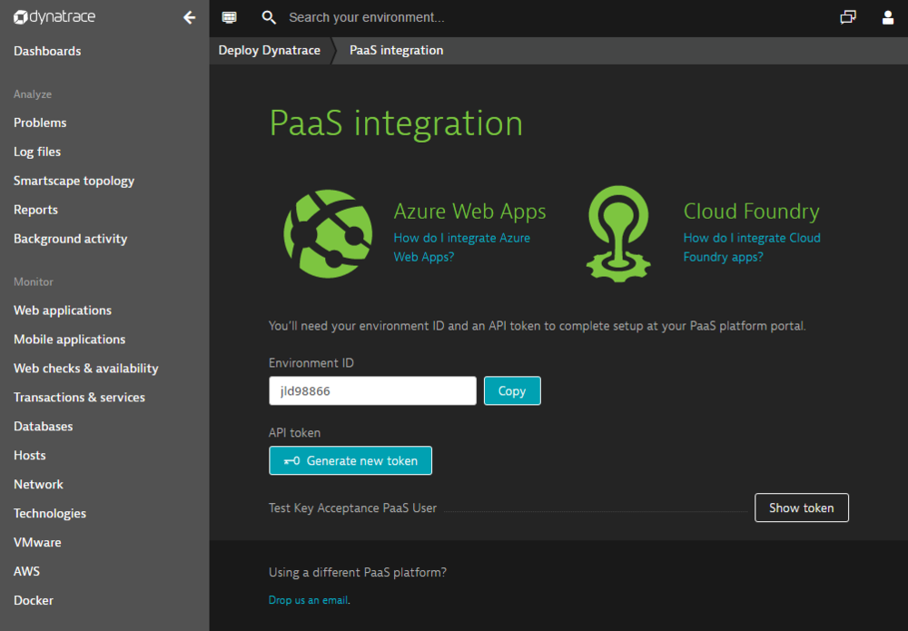

# Monitor an Azure Service Fabric cluster with Dynatrace SaaS/Managed
In this article, we show you how to deploy the [Dynatrace](https://www.dynatrace.com/) OneAgent to monitor all the agent nodes in your Azure Service Fabric cluster. You need an account with Dynatrace SaaS/Managed for this configuration. 

## Dynatrace SaaS/Managed
Dynatrace is a cloud-native monitoring solution for highly dynamic container and cluster environments. It allows you to better optimize your container deployments and memory allocations by using real-time usage data. It is capable of automatically pinpointing application and infrastructure issues by providing automated baselining, problem correlation, and root-cause detection.

The following figure shows the Dynatrace UI:


## Prerequisites 
[Deploy](service-fabric-get-started-azure-cluster.md) an Azure Service Fabric cluster. Go to [https://www.dynatrace.com/trial/](https://www.dynatrace.com/trial/) to set up a Dynatrace SaaS account.  

## Configure a Dynatrace deployment with Azure Service Fabric
Azure Service Fabric clusters are built around VM Scale Sets. You can leverage Azure CLI or PowerShell Commandlets to deploy the Dynatrace OneAgent to them. This way, any new node that's added to the cluster or any new service that's deployed is automatically monitored.
These steps show you how to configure and deploy the Dynatrace OneAgent to Azure Service Fabric.

> [!NOTE]
> Regardless of whether you're using Azure CLI or PowerShell commandlets, you can replace `oneAgentWindows` by `oneAgentLinux` in case your cluster is running on Linux instead of Windows.

1. You need a Dynatrace SaaS account or a free trial account. Once you log into the Dynatrace dashboard, select **Deploy Dynatrace**.

    

2. On the page, select **Set up PaaS integration**. 

     

3. Execute the following command on Azure CLI 2.0

```bash
az vmss extension set
  -n oneAgentWindows
  --publisher dynatrace.ruxit
  -g "<resource group name>"
  --vmss-name "<VMSS name>"
  --settings "{\"tenantId\":\"<your environment ID>\",\"token\":\"<PaaS token>\"}"
```

In case you are using Dynatrace Managed, please make sure to add the server's address to the settings JSON. The according value is the address only, without https:// and without any subpaths.

```bash
--settings "{\"server\":\"<Dynatrace Managed URL>\",\"tenantId\":\"<your environment ID>\",\"token\":\"<PaaS token>\"}"
```

If you prefer PowerShell commandlets, please execute the following command:
powershell
Add-AzureRmVmssExtension
  -Name oneAgentWindows
  -Publisher dynatrace.ruxit
  -Type oneAgentWindows
  -TypeHandlerVersion 1.99
  -AutoUpgradeMinorVersion $true
  -Setting @{ "tenantId"="<your environment ID>"; "token"="<PaaS token>" }
  -VirtualMachineScaleSet $vmss
```

In case you are using Dynatrace Managed, please make sure to add the server's address to the settings parameters. The according value is the address only, without https:// and without any subpaths.
```powershell
-Setting @{ "server"="<Dynatrace Managed URL>"; "tenantId"="<your environment ID>"; "token"="<PaaS token>" }
```

5. To make sure all your services are monitored properly, restart the VM Scale Set.

## Next steps

Once you've installed the package, navigate back to the Dynatrace dashboard. You can explore the different usage metrics for the containers within your cluster.  The nodes and the deployed services should appear automatically after a few minutes.

