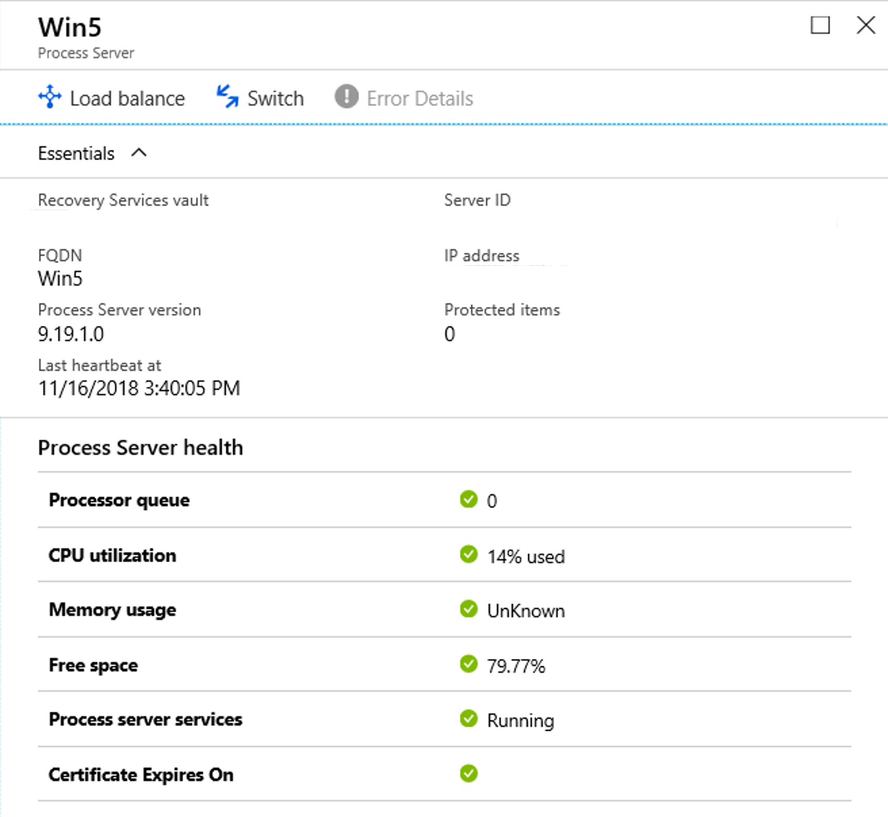

# Manage process servers

By default the process server used when you're replicating VMware VMs or physical servers to Azure is installed on the on-premises configuration server machine. There are a couple of instances in which you need to set up a separate process server:

- For large deployments, you might need additional on-premises process servers to scale capacity.
- For failback, you need a temporary process server set up in Azure. You can delete this VM when failback is done. 

This article summarizes typical management tasks for these additional process servers.

## Upgrade a process server

Upgrade an process server running on premises, or in Azure (for failback purposes), as follows:

[!INCLUDE [site-recovery-vmware-upgrade -process-server](../../includes/site-recovery-vmware-upgrade-process-server-internal.md)]

> [!NOTE]
  Typically, when you use the Azure Gallery Image to create a process server in Azure for the purposes of failback, it's running the latest version available. The Site Recovery teams release fixes and enhancements on a regular basis, and we recommend you keep process servers up-to-date.

## Balance the load on process server

To balance load between two process servers,

1. Navigate to **Recovery Services Vault** > **Manage** > **Site Recovery Infrastructure** > **For VMware & Physical machines** > **Configuration Servers**.
2. Click on the configuration server to which the process servers are registered with.
3. List of process servers registered to the configuration servers are available on the page.
4. Click on the process server on which you wish to modify the workload.

    

5. You can either use **Load Balance** or **Switch** options, as explained below, as per the requirement.

### Load balance

Through this option, you can select one or more virtual machines and can transfer them to another process server.

1. Click on **Load balance**, select target process server from the drop down. Click **OK**

    

2. Click on **Select machines**, choose the virtual machines you wish to move from current process server to the target process server. Details of average data change are displayed against each virtual machine.
3. Click **OK**. Monitor the progress of the job under **Recovery Services Vault** > **Monitoring** > **Site Recovery jobs**.
4. It takes 15 minutes for the changes to reflect post successful completion of this operation OR [refresh the configuration server](vmware-azure-manage-configuration-server.md#refresh-configuration-server) for immediate effect.

### Switch

Through this option, entire workload protected under a process server is moved to a different process server.

1. Click on **Switch**, select the Target process server, click **OK**.

    

2. Monitor the progress of the job under **Recovery Services Vault** > **Monitoring** > **Site Recovery jobs**.
3. It takes 15 minutes for the changes to reflect post successful completion of this operation OR [refresh the configuration server](vmware-azure-manage-configuration-server.md#refresh-configuration-server) for immediate effect.

## Reregister a process server

If you need to reregister a process server running on-premises, or in Azure, with the configuration server, do the following:

[!INCLUDE [site-recovery-vmware-register-process-server](../../includes/site-recovery-vmware-register-process-server.md)]

After you've saved the settings, do the following:

1. On the process server, open an administrator command prompt.
2. Browse to folder **%PROGRAMDATA%\ASR\Agent**, and run the command:

    ```
    cdpcli.exe --registermt
    net stop obengine
    net start obengine
    ```

## Modify proxy settings for an on-premises process server

If the process server uses a proxy to connect to Site Recovery in Azure, use this procedure if you need to modify existing proxy settings.

1. Log onto the process server machine. 
2. Open an Admin PowerShell command window, and run the following command:
  ```powershell
  $pwd = ConvertTo-SecureString -String MyProxyUserPassword
  Set-OBMachineSetting -ProxyServer http://myproxyserver.domain.com -ProxyPort PortNumber –ProxyUserName domain\username -ProxyPassword $pwd
  net stop obengine
  net start obengine
  ```
2. Browse to folder **%PROGRAMDATA%\ASR\Agent**, and run the following command:
  ```
  cmd
  cdpcli.exe --registermt

  net stop obengine

  net start obengine

  exit
  ```


## Remove a process server

[!INCLUDE [site-recovery-vmware-unregister-process-server](../../includes/site-recovery-vmware-unregister-process-server.md)]

## Manage anti-virus software on process servers

If anti-virus software is active on a standalone process server or master target server, exclude the following folders from anti-virus operations:


- C:\Program Files\Microsoft Azure Recovery Services Agent
- C:\ProgramData\ASR
- C:\ProgramData\ASRLogs
- C:\ProgramData\ASRSetupLogs
- C:\ProgramData\LogUploadServiceLogs
- C:\ProgramData\Microsoft Azure Site Recovery
- Process server installation directory, Example: C:\Program Files (x86)\Microsoft Azure Site Recovery

