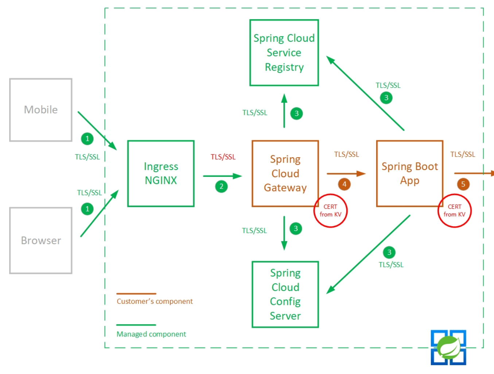
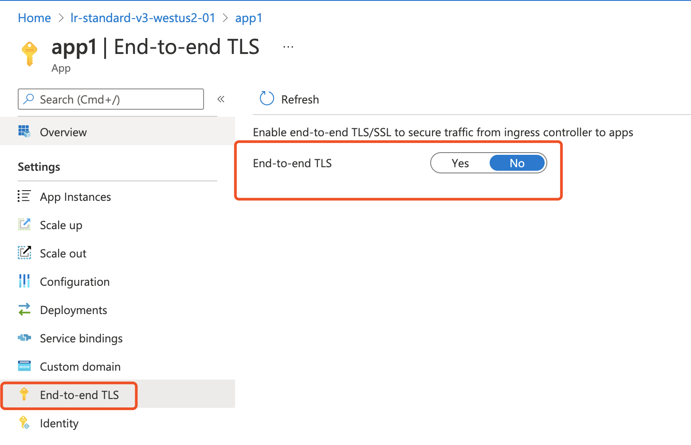

# Overview

This article describes what the secure communication of Azure Spring Cloud like and the following picture shows the overall secure communication support in Azure Spring Cloud.



# Enable end-to-end TLS for an application

This topic shows you how to enable end-to-end SSL/TLS to secure traffic from an ingress controller to applications that support HTTPS.

After you enable end-to-end TLS, when external app (Mobile or Browser and so on) communicate with Azure Spring Cloud using TLS (label 1 in overview), the communication between your application and ingress controller are secured with TLS(label 2 in overview), too. 
 
And under this condition, External app would receive the certificate return from your application towards the forwarding of ingress controller(spring cloud gateway in overview). 

## Prerequisites

- A deployed Azure Spring Cloud instance. Follow our [quickstart on deploying via the Azure CLI](./quickstart.md) to get started.
- If you're unfamiliar with end-to-end TLS, see the [end-to-end TLS sample](https://github.com/Azure-Samples/spring-boot-secure-communications-using-end-to-end-tls-ssl).
- To securely load the required certificates into Spring Boot apps, you can use [keyvault spring boot starter](https://github.com/Azure/azure-sdk-for-java/tree/master/sdk/spring/azure-spring-boot-starter-keyvault-certificates).

## Enable end-to-end TLS on an existing app

Use the command `az spring-cloud app update --enable-end-to-end-tls` to enable or disable end-to-end TLS for an app.

```azurecli
az spring-cloud app update --enable-end-to-end-tls -n app_name -s service_name -g resource_group_name
az spring-cloud app update --enable-end-to-end-tls false -n app_name -s service_name -g resource_group_name
```

## Enable end-to-end TLS when you bind custom domain

Use the command `az spring-cloud app custom-domain update --enable-end-to-end-tls` or `az spring-cloud app custom-domain bind --enable-end-to-end-tls` to enable or disable end-to-end TLS for an app.

```azurecli
az spring-cloud app custom-domain update --enable-end-to-end-tls -n app_name -s service_name -g resource_group_name
az spring-cloud app custom-domain bind --enable-end-to-end-tls -n app_name -s service_name -g resource_group_name
```

## Enable end-to-end TLS using Azure portal
To enable end-to-end TLS in the [Azure portal](https://portal.azure.com/), first create an app, and then enable the feature.

1. Create an app in the portal as you normally would. Navigate to it in the portal.
2. Scroll down to the **Settings** group in the left navigation pane.
3. Select **End-to-end TLS**.
4. Switch **End-to-end TLS** to *Yes*.



## Verify end-to-end TLS status

Use the command `az spring-cloud app show` to check the value of `enableEndToEndTls`.

```azurecli
az spring-cloud app show -n app_name -s service_name -g resource_group_name
```

# TLS communications between your application and external services

The communication between your application and external service(label 5 in overview) could be fully managed by users.

To reduce developers' effort, Azure Spring Cloud provides a convenient way to help users manage their public certificates and load them into  application's trust store. 

You could follow [Use TLS/SSL certificates in an application](./how-to-use-tls-certificate.md) to use this feature.

# TLS communications between Azure Spring Cloud components

## TLS communications between applications and Azure Spring Cloud service runtime

TLS communication between your application and Azure Spring Cloud service runtime like config server, service registry and eureka server (label 3 in overview) is fully took care of by Azure Spring Cloud and users do not need to concern about them.

Additionally, instead of using simple TLS for communications between applications, Azure Spring Cloud uses mutual TLS. 

## TLS communications between applications

The communication between your applications (label 4 in overview) is fully managed by users and users could also take the convenience of Azure Spring Cloud provided feature to load certificates into application's trust store.


## Next steps

* [Access Config Server and Service Registry](how-to-access-data-plane-azure-ad-rbac.md)
