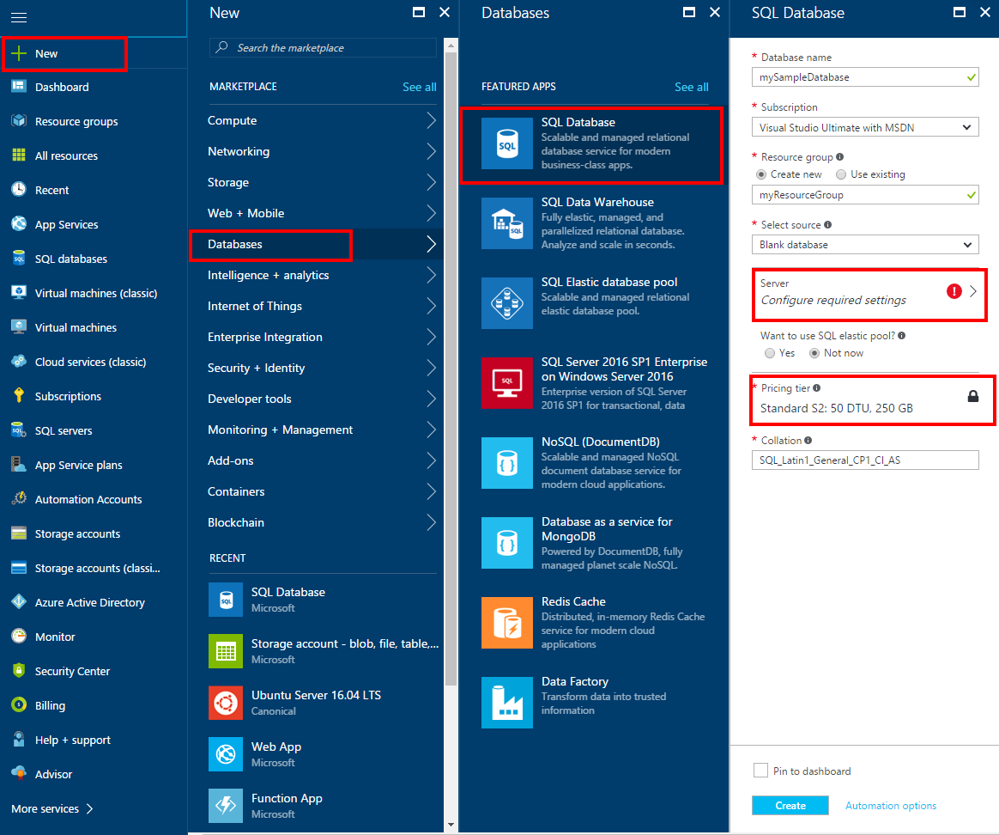
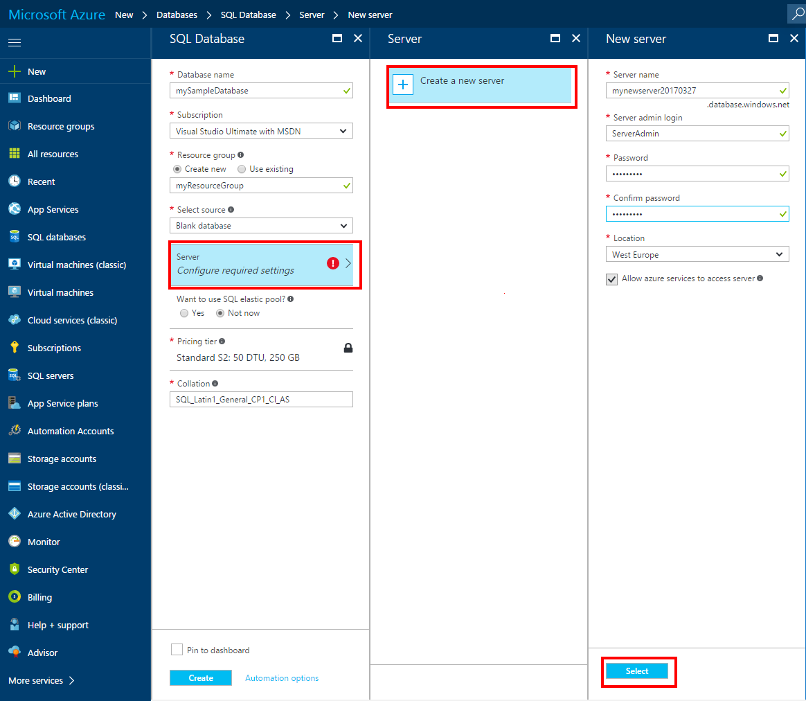
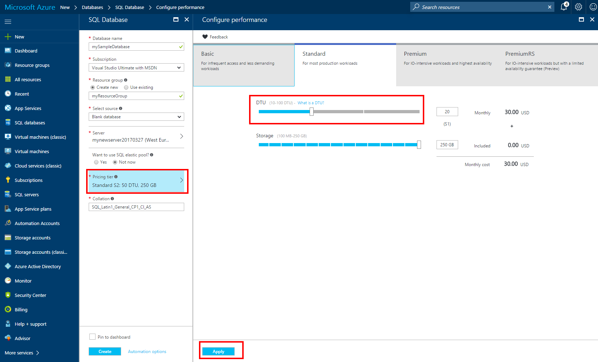
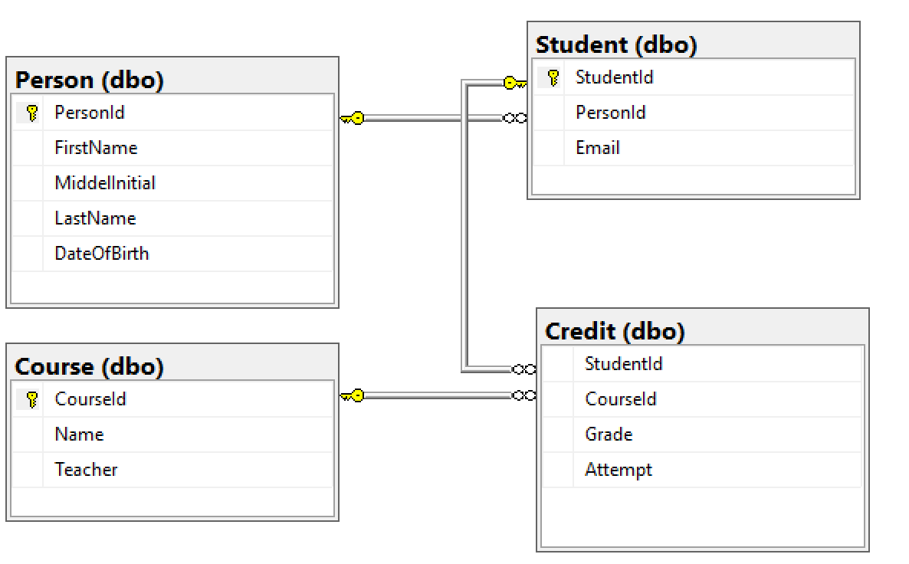
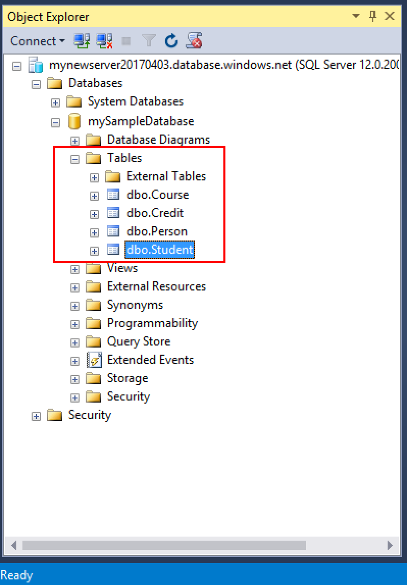

# Design your first Azure SQL database

When designing a database, it's important to think through the data you want to include in your database and what you want to be able to do with the data later on. In this tutorial, you'll be building a small cloud database for a university. The database will be used to track student grades and what courses students have enrolled for. 

You will use the Azure portal and SQL Server Management Studio (SSMS) to create an Azure SQL database on a new server, add tables to the database, and load data into the tables. You will also add indexes to your tables to make information retrieval faster. Finally, you'll use the SQL Database service's automated backups to restore the database to an earlier point in time before you added the tables.

To complete this tutorial, make sure you have installed the newest version of [SQL Server Management Studio](https://msdn.microsoft.com/library/ms174173.aspx) (SSMS) 

## Step 1: Log in to the Azure portal

Log in to the [Azure portal](https://portal.azure.com/).

## Step 2: Create a SQL database

An Azure SQL database is created with a defined set of [compute and storage resources](sql-database-service-tiers.md). The database is created within an [Azure resource group](../azure-resource-manager/resource-group-overview.md) and in an [Azure SQL Database logical server](sql-database-features.md). 

Follow these steps to create a SQL database containing the Adventure Works LT sample data. 

1. Click the **New** button found on the upper left-hand corner of the Azure portal.

2. Select **Databases** from the **New** page, and select **SQL Database** from the **Databases** page. **[Todo: Update image below]**

    

3. Fill out the SQL Database form with the following information, as shown on the preceding image:     

   - Database name: **mySampleDatabase**
   - Resource group: **myResourceGroup**
   - Source: **Blank Database**

4. Click **Server** to create and configure a new server for your new database. Fill out the **New server form** specifying a globally unique server name, provide a name for the Server admin login, and then specify the password of your choice. 

    
5. Click **Select**.

6. Click **Pricing tier** to specify the service tier and performance level for your new database. For this quick start, select **20 DTUs** and **250** GB of storage

    

7. Click **Apply**.  

8. Click **Create** to provision the database. Provisioning takes a few minutes. 

9. On the toolbar, click **Notifications** to monitor the deployment process.

    


## Step 3: Create a server-level firewall rule

The SQL Database service creates a firewall at the server-level preventing external applications and tools from connecting to the server or any databases on the server unless a firewall rule is created to open the firewall for specific IP addresses. Follow these steps to create a [SQL Database server-level firewall rule](sql-database-firewall-configure.md) for your client's IP address and enable external connectivity through the SQL Database firewall for your IP address only. 

1. After the deployment completes, click **SQL databases** from the left-hand menu and click your new database, **mySampleDatabase**, on the **SQL databases** page. The overview page for your database opens, showing you the fully qualified server name (such as **mynewserver20170327.database.windows.net**) and provides options for further configuration.

       

2. Click **Set server firewall** on the toolbar as shown in the previous image. The **Firewall settings** page for the SQL Database server opens. 

3. Click **Add client IP** on the toolbar and then click **Save**. A server-level firewall rule is created for your current IP address.

       

4. Click **OK** and then click the **X** to close the **Firewall settings** page.

You can now connect to the database and its server using SQL Server Management Studio or another tool of your choice.

## Step 4 - Get connection information

Get the fully qualified server name for your Azure SQL Database server in the Azure portal. You use the fully qualified server name to connect to your server using SQL Server Management Studio.

1. Log in to the [Azure portal](https://portal.azure.com/).
2. Select **SQL Databases** from the left-hand menu, and click your database on the **SQL databases** page. 
3. In the **Essentials** pane in the Azure portal page for your database, locate and then copy the **Server name**.

    

## Step 5 - Connect to the server using SQL Server Management Studio

Use [SQL Server Management Studio](https://docs.microsoft.com/en-us/sql/ssms/sql-server-management-studio-ssms) to establish a connection to your Azure SQL Database server.

1. Type **SSMS** in the Windows search box and then click **Enter** to open SSMS.

2. In the **Connect to Server** dialog box, enter the following information:
   - **Server type**: Specify Database engine
   - **Server name**: Enter your fully qualified server name, such as **mynewserver20170313.database.windows.net**
   - **Authentication**: Specify SQL Server Authentication
   - **Login**: Enter your server admin account
   - **Password**: Enter the password for your server admin account
 
    

3. Click **Connect**. The Object Explorer window opens in SQL Server Management Studio. 

    

4. In Object Explorer, expand **Databases** and then expand **mySampleDatabase** to view the objects in the sample database.

## Step 6 - Create tables in the database 



You will create four tables below as seen in the diagram above - the Person, Course, Student, and Credit tables. Some of these tables reference columns in other tables - the Student table references the 'PersonId' column of the Person table for example. Study the diagram above to understand how the tables in this tutorial are related to one another. [See here for an in-depth look at how to create effective database tables.](https://msdn.microsoft.com/library/cc505842.aspx)

1. In Object Explorer, right-click **mySampleDatabase** and click **New Query**. A blank query window opens that is connected to your database.

2. Below, we will create tables using the Transact-SQL (T-SQL) Data Definition Language [(see here for more information on T-SQL)](https://docs.microsoft.com/sql/t-sql/language-reference). You can also use the table designer in SQL Server Management Studio to create and design your tables [(see here for more information on how to create tables using the table designer)](https://msdn.microsoft.com/library/hh272695.aspx).

3. In the query window, execute the following query to create four new tables in your database: 

   ```sql 
   -- Create Person table

    CREATE TABLE Person
    (
      PersonId      INT IDENTITY PRIMARY KEY,
      FirstName     NVARCHAR(128) NOT NULL,
      MiddelInitial NVARCHAR(10),
      LastName      NVARCHAR(128) NOT NULL,
      DateOfBirth   DATE NOT NULL
    )
   
   -- Create Student table
 
    CREATE TABLE Student
    (
      StudentId INT IDENTITY PRIMARY KEY,
      PersonId  INT REFERENCES Person (PersonId),
      Email     NVARCHAR(256)
    )
    
   -- Create Course table
 
    CREATE TABLE Course
    (
      CourseId  INT IDENTITY PRIMARY KEY,
      Name      NVARCHAR(50) NOT NULL,
      Teacher   NVARCHAR(256) NOT NULL
    ) 

   -- Create Credit table
 
    CREATE TABLE Credit
    (
      StudentId   INT REFERENCES Student (StudentId),
      CourseId    INT REFERENCES Course (CourseId),
      Grade       DECIMAL(5,2) CHECK (Grade <= 100.00),
      Attempt     TINYINT,
      CONSTRAINT  [UQ_studentgrades] UNIQUE CLUSTERED
      (
        StudentId, CourseId, Grade, Attempt
      )
    )
   ```
4. Expand the 'tables' node in the SQL Server Management Studio Object explorer to see the tables you created.


## Step 7 - Load data into the tables

1. Create a new folder called **SampleTableData** in your Downloads folder. This folder will be used to store sample data for your database. 

2. Right-click the following links and save them into the **SampleTableData** folder.  
   [SamplePersonData](), [SampleCreditData](), [SampleCourseData](), [SampleStudentData]()

3. Open a command prompt window and navigate to the SampleTableData folder.

4. Execute the following command to insert sample data into the **Course table**, replacing the values for **ServerName**, **DatabaseName**, **UserName**, and **Password** with the values for your environment.
  
   ```bcp
   bcp Course in SampleCourseData.csv -S <ServerName> -d <DatabaseName> -U <Username> -P <password> -q -c -t ","
   ```
5. Execute the following command to insert sample data into the **Person table**, replacing the values for **ServerName**, **DatabaseName**, **UserName**, and **Password** with the values for your environment.
  
   ```bcp
   bcp Person in SamplePersonData.csv -S <ServerName> -d <DatabaseName> -U <Username> -P <password> -q -c -t ","
   ```
6. Execute the following command to insert sample data into the **Student table**, replacing the values for **ServerName**, **DatabaseName**, **UserName**, and **Password** with the values for your environment.
  
   ```bcp
   bcp Student in SampleStudentData.csv -S <ServerName> -d <DatabaseName> -U <Username> -P <password> -q -c -t ","
   ```
7. Execute the following command to insert sample data into the **Credit table**, replacing the values for **ServerName**, **DatabaseName**, **UserName**, and **Password** with the values for your environment.
  
   ```bcp
   bcp Credit in SampleCreditData.csv -S <ServerName> -d <DatabaseName> -U <Username> -P <password> -q -c -t ","
   ```

You have now loaded sample data into the tables you created earlier. You will query these tables for information in the next step.

## Step 8 - Query the tables and add indexes

To make searching for specific values in the table more efficient, you will create NonClustered indexes on the Course, Student, and Person tables. An index organizes the data in a database table to speed up retrieval of its rows. [See here for more information on the different types of indexes Azure SQL databases support](https://docs.microsoft.com/sql/relational-databases/indexes/indexes)

1. In a SQL Server Management Studio query window, execute the following query:

   ```sql 
   -- Find the students taught by Dominick Pope who have a grade higher than 75%

    SELECT  person.FirstName,
        person.LastName,
        course.Name,
        credit.Grade
    FROM  Person AS person
        INNER JOIN Student AS student ON person.PersonId = student.PersonId
        INNER JOIN Credit AS credit ON student.StudentId = credit.StudentId
        INNER JOIN Course AS course ON credit.CourseId = course.courseId
    WHERE course.Teacher = 'Dominick Pope' 
        AND Grade > 75
   ```

   This query returns all the students taught by 'Dominick Pope' who have a grade higher than 75%

2. In a SQL Server Management Studio query window, execute following query to create indexes:

   ```sql 
   CREATE NONCLUSTERED INDEX Idx_Teacher ON Course (Teacher) INCLUDE (Name)
   CREATE NONCLUSTERED INDEX Idx_StudentDetails ON Student (PersonId)
   CREATE NONCLUSTERED INDEX Idx_Student ON Person (FirstName, LastName)
   ```

   This query adds indexes on the Course, Student, and Person tables. This organizes the data in such a way that retrieving the values will be faster.

3. In a SQL Server Management Studio query window, execute following query:

   ```sql
   -- Find all the courses that Noe Coleman has ever enrolled for

    SELECT  course.Name,
        course.Teacher,
        credit.Grade
    FROM  Course AS course
        INNER JOIN Credit AS credit ON credit.CourseId = course.CourseId
        INNER JOIN Student AS student ON student.StudentId = credit.StudentId
        INNER JOIN Person AS person ON person.PersonId = student.PersonId
    WHERE person.FirstName = 'Noe'
        AND person.LastName = 'Coleman'
   ```

   This query returns all the courses 'Noe Coleman' has ever enrolled for.

## Step 9 - Restore a database to a previous point in time 

Databases in Azure have [continuous backups](sql-database-automated-backups.md) that are taken automatically. These backups allow you to restore your database to a previous point in time. Restoring a database to a different point in time creates a duplicate database in the same server as the original database as of the point in time you specify (within the retention period for your service tier). The following steps restore the sample database to a point before the tables were added. 

[!NOTE] Backups are automatically taken every 5-10 minutes, but don't worry all data is being backed up, you may just have to wait 5 min before you can restore to the point in time you intended.

1. On the SQL Database page for your database, click **Restore** on the toolbar. The **Restore** page opens.

    

2. Fill out the **Restore** form with the required information:
	* Database name: Provide a database name 
	* Point-in-time: Select the **Point-in-time** tab on the Restore form 
	* Restore point: Select a time that occurs before the database was changed
	* Target server: You cannot change this value when restoring a database 
	* Elastic database pool: Select **None**  
	* Pricing tier: Select **20 DTUs** and **250 GB** of storage.

    

3. Click **OK** to restore the database to a point in time before the tables were added.

## Next Steps 
For PowerShell samples for common tasks, see [SQL Database PowerShell samples](sql-database-powershell-samples.md)
