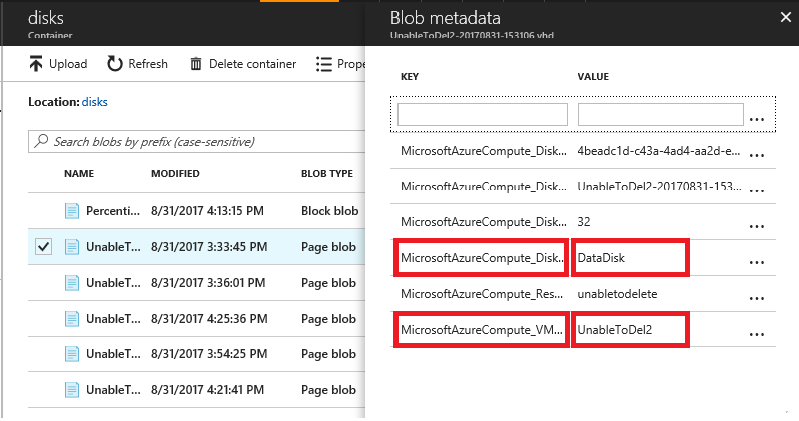
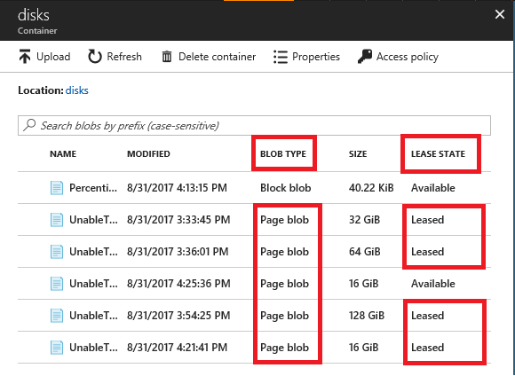
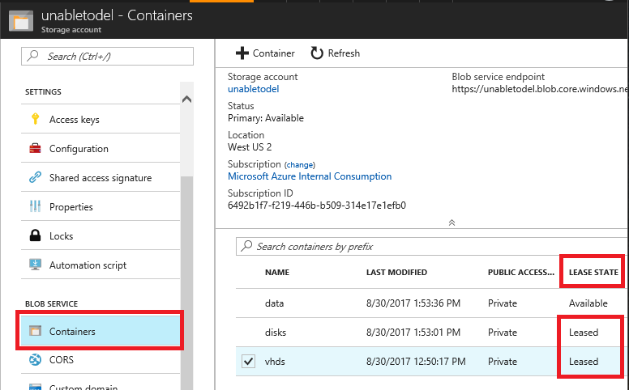
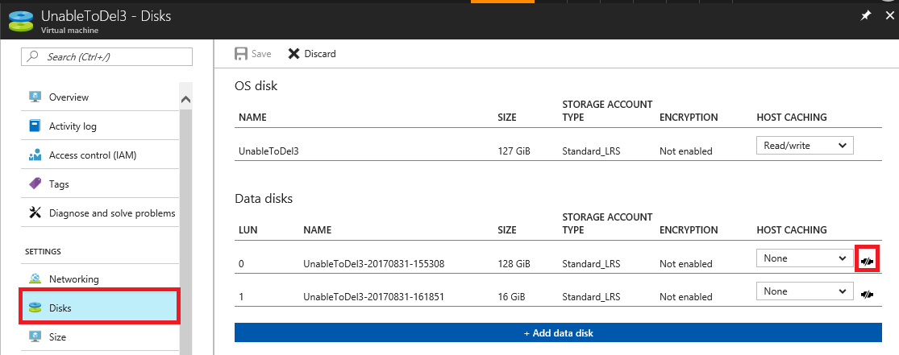

# Troubleshoot Storage delete errors in ARM deployment
This article provides troubleshooting guidance when one of the following errors occur when trying to delete Azure Storage account, container, or blob in Azure Resource Manager (ARM) deployment.

>_Failed to delete storage account 'StorageAccountName'. Error: The storage account cannot be deleted due to its artifacts being in use._

>_Failed to delete # out of # container(s): vhds: There is currently a lease on the container and no lease ID was specified in the request._

>_Failed to delete # out of # blobs: BlobName.vhd: There is currently a lease on the blob and no lease ID was specified in the request._

The Virtual Hard Disks used in Azure VMs are .vhd files stored as page blobs in a standard or premium storage account in Azure.  More information about Azure disks can be found [here](../../virtual-machines/windows/about-disks-and-vhds.md). Azure prevents deletion of a disk that is attached to a VM to prevent corruption. It also prevents deletion of containers and storage accounts which have a page blob that is attached to a VM. 

## Solution
The process to delete a Storage account, container, or blob when receiving one of the above errors is: 
1. [Identify blobs attached to a VM](#step-1-identify-blobs-attached-to-a-vm)
2. [Delete VMs with attached **OS disk**](#step-2-delete-vm-to-detach-os-disk)
3. [Detach all **data disk(s)** from remaining VM(s)](#step-3-detach-data-disk-from-the-vm)
4. Retry deleting Storage account, container, or blob.

### Step 1: Identify blob(s) attached to a VM

#### Scenario 1: Deleting a blob – identify attached VM
1. Sign in to the [Azure portal](https://portal.azure.com).
2. On the _Hub_ menu, select **_All resources_**. Go to the Storage account, under **_Blob Service_** select **_Containers_** and navigate to the blob to be deleted.
3. If the blob **_Lease State_** is **_Leased_**, right click, and select **_Edit Metadata_** to open Blob metadata pane. 

    

4. In Blob metadata pane, check and record the value for **_MicrosoftAzureCompute_VMName_**. This value is the name of the VM that the VHD is attached to. (See **_Note_** if this field does not exist)
5. In Blob metadata pane, check and record the value of **_MicrosoftAzureCompute_DiskType_**. This identifies if the attached disk is OS or data disk (See **_Note_** if this field does not exist). 

     

6. If the blob disk type is **_OSDisk_** follow [Step 2: Delete VM to detach OS disk](#step-2-delete-vm-to-detach-os-disk). Otherwise, if the blob disk type is **_DataDisk_** follow the steps in [Step 3: Detach data disk from the VM](#step-3-detach-data-disk-from-the-vm). 

> _**Note:** If **MicrosoftAzureCompute_VMName** and **MicrosoftAzureCompute_DiskType** do not appear in the blob metadata, it indicates that the blob is explicitly leased and is not attached to a VM. Leased blobs cannot be deleted without breaking the lease first. To break lease, right click on the blob and select **Break lease**. Leased blobs which are not attached to a VM prevent deletion of the blob but do not prevent deletion of Container or Storage account._

#### Scenario 2: Deleting a container - identify all blob(s) within container that are attached to VMs
1. Sign in to the [Azure portal](https://portal.azure.com).
2. On the _Hub_ menu, select **_All resources_**. Go to the Storage account, under **_Blob Service_** select **_Containers_** and find the container to be deleted.
3. Click to open the container and the list of blobs inside it will appear. Identify all the blobs with Blob Type = **_Page blob_** and Lease State = **_Leased_** from this list. These are the blobs with attached VMs. Follow [Scenario 1](#scenario-1-deleting-a-blob---identify-attached-vm) to identify the VM associated with each of these blobs.

    

4. Follow [Step 2](#step-2-delete-vm-to-detach-os-disk) and [Step 3](#step-3-detach-data-disk-from-the-vm) to delete VM(s) with **_OSDisk_** and detach **_DataDisk_**. 

#### Scenario 3: Deleting storage account - identify all blob(s) within storage account that are attached to VMs
1. Sign in to the [Azure portal](https://portal.azure.com).
2. On the _Hub_ menu, select **_All resources_**. Go to the Storage account, under **_Blob Service_** select **_Containers_**.

    

3. In **_Containers_** blade, identify all containers where **_Lease State_** is **_Leased_** and follow [Scenario 2](#scenario-2-deleting-a-container---identify-all-blobs-within-container-that-are-attached-to-vms) for each **_Leased_** container.
4. Follow [Step 2](#step-2-delete-vm-to-detach-os-disk) and [Step 3](#step-3-detach-data-disk-from-the-vm) to delete VM(s) with **_OSDisk_** and detach **_DataDisk_**. 

### Step 2: Delete VM to detach OS disk
If the VHD is an OS disk, you must delete the VM before the attached VHD can be deleted. No additional action will be required for data disks attached to the same VM once these steps are completed:

1. Sign in to the [Azure portal](https://portal.azure.com).
2. On the _Hub_ menu, select **_Virtual Machines_**.
3. Select the VM that the VHD is attached to.
4. Make sure that nothing is actively using the virtual machine, and that you no longer need the virtual machine.
5. At the top of the **_Virtual Machine details_** blade, select **_Delete_**, and then click **_Yes_** to confirm.
6. The VM should be deleted, but the VHD can be retained. However, the VHD should no longer be attached to a VM or have a lease on it. It may take a few minutes for the lease to be released. To verify that the lease is released, browse to the blob location and in the **_Blob properties_** pane, the **_Lease Status_** should be **_Available_**.

### Step 3: Detach data disk from the VM
If the VHD is a data disk, detach the VHD from the VM to remove the lease:

1. Sign in to the [Azure portal](https://portal.azure.com).
2. On the _Hub_ menu, select **_Virtual Machines_**.
3. Select the VM that the VHD is attached to.
4. Select **_Disks_** on the **_Virtual Machine details_** blade.
5. Select the data disk to be deleted the VHD is attached to. You can determine which blob is attached in the disk by checking the URL of the VHD.
6. You can verify the blob location by clicking on the disk to check the path in **_VHD URI_** field.
7. Select **_Edit_** on the top of **_Disks_** blade.
8. Click **_detach icon_** of the data disk to be deleted.

     

9. Select **_Save_**. The disk should now be detached from the VM, and the VHD should no longer have a lease on it. It may take a few minutes for the lease to be released. To verify that the lease has been released, browse to the blob location and in the **_Blob properties_** pane, the **_Lease Status_** value should be **_Unlocked_**.

### Step 4: Retry delete Storage object
Retry Storage object deletion process.

