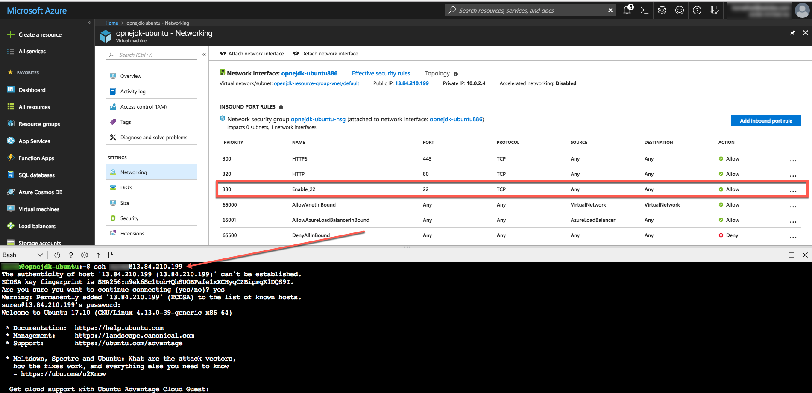

# How to login to a virtual machine (Windows or Linux) using SSH by opening a port in Azure Portal
When a new VM is created on Azure, by-default the Protocol TCP on Port 22 is Disabled. This will not let you SSH into the VM either from Azure’s Cloud Shell or external access from a Mac Terminal or Putty.

When trying to do an `ssh username@vm-ipaddress` you may see a nothing happening or an error message like `ssh: connect to host <ip-address> port 22: Connection timed out`

## Resolution
To use SSH on Cloud Shell or Mac Terminal or Putty, do the following:

- Select the VM
- Select “Networking”
- On the right, select “Add inbound port rule”. This should open a popup
  - 
  - Source: Any (default)
  - Source port range: * (default)
  - Destination: Any (default)
  - Destination port ranges: 22
  - Protocol: TCP
  - Action: Allow
  - Priority: 330 (default)
  - Name: Enable 22 (can be anything you can identify)
- Select “Add“

You may now try to SSH and you will be able to login to your VM.

## Caution
The actions above will exposed SSH port 22 to the internet and this will be not safe on your VM. This is only recommended for testing. For production environments, use a VPN or private connection.