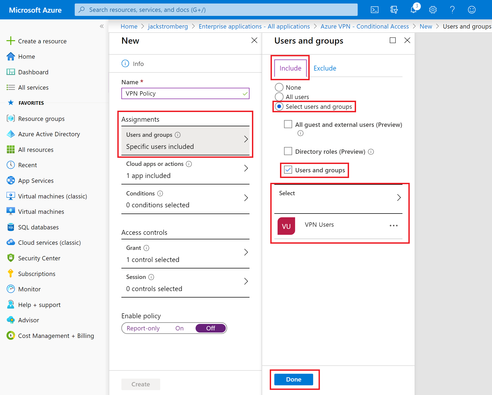
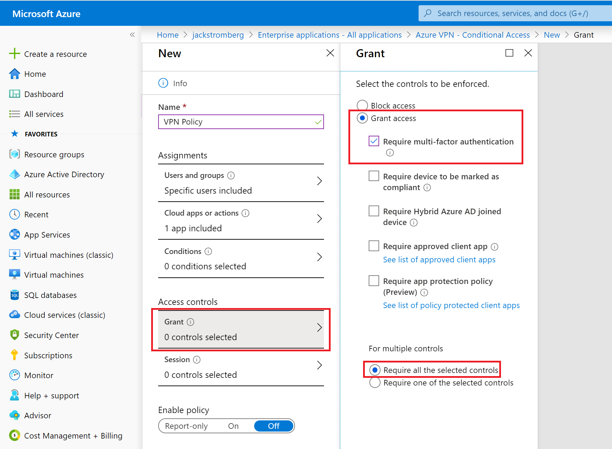

Conditional Access allows for fine-grained access control on a per-application basis. In order to use Conditional Access, you should have Microsoft Entra ID P1 or P2 or greater licensing applied to the users that will be subject to the Conditional Access rules.

1. Navigate to the **Enterprise applications - All applications** page and click **Azure VPN**.

   - Click **Conditional Access**.
   - Click **New policy** to open the **New** pane.
2. On the **New** pane, navigate to **Assignments -> Users and groups**. On the **Users and groups ->** **Include** tab:

   - Click **Select users and groups**.
   - Check **Users and groups**.
   - Click **Select** to select a group or set of users to be affected by MFA.
   - Click **Done**.

   
3. On the **New** pane, navigate to the **Access controls -> Grant** pane:

   - Click **Grant access**.
   - Click **Require multi-factor authentication**.
   - Click **Require all the selected controls**.
   - Click **Select**.
   
   
4. In the **Enable policy** section:

   - Select **On**.
   - Click **Create**.

   
